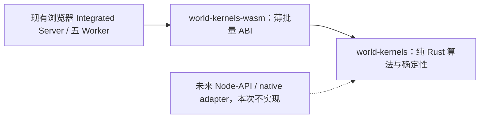

# 修订方案概述：Rust-first，当前只做浏览器 Wasm

**当前任务仍是浏览器 Integrated Server 优化。** Rust-first是为了让算法未来能长期复用于Node-API/native；现在不开发Node Dedicated Server、Node线程池或Rust Node-API，也不把它们列入本次验收与预算。

## 已执行的止损

- 暂停新增服务端MoonBit算法和产品接入；已有MoonBit继续参加公平浏览器对照。
- 浏览器分项与正收益集统一A/B继续是正式产品决策依据，没有取消。旧统一runner已保留，正式组合采样尚未启动。
- 保全30类负载、P0原始profile、TS原版/布局控制、数值ABI、schema2语料、强等价、Moon/Rust参考和headless设施；不丢弃原型。
- 不再展开Node/NAPI实现。刚形成的Node审计和多环境矩阵仅保存为长期参考。
- 功能开关默认关闭、主checkout不动、没有push/合并/发布；所有浏览器保持headless。

## 当前架构与实施顺序

现有Rust参考耦合Wasm固定地址，先提取纯core和薄adapter。core不依赖Node、Wasm global、浏览器、网络或调度，不为未来接口提前写空壳。TS继续持有权威状态、tick与提交校验；不重写整个服务端状态机。

先打通最小编解码/CRC闭环，再覆盖三类共享形态：**W02 Chunk数值填充、W07流体候选、W14编解码**。W01宏观采样仍TS，其成本计入生成端到端。浏览器专用halo、mesh descriptor、顶点/索引打包继续按ROI分项；不强加没有消费者的Node接口。

浏览器维持默认五Worker，各需要计算的Worker持有独立单线程Wasm。不开启共享内存、Wasm内部线程或额外COOP/COEP要求。

## 如何决定保留

比较TS单线程kernel参照、TS Web Worker、已有MoonBit Wasm Worker、Rust Wasm Worker。固定算法、布局、输入、线程数，分别记录核心、边界、复制/增长、吞吐、p50/p95/p99、RSS/GC、启动、体积和维护成本。布局收益另给TS控制，不能算成Rust收益。

分项保留要求端到端p50改善≥15%、95%CI下界>0、满足绝对收益并无尾延迟退化；所有通过项再统一A/A′/B，至少一个预注册主要产品指标改善≥10%。未过门槛可保留TS，允许最终只迁部分甚至不迁。

共享内核默认Rust。MoonBit只有在浏览器专用场景表现出明确的性能、体积或可核验开发效率优势，且覆盖双实现维护与确定性成本时才保留；不因已有投入而自动留下第二套长期实现。

## 当前事实与新增预算

已完成P0 headless六场景各一对A/A、多组真实Wasm强等价和短探针。**正式10配对全矩阵、统一收益和新纯Rust core尚未完成**；短测不作为采用结论。

| 当前新增阶段                                    | 工程人日估算 | 止损点                               |
| ----------------------------------------------- | -----------: | ------------------------------------ |
| 纯Rust core与Wasm adapter、最小闭环到三代表形态 |          3–5 | 第一小核先验证；边界/等价失败就停扩  |
| 浏览器候选Rust对照、ROI筛选和实际消费者接入     |          2–4 | 不扩写低收益或超过单项成本门槛的核   |
| 正式分项/统一AB、回退、静态/构建/浏览器验证     |          2–3 | 组合无益则消融，不强行启用           |
| **本次合计**                                    |     **7–12** | 不含Node/NAPI/native产品和完整服务器 |

这是含审查与测试的工程量估算，不是自动化墙钟交付时长承诺；正式大规模采样前冻结稀疏矩阵，避免维度无限膨胀。未来Node路线的16–26日等旧草案估算明确不属于当前预算。

主负责人承担架构、首个MVP与准出；Sol承担评测/独立审查，Terra承担冻结接口内Rust算法，Luna承担工具链/薄adapter/产物校验。性能采样串行，浏览器无头。

详细合同见[spec.md](spec.md)、[ab-plan.md](ab-plan.md)，成果见[asset-preservation.md](asset-preservation.md)。按你此前要求，本次先汇报修订方案与保全点，审核该精确hash后再扩大实现。
