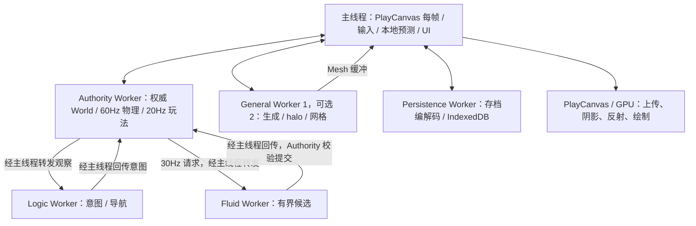

# 游戏循环与计算负载清单

本表按可单独计时的计算责任分组，覆盖启动、每帧、固定步、事件、后台保存及 GPU/宿主路径。源码路径以 `src/` 为前缀，绑定本 change 基准文件树；不是声称每个函数都是 CPU 热点。静态评分是筛选先验，运行时 CPU 占比、调用频次、峰值负载仍须 P0 采样补齐。

## 当前循环和调用边界

`Game.update()` 处理本地呈现，不推进权威物理；Authority 的8ms唤醒检查独立调度器，物理默认60Hz、玩法20Hz、流体30Hz，单次物理追赶最多4步。姿态发布限至60Hz，玩法投影约20Hz。Logic收到观察才计算；Fluid/General按任务工作，Persistence按请求工作，不把它们称为各自固定60Hz的线程。

现有关键保护包括 epoch/revision/read-set 门禁、有界队列、取消、陈旧结果丢弃、准备 lease 和权威事务提交。Wasm仅替换对应纯计算片段。

## 评分和筛选规则

每维0–5：H=静态热点可能性，D=数值密度，B=可批量且少跨界，V=用户关键路径价值，E=迁移/维护容易程度。总分 `S=6H+5D+4B+3V+2E`，满分100。H目前是源码先验，不是已测 CPU 占比。≥65进入成本筛选；50–64暂不迁移但保留采样；<50不单独迁移。GPU/DOM/宿主I/O及权威协调有硬性排除，分数不覆盖它。

“内核倍率”是代码形态推导的**探索假设**，不包含复制/调度、不是承诺；实际倍率可以小于1。除主要计算项外，不能诚实给出数值加速预测的行明确写不预期收益。候选不等于必迁：必须再满足 spec 的端到端净收益和维护门槛。P0会给所有CPU类别记录实测值或采样分辨率上界；若热路径遗漏或低分项实际越过门槛，更新评分和计划，不能静默漏掉。

| 编号 | 负载                                         | 代码与执行位置                                                                                                                | H/D/B/V/E | 分数 | 内核倍率假设             | 处理       | 成本/正确性判断                                                                        |
| ---- | -------------------------------------------- | ----------------------------------------------------------------------------------------------------------------------------- | --------- | ---- | ------------------------ | ---------- | -------------------------------------------------------------------------------------- |
| W01  | 宏观地形、噪声、河湖与气候                   | `world/macro-world.ts: macroAt`；General / Persistence 生成依赖；地图调用                                                     | 5/5/5/5/2 | 94   | 1.2–2.5×                 | 候选       | 批量坐标；双精度/三角函数结果风险高，冷热缓存分别比较                                  |
| W02  | Chunk 基础体素与树木填充                     | `world/chunk-generation.ts: makeChunk`、`world/voxel.ts: baseVoxel`；32³=32768 格                                             | 4/5/5/5/3 | 90   | 1.2–2.0×                 | 候选       | 1024 个列采样后填充；W01 先保持 TS，预采样成本计入 W02                                 |
| W03  | halo 采样、覆盖层与 revision hash            | `world/mesh.ts: createProceduralMeshInput`；34³=39304 格                                                                      | 4/5/5/4/3 | 87   | 1.1–2.0×                 | 候选       | 数值填充与边缘采样；W01 结果相同，不能把整条生成管线当作独立 halo 收益                 |
| W04  | 固体 greedy meshing、遮挡、AO                | `world/mesh.ts: meshChunk/vertexAo`、`mesh-mask.ts`；General                                                                  | 5/5/5/5/3 | 96   | 1.3–3.0×                 | 候选       | 密集扫描、掩码、面合并；输出位置/索引/AO/材质顺序完全对等                              |
| W05  | 水面高度、台阶侧面及特殊模型网格             | `world/water-mesh-height.ts`、`voxel-model-mesh.ts`；meshChunk 子项                                                           | 3/4/4/4/3 | 72   | 1.1–2.0×                 | 候选       | 单独水面/灯笼等数据集；保持流向、透明类别与真实非零水面                                |
| W06  | 网格合批、紧凑打包与格式转换                 | `world/mesh.ts: batchMeshData/compactMeshData/decodeCompactMeshData`                                                          | 3/5/4/3/4 | 76   | 1.1–1.8×                 | 候选       | 按现有 float32/compact 和索引宽度分别测；大结果回拷可能吃掉收益                        |
| W07  | 流体传播、消退、去重和候选输出               | `server/fluid/fluid-transaction.ts: computeFluidCandidate`；专用 Fluid                                                        | 4/4/4/5/2 | 79   | 1.2–2.5×                 | 候选       | 当前 frontier 基准 128，互动/cleanup 有更小预算；整块复制相对稀疏计算可能负收益        |
| W08  | 批量身体碰撞、扫掠、接触、介质力与恢复       | `physics/{step-body,geometry,recovery}.ts`、`server/authority/voxel-collision-world.ts`；Authority 60Hz                       | 3/4/4/5/1 | 71   | 1.1–2.0×                 | 候选       | 查询与求解整体批量；不能逐格调用 JS；严格 f64 和同 tick 排序，不能异步等待通用池       |
| W09  | 角色两两推离、拾取传感器配对                 | `server/authority/authority-session.ts: stepPhysics`；角色成对循环                                                            | 2/3/3/2/2 | 49   | 约 1.0×；压力场景待采样  | 暂不迁移   | 小规模低收益；若规模增长，优先对等 TS 空间筛选对照，不能把算法复杂度改善记作 Wasm      |
| W10  | AI 地形观察窗口的占据位提取                  | `server/authority/logic-observation-builder.ts: createTerrainWindow`；20Hz，最多32768格                                       | 3/5/4/4/2 | 75   | 1.2–2.0×                 | 候选       | Authority 原地对已加载块批处理；未知/版本一致检查由 TS 保留；包括准备复制成本          |
| W11  | 导航搜索、可达性与批量视线地形查询           | `server/logic/logic-terrain.ts: nextStep`；Logic；每次搜索最多128节点                                                         | 4/3/4/3/2 | 68   | 1.1–2.0×                 | 候选       | 目标/意图选择保持 TS；保持稳定 tie-break；先排除改堆结构引起的混杂                     |
| W12  | 实体/POI 邻域与感知候选筛选                  | `server/gameplay/entity-store.ts`、`server/simulation/{perception-runtime,poi-registry}.ts`、`logic-decision.ts`              | 2/2/3/3/2 | 47   | 约 1.0×                  | 暂不迁移   | 对象、索引和少量距离比较，已有桶/范围约束；若实测热则重新评分                          |
| W13  | AI 目标效用、动作状态机、背包/合成/生命/冷却 | `server/logic/logic-decision.ts`、`server/gameplay/`、`simulation/action-runtime.ts`；20Hz/事件                               | 2/1/2/3/2 | 38   | 不预期净收益             | 不迁移     | 字符串、对象、分支和权威状态密集；迁移成本高                                           |
| W14  | 存档 diff/palette/bitpack/raw 编解码         | `world/chunk-snapshot-codec.ts`；Persistence；保存/读入按块                                                                   | 3/5/5/3/4 | 80   | 1.2–2.5×                 | 候选       | 所有 codec 分别测；W01/W02 的基底重建另记，输出格式与字节不变                          |
| W15  | 存档 CRC32/体素校验和                        | `world/chunk-snapshot-codec.ts` 校验循环；Persistence                                                                         | 2/5/5/2/4 | 71   | 1.2–3.0×                 | 候选       | 按64KiB至批量块测；单独往返可能不值，W14共驻合并时另测，不重复计算                     |
| W16  | 宏观地图像素采样与着色                       | `app/macro-map-renderer.ts: renderMacroMap`；主线程每片4ms                                                                    | 4/5/5/4/3 | 87   | 1.2–2.5×                 | 候选       | 逐像素 macroAt；地图开启/换层事件。TS Worker控制组隔离 offload 收益，Canvas绘制保留 JS |
| W17  | 出生点、初始生态与安全地面搜索               | `worker/world-compute-task.ts`、`server/gameplay/safe-spawn.ts`、`server/starter-surface.ts`                                  | 2/2/2/3/2 | 43   | 独立迁移约 1.0×          | 不单独迁移 | 启动一次；复用 W01/W02 获益，搜索编排保持 TS；禁止重复计算启动收益                     |
| W18  | 快照/碰撞镜像、序列化、复制与事件投影        | `server/authority/authority-session.ts: snapshot`、`client/authority-collision-mirror.ts`、`server/server-mesh-snapshots.ts`  | 2/3/2/3/1 | 46   | 不预期直接净收益         | 不迁移     | 内存带宽与 structured clone 成本；作为每项总成本测量，不靠增加拷贝解决                 |
| W19  | 编辑/fill、修订号、dirty 集合与事务提交      | `server/world-{mutation,transaction-commit}.ts`、`server/commands/fill-command.ts`、`server/fluid/`提交                       | 2/3/3/3/1 | 50   | 大批填充可能获益；常态低 | 暂不迁移   | 已有事务批处理；Wasm 不拥有权威写权限；先测纯掩码是否占主导                            |
| W20  | streaming 排序、驻留、任务队列/取消/调度     | `app/world-runtime.ts: updateStreaming`、`runtime/compute-task-queue.ts`、`client/compute-worker-pool.ts`                     | 1/2/2/3/3 | 39   | 不预期净收益             | 不迁移     | 跨Chunk才重排，协调逻辑与消息密集；不通过改变调度频率改善 A/B                          |
| W21  | 单玩家预测、校正与输入回放                   | `client/local-player-prediction.ts`、`prediction-buffer.ts`；主线程                                                           | 2/3/1/5/1 | 48   | 独立迁移可能负收益       | 不单独迁移 | 高频小批量，不能多一次 Worker 往返；W08一致性要求下可复用同核并独立报告成本            |
| W22  | 瞄准 DDA/实体命中/放置校验                   | `client/voxel-target.ts`、`entity-hit-volume.ts`、`server/gameplay/voxel-ray.ts`                                              | 1/2/1/4/3 | 38   | 可能负收益               | 不迁移     | 短射线与少量实体，UI/输入关键路径；避免细粒度 FFI                                      |
| W23  | 实体插值、动画、视角/工具/裂纹表现           | `client/snapshot-interpolator.ts`、`entity-presentation-motion.ts`、`app/first-person-viewmodel.ts`、`voxel-break-overlay.ts` | 1/3/2/2/3 | 41   | 不预期净收益             | 不迁移     | 数值量小、最终调用 PlayCanvas；保留连续帧视觉验收                                      |
| W24  | 局部灯光/反射面扫描、昼夜、水下反馈          | `app/advanced-visual-effects.ts`、`water-reflection-plane.ts`、`world-environment.ts`、`water-experience.ts`                  | 2/2/2/3/2 | 43   | 约 1.0×                  | 暂不迁移   | 有界灯池/扫描；Math与对象/引擎调用交错；需从 GPU 成本中分离                            |
| W25  | 阴影、倒影、透明水、后处理/材质绘制          | `app/voxel-render-pipeline.ts`、`stylized-post-effect.ts`、`shaders/`、PlayCanvas                                             | 5/0/0/5/0 | 45   | 不适用                   | 不迁移     | 主要在 GPU/引擎，本次 CPU Wasm 无法直接消除 draw call、fill rate 或纹理开销            |
| W26  | GPU Mesh 上传、挂接与可见屏障                | `app/playcanvas-chunk-adapter.ts`、`mesh-visibility-barriers.ts`                                                              | 2/2/1/4/1 | 40   | 不预期净收益             | 不迁移     | 引擎 API 和驱动同步边界；W06结果输出复制须计入                                         |
| W27  | IndexedDB I/O、保存屏障与恢复编排            | `worker/persistence-{save,load-many,frozen-save}.ts`、`server/persistence/`                                                   | 2/1/1/4/1 | 35   | 不预期净收益             | 不迁移     | I/O等待不是数值计算；只迁移W14/W15及复用基底生成，不更改存档事务                       |
| W28  | UI、HUD、命令解析、输入、遥测与生命周期      | `app/ui/`、`hud-projector.ts`、`server/commands/`、`runtime/`                                                                 | 1/1/1/3/3 | 30   | 不预期净收益             | 不迁移     | DOM/事件/字符串为主；埋点有界，world纯逻辑边界维持                                     |
| W29  | 音乐、环境音、音频混音/解码                  | `app/audio/`、`client/audio/`、浏览器 Web Audio                                                                               | 1/1/1/2/1 | 23   | 不适用                   | 不迁移     | 当前没有自研密集 DSP 内核；宿主音频调度与原生解码保持                                  |
| W30  | 旧模拟/无头适配、种子与坐标工具              | `server/simulation/{autonomy-runtime,ground-navigator}.ts`、`server/headless/`、`world/voxel.ts`                              | 1/2/1/2/2 | 30   | 不预期独立净收益         | 不单独迁移 | 不能把旧 GroundNavigator 误当浏览器 Logic 热路径；通用工具仅随调用内核复用             |

## 分项边界与避免重复计数

候选共13项：W01–W08、W10–W11、W14–W16。正式追踪集合固定为 `W01,W02,W03,W04,W05,W06,W07,W08,W10,W11,W14,W15,W16`，每项有自己的TS/Wasm计时、输入输出摘要和决定；不得以一个“生成+网格”的数字替代子项。

W01→W02→W03→W04/W05→W06 是依赖管线。子项A/B固定上游输出，包含为了独立替换增加的真实准备/复制；W04/W05无法自然分离时先用相同调度的分支开关隔离，不能虚造可插拔边界。最后再测连用时复用工作区的收益。W14/W15同理，CRC独立未过门槛则保留TS；若仅共驻时过门槛，标记为组合依赖，不称独立获益。

W08不是逐个`stepBody`导出后逐次JS读取体素：整个批次需要预先准备紧凑近场碰撞输入、稳定实体顺序与介质数据，准备、修订同步和读回必须算进来。JS回调访问世界若不能消除，则应判定迁移失败。W10只负责占据位提取，不移走观察快照的权威门禁。

W11先冻结现有搜索顺序与128节点限制；若发现TS用堆替代反复排序就能解决成本，增加等算法TS优化控制组。W16的像素核与W01共用数学部分，独立地图A/B既报告完整地图完工时间，也报告TS Worker对照下的Wasm贡献。

## 已有性能证据提供的边界

本次读取仓库归档 `changes/2026-09-06-independent-loops-unified-physics/evidence/authority-load-general-1-2257aff.json`：历史source SHA为`2257aff`，16个专用角色+64个物件+1024背景源水，Medium，1920×1080 CSS、DPR2、内部3379×1900，physics p95约1.6ms，frame p95约10.4ms，流体编辑至可见p95约73.9ms。归档自然A1的physics p95约0.4ms、frame p95约10.8ms。

这些是**最新树携带的历史证据**，不是本次新基准、也不是Wasm A/B。它们提示：自然场景物理绝对成本不大，流体首见包含提交、排队、网格与渲染，不能把1.6ms物理减少一半说成FPS翻倍。此前两次5/6 Worker比较方向不一致，因此继续保持默认5个Worker。P0须重新测量当前不可变产物，历史数据只用于设计场景。

Amdahl仅用于预算：若某条串行关键路径中可迁移比例为p、局部速度为s，理论上限为`1/((1-p)+p/s)`，再扣新增开销。例如p=0.2、s=2时上限约1.11×，并非本项目预测。不同Worker的CPU时间可用于CPU总量账本，但不能相加当作帧时长。
