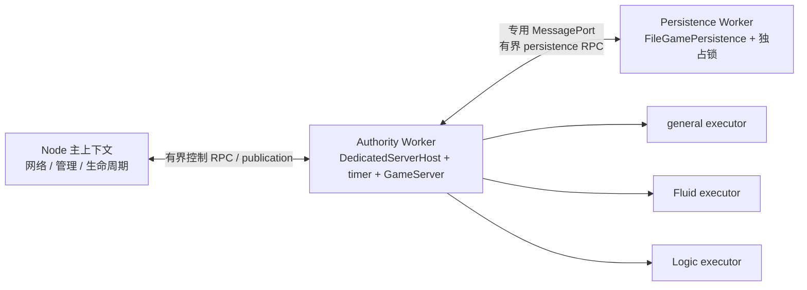

# Node Authority 与 Persistence lane 最小接线设计

## 当前差距与目标拓扑

Spec 3.3 要求 Node 主上下文只承担轻量网络、管理和生命周期，默认资源拓扑包含一个 Authority、一个 Logic、一个 Fluid、一个 general 和一个 persistence lane。当前 `NodeDedicatedRuntime` 在主上下文直接创建 `DedicatedServerHost` 与 `FileGamePersistence`，只把 Logic、Fluid、general 候选计算放入独立执行器；因此 Authority 与磁盘存储仍和网络/管理共享同一事件循环。

最小目标拓扑如下：

首版 Authority 与 persistence 使用各一个常驻 `worker_threads` Worker；`inline` 只保留为等价参考与单元测试模式。Persistence Worker 一旦异常退出，不在同一 runtime epoch 内自动拉起：Worker 与主进程共享 PID，现有磁盘锁无法仅凭 PID 证明旧 Worker 已停止全部写入。主上下文应把整个 runtime 标为 fatal、停止接入并非零退出；新进程以新 epoch 启动后，才按既有锁合同核验恢复。若未来要求 persistence lane 单独自动恢复，应先以真实子进程 PID 或可证明的写租约重新设计并审核锁身份。

## Authority 跨边界合同

Authority Worker 独占 `DedicatedServerHost`、`AuthorityRuntime`、`GameServer`、权威 timer、compute scheduler 和三个 compute executor。主上下文不得保留第二个 `GameServer`，也不得直接访问 `runtime.host.runtime.server`。Node 内部控制协议与公开网络 allowlist 分离，不能把现有浏览器 `AuthorityRequest` 原样暴露给客户端。

以下操作的权威结果都依赖 Worker 内状态，必须异步化：

| 当前调用                          | Worker 边界后的最小接口                                    | 说明                                                                                                                                           |
| --------------------------------- | ---------------------------------------------------------- | ---------------------------------------------------------------------------------------------------------------------------------------------- |
| `DedicatedServerHost.create(...)` | `start(config): Promise<Ready>`                            | Worker 内完成 persistence restore、安全出生点、compute ready 和 Host 激活；主上下文收到 ready 前不开放网络。                                   |
| `receiveInput(input)`             | `receiveInput(input): Promise<SequenceDecision>`           | 本地发送队列可以同步拒绝 capacity，但 accepted/duplicate/stale 的权威判断必须由 Authority 回复；高频调用方可不逐条阻塞等待，仍需消费有界回执。 |
| `performAction(action, sequence)` | `performAction(...): Promise<AuthorityTransactionReceipt>` | 玩家写动作只在 Authority 执行，不经计算池重试。                                                                                                |
| `requestChunk(key)`               | `requestChunk(key): Promise<boolean>`                      | durable preflight、候选生成和最终接纳都留在 Authority Worker。                                                                                 |
| `setInterestRadius(radius)`       | `setInterestRadius(radius): Promise<void>`                 | 配置经 Worker 校验并确认后才生效。                                                                                                             |
| `save()`                          | `requestCheckpoint(): Promise<SaveResult>`                 | 主上下文只能请求保存当前权威状态，不能传入冻结体、路径或自报检查点序号。                                                                       |
| `stop()`                          | `stop(): Promise<{ durableCommitSequence: number }>`       | Worker 先停 timer、清输入、收完已接纳工作并完成最终保存，再返回 durable 序号。                                                                 |
| `waitForIdle()`                   | 仅测试/管理 RPC                                            | 不进入公开网络合同。                                                                                                                           |

Publication、提交和健康变化由 Worker 主动推送。主上下文可保存最近一次只读 snapshot、gameplay view、durable 序号和诊断，供网络投影与同步展示；这些缓存不是新的 Authority。需要精确瞬时诊断时使用异步 `readDiagnostics()`，普通 `diagnostics()` 只能明确标为最近已发布值。

`now: () => number` 不能结构化克隆到 Worker。生产 Worker 在自身上下文使用 `performance.now()` 并自行驱动 timer；当前可注入时钟只保留给 `inline` 参考。真实 Worker 验收使用可观察的时间推进和协议期限，不增加能直接设权威时间的生产消息。

## Persistence 跨边界合同

Persistence Worker 独占 `FileGamePersistence` 和目录锁。Authority 侧只持有 `PersistenceLaneProxy`，不得直接导入 Node 文件 API。Node 内部 RPC 每条都携带 runtime epoch、persistence generation、严格递增 request id、消息 kind 和实际字节长度；wrong epoch、旧 generation、重复 id、越界 payload 和迟到回复均明确拒绝并结算 Promise。

必须跨 Worker 异步执行的方法：

- `open(config)`：创建目录、取得锁、校验 CURRENT/manifest/blob，返回已克隆的 Gameplay、checkpoint、世界身份和限制；ready 前失败要释放已取得的锁。
- `ensureSnapshot(cx, cy, cz)` 与 `ensureNeighborhood(...)`：执行受限磁盘读取、hash 校验和解码，并返回找到的 `ChunkSnapshot` 及诊断。
- `saveFrozenSnapshot(snapshot)`：Authority 侧在任何 await 或排队前立即深拷贝冻结体，并另建 transport 副本；只允许 detach transport 副本，保留的提交副本供 durable ACK 后更新缓存。Worker 串行执行正式发布，只有 CURRENT 同步完成后回复 durable 成功。不得为跨 lane 重新开放 `saveSnapshots` 或 `saveGameplaySnapshot`。
- `inspectPreviousCheckpoint()`：显式只读校验旧检查点，不改变 CURRENT。
- `close()`：等待已接纳写入终结，核对并释放目录锁；超时不能提前报告成功或假装锁已释放。

### 保留同步缓存读取

`ChunkPersistence.loadSnapshot(key)` 是世界热路径的同步合同，不能改成同步 IPC、阻塞 Atomics 或每次磁盘 RPC。Authority 侧 proxy 维持有界 Map 和 missing 集合：

1. 初始状态为 `unknown`，`loadSnapshot(key)` 只克隆并返回本地已准备值，没有值立即返回 `null`。
2. `ensureSnapshot`/`ensureNeighborhood` 异步请求 Worker；成功回复先校验 key、坐标、seed、generatorVersion、revision、TypedArray 类型和长度，再原子写入 Authority 侧缓存并把状态变为 `found` 或 `missing`。
3. `preparedSnapshotStatus` 只查询本地状态。`evictSnapshot` 同步删除 Authority 缓存，使状态回到 `unknown`；不得依赖异步 Worker 回执才能释放世界驻留。每个异步 prepare 都取得唯一 token；`evictSnapshot` 会使该 key 当前 token 失效，迟到的 `found` 或 `missing` 回复只有在 token 仍是当前请求时才能写缓存，因此不能把已经 evict 的 Chunk 重新驻留。
4. Worker 调用现有 `ensure*` 后，用 `loadSnapshot` 取得克隆用于传输，并立即 `evictSnapshot` 其临时缓存。这样磁盘对象不再长期复制一份完整热缓存；保存成功后也清理 Worker 内本次写入产生的缓存。
5. `open` 已返回 Gameplay 和 checkpoint，proxy 可让 `loadGameplaySnapshot()`、`loadGameCheckpoint()` 同样从初始化缓存同步克隆；现有接口本来也允许 Promise，但保持同步可减少 restore 分支。只有 durable save ACK 后才更新这两个缓存和已保存 Chunk，失败或迟到 ACK 不得推进缓存中的 durable checkpoint。
6. prepare token、generation 与 missing 状态本身也必须有界。Proxy 只为当前驻留缓存或正在结算的请求保留元数据；请求结算后，若 key 未驻留且没有更新的在途请求，就删除该 key 的记录。不能为所有历史 Chunk 永久保存 tombstone。
7. 保存提交时记录每个已驻留 Chunk 的 cache generation 与 revision。Durable ACK 只能更新仍驻留、generation 未变化且当前 revision 不高于所提交 revision 的项；其后发生的 prepare、编辑或 evict 都会使门禁失效。ACK 不得重新插入提交时或其后已 evict 的 Chunk，也不得用旧保存覆盖更高 revision。

跨 Worker 传输只使用单独 transport 副本的可转移 ArrayBuffer，不能 detach `GameServer`、冻结 token、待 durable 提交副本或缓存正在使用的 TypedArray；在 `postMessage` 前，保留提交副本与 transport 副本的峰值都计入本地瞬时字节预算。Transport buffer detach 后不再计入本地副本，但其完整 payload 仍计入远端在途预算，直到 durable ACK 或明确失败完成结算。单次 neighborhood 继续受现有 27 Chunk 范围约束；请求队列、在途请求、返回快照和冻结保存分别计数与计字节。Persistence 只允许一个写入中和一个由 Host 合并的待保存请求，读可有界并发，但损坏或写失败使 lane 进入 fatal，不自动回滚或重试玩家写入。

## 生命周期与资源所有权

主上下文先生成 epoch，再启动 Persistence Worker 并等待其持久化 ready；随后启动 Authority Worker，把专用 `MessageChannel` 一端转交 Authority、另一端转交 Persistence。Authority 创建三个 compute executor 和 scheduler，完成 restore/激活后才向主上下文发布 ready。生产构建相应增加 `node-authority-worker.js` 与 `node-persistence-worker.js`，并继续显式传入 compute worker/child URL；所有产物必须由 Node 22 在空目录、无 TS loader 条件下启动验证。

启动失败按反向所有权清理：Authority 未 ready 时先要求其关闭已创建 compute 资源，再要求 Persistence 完成 close/释放锁，最后 terminate Worker。任一 Worker 意外退出或协议失配都使 runtime fatal，主上下文停止新连接和写入；同 epoch 不创建第二 Authority 或第二 persistence writer。

正常关停顺序为：停止网络接入和新管理写入 → 请求 Authority stop → Authority 停 timer、清输入、drain scheduler/mailbox/动作并通过 persistence proxy 保存最终冻结检查点 → Persistence 回复 durable C → Authority 返回 stopped → 主上下文请求 Persistence close 并等待锁释放 → terminate 两个 Worker。30 秒调用期限可以让 CLI 非零退出，但不能提前 resolve `whenStopped()`、释放仍在写入的资源或报告新的 durable C。

## 推荐实施顺序

1. 先定义 Node 内部 Authority/Persistence DTO、runtime validator、字节核算和通用 request ledger；先写 wrong epoch、旧 generation、重复/迟到 reply、队列数量与字节超限的 RED。协议只放 Node adapter，不扩大公开网络消息。
2. 实现 `PersistenceLaneProxy` 的本地同步缓存和 `inline` transport，以现有 `FileGamePersistence` 跑通等价合同；覆盖同步读取绝不触发 transport、prepare 后状态切换、clone/detach 隔离和 durable ACK 后更新。
3. 增加 Persistence Worker 入口和 Worker transport。先保持 Authority/Host inline，证明文件操作、编码、hash/fsync 和锁都在独立 thread id，主线程只看到有界 DTO；Worker 崩溃必须 fatal 且不自动抢锁。
4. 定义 `NodeDedicatedHostClient`，把 Node runtime 与 CLI 从具体 `DedicatedServerHost` 改为异步 façade；移除产品路径对 `host.runtime.server` 的访问。先用 inline Authority transport 保持现有宿主行为。
5. 增加 Authority Worker 入口，把真实 timer、Host、compute scheduler/executors 和 persistence port 移入 Worker。接入 publication/health 推送，再验证无客户端仍持续推进。
6. 最后收口主上下文生命周期、信号关停、两 Worker 异常传播、构建产物清单和 Node 22 离线启动。完成确定性门禁后再进入资源/性能实验，不能用“建出了 Worker”代替 F1/F2 收益证据。

## 最小验收用例

| 用例                  | 必须证明的结果                                                                                                                                  |
| --------------------- | ----------------------------------------------------------------------------------------------------------------------------------------------- |
| 同步缓存热路径        | spy 证明 `loadSnapshot`/`preparedSnapshotStatus` 不发送消息、不阻塞；返回值修改不污染缓存。                                                     |
| 异步准备与乱序        | 两个不同 Chunk 回复乱序仍写入正确 key/revision；同 key 请求合并；wrong epoch/旧 generation/迟到回复都 settle 且不改缓存。                       |
| 缓存与驻留            | neighborhood 返回后 Authority 缓存有界；`evictSnapshot` 立即回到 unknown；Worker 临时缓存不随历史 Chunk 总数增长。                              |
| evict 与 prepare 竞态 | prepare 在途时 evict，再收到迟到的 found/missing 回复，状态仍为 unknown；随后同 key 新 prepare 可独立成功，且结算后不留下无界 token/tombstone。 |
| 冻结保存隔离          | 调用 `saveFrozenSnapshot` 后立即修改调用方 Gameplay/TypedArray，落盘仍为提交瞬间副本；失败 ACK 不推进 durable cache。                           |
| 保存 ACK 版本门禁     | 保存后发生更高 revision prepare、编辑或 evict 时，迟到 ACK 不覆盖新值且不重新驻留 Chunk；完全未变化的驻留项才更新为已保存副本。                 |
| 增量与重启            | 两次增量保存保留旧 Chunk；进程重启由新 epoch 恢复同一 Gameplay/checkpoint/Chunk。                                                               |
| 单写者与 Worker 失败  | 同目录第二 runtime 拒绝；Persistence Worker 写入中退出后当前 runtime fatal、拒写、不声称新 durable，且不在同 PID 内自动抢占残留锁。             |
| 唯一 Authority        | 静态边界和真实 thread id 证明主上下文没有 `GameServer`；所有玩家写动作只在 Authority Worker 产生 commit。                                       |
| 自主时间与输入租期    | 没有网络客户端和主线程 wake 消息时，Authority Worker 仍推进物理/Gameplay/Fluid 周期；500 ms 后清输入但世界继续。                                |
| 主线程响应性          | Authority 持续 tick、Chunk prepare 与保存期间，主上下文的控制 ping/网络队列仍在明确期限内响应；该确定性健康门不替代后续正式性能矩阵。           |
| 故障与新 epoch        | Authority Worker 异常时停止接入、关闭 persistence、`whenStopped()` reject；重启创建新 epoch 并全量恢复，不重放未知玩家动作。                    |
| 顺序关停              | 已接纳 action/compute candidate 全部结算，最终 durable ACK 先于 persistence close 和 Worker terminate；deadline 失败不返回 stopped。            |
| Node 22 产物          | 空目录中的 `node-server.js`、Authority/Persistence Worker 和 compute worker/child 全部从正式 ESM 产物启动，无源码树或 TS loader 依赖。          |

## 明确不在最小接线内

本设计不选择公开网络 transport/codec，不把浏览器 persistence worker 的 IndexedDB/harness 消息直接搬到 Node，不增加同步 IPC，不在 Worker 崩溃后自动恢复写者，不改变 `FrozenGameSaveSnapshot` 或 Chunk 世界 schema，也不以本接线替代 Linux 设备断电和 F1/F2 正式资源收益验证。
