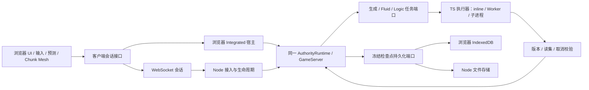

# Node 独立服务端与双模式客户端方案

**状态：方案完成，待精确版本审核；Breaking flow。当前只交付设计与独立 baseline，不修改生产代码。**

阅读入口：[方案概述](overview.md)；性能合同：[实验与归因方案](experiments.md)；远端环境：[部署与网络验收](remote-environment.md)；审核版本：[绑定清单](review-binding.md)。以下数值均为拟议合同或实验预算，不是实测收益。

## 一、背景与目标

推进 [Living World A 线](../../docs/living-world-alignment.md)：先让现有 TypeScript 权威世界脱离浏览器常驻，再为未来 Agent 接入提供稳定的世界生命周期、命令和观察入口。首版完成浏览器本地世界、浏览器连接 Node 世界两条可玩旅程，并可区分宿主迁移、网络传输、Node 分项优化和最终组合收益。

### 恢复结果与分支基点

| 项目              | 本轮核对结果                                                                         | 适用边界                                                              |
| ----------------- | ------------------------------------------------------------------------------------ | --------------------------------------------------------------------- |
| 当前主 checkout   | `codex/repository-codemap`，`fad5b608a525a2cfa0cbe23e85fc5aaae7f15933`，干净         | 保持原样                                                              |
| 目录治理          | `codex/context-engineering`，`1e3619d9eeac03bd779e1393de6a2547a0b7c71f`              | 建树来源；PR #8 已合并，最终基点改为下行 main                         |
| 本地远端跟踪 main | `c777ba811cf4a77500f43e3e1af8c814b725443c`                                           | 本轮 fetch 后的最终基点；已合入此功能分支                             |
| 本轮 worktree     | `/Users/chlorinec/.codex/worktrees/node-dedicated-20260906/voxel-sandbox-foundation` | 分支 `codex/node-dedicated-server`                                    |
| Wasm 参考         | `codex/moonbit-wasm-workload-experiment`，`36a0022`                                  | 只读参考，没有合入；修订为 Rust-first 浏览器 Wasm，当前不做 Node/NAPI |

已通过 `read_thread` 读取「沉淀 Living World 长期路线图」与「调研并设计 WASM 迁移方案」。前者已有目录聚合、归档、治理和测试竞态修正，本地记录为 760 项测试通过、4 项跳过、构建通过及浏览器基线 9/9；最终复核 PR HEAD `1e3619d` 的三项必要 CI 全部通过。用户随后确认合并，本轮 fetch 验证远端 main 为 `c777ba8`，已同步到此功能分支；该 main 文件树与 `1e3619d` 完全一致，包含归档工具与 Svelte 所有权边界修正。后者保全检查为 797 项测试及构建通过，正式 Rust 分项/统一 A/B 未完成。上述是来源版本的历史证据，本轮没有复跑或据此宣称 Node 已通过验收。

本分支最初建立于治理提交，现已合入最新 `origin/main` 的 `c777ba8`，没有未合并的治理依赖。同步无冲突、未产生产品文件差异，保留此前本地设计提交而不改写历史。未来 main 若改变入口或契约，先核对本分支差异；实质改变本合同则重新绑定审核。Wasm 合并是未来集成点，不是本次 TS 设计的前置条件。

### 当前代码事实

| 实际入口                                                               | 已有能力                                                              | 迁移缺口                                                                               |
| ---------------------------------------------------------------------- | --------------------------------------------------------------------- | -------------------------------------------------------------------------------------- |
| `src/server/authority/authority-runtime.ts`、`authority-session.ts`    | `GameServer` 权威、固定步长、多频率、事务去重、Logic/Fluid 校验和提交 | `AuthorityRuntime` 绑定一个 `playerId`；不是多客户端会话服务                           |
| `src/server/headless/headless-session.ts`                              | 无 DOM 命令入口、确定性手动推进、复用正式规则                         | 强绑定 `MemoryGamePersistence`；手动推进；部分加载走 `generate-mesh`；不是常驻生产宿主 |
| `src/app/browser-worker-session.ts`                                    | 主线程编排 Authority、Logic、通用计算、Fluid                          | 生成结果/流体候选/Logic 意图通过浏览器回送；不能直接信任远端玩家上传这些结果           |
| `src/worker/authority-worker.ts`                                       | 浏览器计时唤醒与 IndexedDB 适配                                       | `self`、Worker 消息和浏览器存储需要独立宿主适配                                        |
| `src/client/authority/browser-authority-client.ts`                     | 快照门禁、碰撞基线、请求登记、预测输入                                | `postMessage`/可转移对象并不是网络格式；dispose/pause 语义不同                         |
| `src/server/persistence/game-save-runtime.ts`                          | 冻结检查点、串行保存、脏 Chunk 与 Gameplay 原子保存要求               | Node 磁盘实现必须消费 `saveFrozenSnapshot`，不能分别写 Chunk 和 Gameplay               |
| `src/client/shell/shell-controller.ts`、`src/app/application-shell.ts` | 本地启动、暂停、保存退出                                              | 隐藏页面会暂停本地世界；远端需要只停止输入，保留世界推进                               |

## 二、范围与非目标

### 拟实施范围

1. TS Node ESM 独立产物；真实时钟运行、完整服务端计算调度、磁盘检查点、启动/停止/故障状态。
2. 版本化网络协议、身份绑定、连接与重连、世界数据和碰撞镜像同步；浏览器渲染和预测保留。
3. 启动页选择「本地世界（此浏览器）」或「连接服务器」，配置地址和访问口令；本机 Node 使用服务器模式中的 loopback 地址。
4. 可复现的 TS 宿主比较、线程池扩展、多进程计算、可选共享缓冲区和 I/O 调度实验；逐项结论、消融和最终组合。
5. 保存与 Wasm 线的集成边界，复用输入语料和纯计算结果合同；本轮 TS 开关关闭其他语言后端。
6. 用户补充的 CT105 `mcs` 真实远端测试环境：独立 HTTPS/WSS 端口、完整离线产物、CI 经 SSH 推送、可恢复部署与公网网络波动验收。

### 首版产品范围假设

**一个 Node 实例承载一个世界，同一时刻允许一个玩家连接。** 这沿用当前 `AuthorityRuntime.playerId` 的实际边界，服务无人连接时继续运行；第二连接返回 `SERVER_FULL`，不偷偷共享玩家控制权。并发计算进程不等于并发玩家，也不等于多权威世界。

不实现 LLM AgentServer、多人身份/角色体系、模拟岛迁移、跨机集群、完整 Rust server、Rust NAPI、插件 API 或世界生成算法变更。面向所有玩家的公网生产托管、浏览器旧存档导入 Node、Node 存档下载回浏览器仍留给独立需求。用户本轮新增的单台 CT105 远端测试部署及有限 TLS/CI 配置纳入本方案；具体首次远端写入仍需落实目标、备份和验证准备，不自动迁移用户存档。

这些范围可以在本轮审核时调整；若需要首版多人，必须重设玩家会话、兴趣区域与持久化合同，不能在网络层加一个 socket 循环即宣称支持。

## 三、关键决策

### 3.1 同一权威实现，两个长期宿主

图中的 Authority 表示共用代码，每个世界实例只有一个权威所有者。网络、调度器、Worker、将来 Rust 内核都不能持有另一份可独立提交的世界。

- `DedicatedServerHost` 负责生命周期、时钟、生成需求、Logic 观察、Fluid 任务和保存；直接组合 `AuthorityRuntime`，不把手动 `HeadlessSession` 改名充当服务。
- 权威固定在一个执行上下文，所有消息经有界 mailbox 入站。异步计算/I/O 期间 tick 继续；候选回到 mailbox 后校验，提交段不可跨 `await`。准备 Chunk 可以异步，恢复操作时重新验证前置版本。
- 使用当前 physics/gameplay/fluid 频率与现有 scheduler 的追赶/过载语义；不因 Node 更快提高模拟 Hz。宿主使用单调时间；进程离线时间首版不补算，重启恢复存档世界时间并从新单调时钟继续。
- 服务端自行生成 canonical 数据、安全出生点和生态，自行运行 Fluid 和算法 NPC。远端客户端只消费数据、构建 halo/mesh、处理 GPU、预测及界面；不上传 canonical/Fluid/Logic 作为真值。
- canonical-only 路径复用现有 `generate-canonical` 与 `find-safe-spawn`，不要复制 Headless 的不必要 meshing。此类接线/负载变化单独列 A/A 控制，不能记为 Node 宿主收益。
- 对已编辑 Chunk、流体和碰撞区域传完整版本化数值数据；首版不依赖客户端重新生成 canonical 来省带宽。订阅由服务端根据玩家位置、视距上限及模拟活动窗口决定，客户端只能提出兴趣请求。

### 3.2 文件归属与接口接缝

| 拟议位置                                                             | 职责与约束                                                                                        |
| -------------------------------------------------------------------- | ------------------------------------------------------------------------------------------------- |
| `src/server/dedicated/`                                              | 无平台全局的世界宿主编排、生命周期、任务结果收回；依赖注入时间、执行器和存储                      |
| `src/server/protocol/`                                               | 可跨宿主的会话 DTO、能力说明、版本校验；不依赖 app/client、Node 或 DOM                            |
| `src/server/compute/`                                                | 服务端任务合同与组合；纯 world 内核留原位，不把 server 依赖塞进 world                             |
| `src/node/` 下的 `server/`、`transport/`、`compute/`、`persistence/` | 新 Node 平台适配目录：ESM 入口、socket、Worker/进程入口、文件 I/O；新一级边界需先补 ESLint 正反例 |
| `src/client/authority/`                                              | 可替换会话客户端接口、浏览器/网络适配、已有镜像和预测门禁                                         |
| `src/client/shell/`、`src/app/ui/`                                   | 连接状态、非秘密偏好，Svelte 连接表单与反馈                                                       |
| `src/app/` 既有组合入口                                              | 根据运行选项装配浏览器宿主或远端连接；远端只启动客户端计算资源                                    |

不新增泛化的 engine/shared/common。仅把两个真实消费者需要的 DTO 从 `worker/authority-worker-protocol.ts` 定向提取，Worker 内部消息继续留在 Worker 适配。传输接口不再强制 `MessageEvent`/`Transferable`：以 `send`、`subscribe`、`close`、状态/错误及可选 owned-buffer 语义表达；浏览器 adapter 内部使用 `postMessage`，网络 adapter 负责编解码。

客户端高层会话暴露连接、输入、游戏动作、世界订阅、回执和视图；宿主控制如暂停、停止、保存由能力和模式决定。不能让网络 `close()` 复用本地 `terminate()` 去关闭服务器。

实施时同步 `docs/code-map.md` 和 `docs/repository-structure.md`，建立 Node 专属 globals 与「纯目录不能导入 node」「浏览器产物不能导入 src/node」的静态反例。避免为了提取而批量重命名现有核心类。

### 3.3 Node 产品入口与资源基线

构建为 Node 22 系列已支持的 ESM JavaScript（具体补丁版本随 lock/验证记录冻结），不依赖 Vite dev server、浏览器、TypeScript 运行时加载或原生 addon。浏览器仍是独立静态产物。新增构建/启动命令只有实施时加入 `package.json` 后才可宣称可运行；本设计不提供虚假现有命令。

默认采用与浏览器相同职责的常驻执行 lane：一个 Authority、一个 Logic、一个 Fluid、一个 general、一个 persistence。Node 主上下文负责轻量网络和管理；计算不逐请求创建线程。客户端 mesh 执行资源另计。`inline` 保留为无并发参考，生产默认先使用等价 lane 数，不自动扩满核心。浏览器原版通用计算还混有 mesh，标准化后的角色成本见实验合同。

任务队列复用 `ComputeTaskQueue` 的优先级、合并、依赖、数量与字节预算；Node 适配另覆盖在途工作和结果缓冲的内存。首轮冻结当前生产队列预算，不无界扩容以刷吞吐。重启资源必须递增 executor generation，超时/取消/旧代次结果不能提交；只读候选最多重算一次，玩家写动作不经计算池重试。扩池配置同时登记总活跃计算槽位和保留给 Authority/网络/客户端的资源，避免线程与进程层层扩池。

线程池不是 Node 独有发明，Web Worker 已可并行；Node 专项测试回答的是资源控制、扩展和替代执行方式的增量收益。[Node Worker 文档](https://nodejs.org/api/worker_threads.html) 建议 CPU 密集任务复用线程池。以实际子 PID 验证 `child_process` 多进程，不能拿 Promise 并发或线程数量当进程证据。[Node 子进程文档](https://nodejs.org/api/child_process.html)

### 3.4 网络与权限合同

采用浏览器原生 WebSocket，Node 服务端使用 `ws`；锁定实际安装版本并验证 Node 最低版本。首版关闭 `permessage-deflate`，把压缩作为另一个后续变量，避免默认引入 CPU/内存开销。[ws 官方说明](https://github.com/websockets/ws)

**公开消息采用 allowlist，禁止照搬整个 AuthorityRequest。** 网络只接受握手、玩家输入、玩家 gameplay action、受限查询/兴趣、心跳、回执查询、检查点请求和断开。检查点请求只请求保存当前权威状态，限每 5 秒一次并合并重复请求，不能传入存档数据或路径。`start-authority`、暂停世界、任意 world-edit、上传生成数据、set-player-position、Fluid/Logic 结果、调时间、dispose、带自报 capabilities 的 server-command 均不得进入玩家网络入口。管理命令只经本机管理入口，复用现有 `ServerCommandExecutor`，不开放远程任意代码执行。

服务启动配置 world id、seed、generatorVersion、监听地址、端口、允许的 Origin、口令文件路径、数据目录和资源上限；默认 loopback。LAN/远端监听必须显式配置来源及认证，GUI 不能重设世界 seed、覆盖存档或配置线程池。访问口令在握手首条受限消息中提供，不放 URL、日志或浏览器永久存储；5 秒内未认证即断开。接入层绑定 player/issuer/capabilities，忽略客户端自报权限。部署在非 loopback 时使用 WSS（可由已有 TLS 入口终止）；HTTPS 页面发现 `ws://` 时在连接前提示改用 `wss://`，不承诺浏览器会允许混合内容。

握手协议包含 `wireVersion`、`gameProtocolVersion`、客户端 build id、world id；服务器返回持久 world id、每次进程启动随机 `serverEpoch`、连接 `sessionId`、`playerId`、seed/generator/content/physics/fluid 版本、频率、能力和大小限制。wire/游戏/世界规则版本不兼容明确拒绝；不同 build id 只在契约兼容时允许。客户端只在收到完整基线并校验成功后进入 playing。

首版 frame 是有界二进制封套：固定 magic/version、metadata 长度、payload 长度；metadata 用 UTF-8 JSON，数值块明确类型、元素数、偏移、长度和 little-endian。优先复用已存在 Chunk codec 的经验证格式；原始 TypedArray 也必须有精确 schema，不能 `JSON.stringify(ArrayBuffer)` 或使用不可移植的 V8 序列化。metadata ≤64 KiB，单 frame ≤1 MiB，单次大型基线用 transfer id 和页序分块，总在途 ≤16 MiB；越界、溢出、重叠、NaN/Infinity、未知类型在分配大型内存和提交前拒绝。首次基线按批次可取消，不一次缓存整世界。

入站控制默认 120 条/秒、突发 240 条，动作另限 20 条/秒，排队最多 256 条；单次 interest 请求最多 256 key，长期订阅由服务端按当前画质视距和 halo 计算，服从既有 canonical 驻留硬上限 2,048，而不是把目标驻留数 256 错当渲染范围上限。流体/物理活动范围由服务端规则决定，不能由任意客户端 key 列表扩大。限制可由运营配置向下收紧；增大属于成本变更，要记录并复验。

发送队列高水位 4 MiB：只合并尚未发送的可替换最新快照；不丢事务回执、commit 或 Chunk 增量。若提交积压超过上限，发 resync 标志并重建完整基线，持续 5 秒无法恢复则关闭连接。浏览器也限制自身入站应用队列并监测 `bufferedAmount`，不能假设 WebSocket API 自带背压。[MDN WebSocket](https://developer.mozilla.org/en-US/docs/Web/API/WebSocket)

### 3.5 顺序、重连、预测与故障

- `serverEpoch` 识别权威启动代次，`sessionId` 识别当前连接；所有回复/分片携带这两个值、request id 及适用的 commit/Chunk revision。旧连接迟到消息全部作废。
- 同一进程内，认证后的重连凭证可在 30 秒内恢复同一玩家租约与命令流。复用原 `issuer + stream + sequence` 去重及有界回执缓存，回执超出保留窗口返回 `OUTCOME_UNKNOWN`；不会重新执行未知结果的 craft/place 等动作。
- 新进程恢复时生成新 epoch，不声称跨重启 exactly-once。客户端清空预测/碰撞/请求缓存，完整 resync；未确认动作显示结果未知并读取权威状态，不自动重发。
- 已执行动作回执区分 `executedCommitSequence` 与 `durableCommitSequence`。执行成功不等于已落盘，避免把实时回执当作崩溃后不丢数据保证。
- 重连首版总是重新发送必要完整基线，再订阅增量；先订阅并冻结在序号 C 的基线，缓存 C 之后提交，有界回放后进入实时流。溢出重启基线，不能出现复制途中漏提交。
- 保留现有 `InputCommand` 序号、目标 tick 和预测校正。在接入阶段测 RTT/jitter，以服务器 tick 为依据计算有界提前量；越过接收窗口触发显式重同步，不能篡改 tick 或无限缓存未来输入。高延迟下允许暂停预测等待基线，网络恶化要可见。
- 输入消息附短租期；500 ms 未收到新输入就清零移动、跳跃、纵向状态并取消连续破坏。菜单/隐藏时立即发送中性输入，服务端继续 tick。网络断开时仍以超时为兜底，避免角色一直向前。
- 心跳每 5 秒，15 秒无响应视为断连；重试间隔 1、2、4 秒，加入少量抖动，最多 3 次后展示手动重连。取消连接递增客户端 transition id 并销毁 socket/请求，迟到 welcome 不得重新进入世界。
- 默认保留玩家实体与生存规则，不因断连授予无敌；界面说明远端菜单不暂停世界。无人在线仍以最近玩家/已有活跃实体窗口推进算法 NPC 和流体，保持现有驻留/实体上限，不宣称全地图全精度常驻或无限离线演化。

### 3.6 磁盘持久化与服务生命周期

首版选择**单写者、不可变数据块 + 完整 manifest 的检查点目录**，利用既有 Chunk codec 和 `FrozenGameSaveSnapshot`；无需提前引入数据库或改变世界 payload schema。取舍是索引随已编辑 Chunk 数增长，暂不做多写者查询和在线垃圾回收；若实际检查点规模成为瓶颈，再评估 SQLite 等替换 adapter。

目录按配置中的 world id 管理，网络不接受磁盘路径。manifest 外层版本为 Node store v1，记录 seed、generatorVersion、Gameplay/physics/fluid schema、checkpoint、每个已保存 Chunk 的 revision、codec、长度和内容 hash。`freeze()` 只给脏 Chunk，**新 manifest 必须复制上次完整索引并替换本次脏项**，不能把增量当整世界；Gameplay 与所有 Chunk 引用绑定到同一检查点。

保存步骤：冻结 C → 编码新 immutable blobs → 写入且同步文件及其目录项 → 写完整 manifest 并同步文件及目录项 → 先保存可恢复的上一代指针 → 同目录原子替换 CURRENT 并同步目录 → 返回 durable C → 才调用现有保存确认。冻结期间世界可继续演进，按 revision 清 dirty，C+1 的变化不被错误标记已保存。所有异步写入串行；普通 `writeFile` 完成不能代替持久化确认。[Node 文件同步 API](https://nodejs.org/docs/latest-v22.x/api/fs.html)

首次支持 macOS APFS 与 Linux 本地文件系统，通过各自进程中止与重启实验验证；不把该结果外推为任意网络文件系统或断电硬件保证。单实例独占启动锁；同目录第二进程拒绝启动，异常后以 PID/进程身份核验处理过期锁，无法证实则 fail closed，不能自动抢占仍存活写者。

启动校验 CURRENT、manifest 和所引用文件的版本/长度/hash。发现损坏进入恢复错误态，保留所有原文件；可只读列出上一完整检查点，操作员显式选择恢复，不静默回退丢进度。孤立临时文件不影响完整检查点，首版不自动删除历史 blob。

默认 10 秒自动保存，可有界配置；最多一个写入中和一个待冻结请求，合并保存请求而不是丢弃已承诺检查点。磁盘错误/空间不足保留最后 durable 值，显示健康降级并拒绝新增写入；不把错误吞成成功。容量预警、检查点耗时和待持久化跨度可观察，防止一直运行但永远保存不了。

生命周期 `starting → running → draining → stopped/failed`。启动完成需世界恢复、执行器和网络均 ready；健康状态分别显示存活、接入就绪、持久化就绪。SIGINT/SIGTERM 后停止新连接与写入，清输入、完成已接纳提交，停止 tick 并冻结最终检查点，再关闭池/连接和释放锁。30 秒关停预算耗尽则非零退出并保留上次 durable 检查点。硬 kill 恢复到最后已确认 durable 点，最多丢失自该点以来的数据；不承诺 10 秒是任何故障下的硬上界。

### 3.7 GUI 行为

| 界面      | 本地世界                                     | 连接服务器                                                                              |
| --------- | -------------------------------------------- | --------------------------------------------------------------------------------------- |
| 启动页    | 默认选项；沿用 seed、继续/新建、本浏览器存档 | 地址、访问口令、最近地址；「连接」与「取消」；本机 Node 可填 loopback                   |
| 加载反馈  | 唤醒本地世界                                 | 连接中 → 验证身份 → 同步世界 → 准备场景；区分失败步骤                                   |
| 世界信息  | 当前 seed 与本地模式                         | 服务端世界名、版本、连接状态与延迟；seed 由服务端提供且不可编辑                         |
| 暂停/设置 | 沿用暂停模拟与保存退出                       | 「菜单已打开，服务器仍在运行」；停止输入，保留世界推进                                  |
| 退出      | 等待本地保存成功再退出                       | 请求检查点并显示最后 durable 状态，然后断开；保存失败可重试或明确选择仅断开，不阻止离开 |
| 故障      | 保留既有本地错误恢复                         | 口令错误、版本不兼容、服务器已满、网络中断、同步失败、保存降级各有可操作文案            |

偏好只保存模式、规范化地址、显示名称和画质，拒绝 URL userinfo/查询串中的秘密。口令只在当前会话内存持有，刷新后重新输入。不把远端断连自动切换为同 seed 的本地世界。切换模式必须回启动页并清理上一会话资源；旧 epoch 的 GPU/镜像/流体回调不能污染新世界。

UI 使用现有 Svelte 组件、样式 token 和焦点管理；不把线程数、实验开关、ABI 等放到玩家设置中。性能特性只由 Node 配置/实验清单控制。

### 3.8 Wasm 合并与 Agent 后继边界

- Wasm 线当前所有权：纯 Rust core、浏览器 Wasm adapter、已完成 MoonBit 对照、W02/W07/W14 等内核语料与等价证据。本线所有权：Node 宿主/网络/存储/GUI、TS executor 和 Node 实验。
- 内核端口用有界批量数值输入/输出、显式版本、epoch/work id/read-set；不把 WS frame、Node Buffer 池、文件句柄、浏览器对象写入纯算法。Wasm 线的 kernel ABI、网络 wire、持久化容器是三个独立版本。
- 先保持 TS 算法、排序、布局不变；若 Wasm 合并带来布局改进，重新生成 TS 布局控制与双宿主基线。不能比较旧 TS 布局与新 Rust 布局并归功于宿主。
- 预计冲突集中在 `worker/world-compute-task.ts`、`client/compute/`、Fluid kernel 接入、协议类型与构建配置。对方仍用旧平铺路径：先以 Git rename 对照应用目录治理，再移植真实语义变化，不重新加入旧文件。不 cherry-pick 整个原型分支来图省事。
- 正式实验冻结 source、lock、corpus、构建产物；中途合并后需重跑全部对应配对，旧数据留作旧版证据。TS 控制必须确实不加载 Wasm。
- Agent 后继复用世界身份、Query/Command/Action、epoch、结果/失败回执和事件序列。模型推理永远异步，不阻塞 tick；本轮不设计完整 Agent RPC、记忆 schema 或权限系统，不把内部 Logic port 直接暴露给远端 Agent。

### 3.9 真实远端环境与发布

Node/P2 GUI 本地闭环后，按 [远端附件](remote-environment.md) 在 CT105 使用独立账号、目录和拟议 8443 端口，保留 MC/MCSManager/ddns-go。CI 从可信 main 的成功运行取同 SHA 离线产物，经已验证的 SSH 路径上传，目标不依赖 GitHub 出网。部署切换要有一致检查点、持久状态和失败恢复；外部 TLS/WSS/版本/基线验证通过才报告成功。当前只读已确认 MC 为 LXC CT105、AAAA 匹配且 SSH 从本机可达，CI IPv6/TLS/账号尚未验证。

## 四、可验证行为

1. **常驻**：Given 一个已启动 Node 世界，When 浏览器进入、打开菜单、隐藏、断连，Then 世界 tick 与允许的 NPC/流体窗口继续推进，中性输入在超时内生效；本地模式仍遵守既有暂停行为。
2. **权威**：Given 未认证或已认证玩家，When 提交畸形消息、伪造 issuer、上传 canonical/Logic/Fluid 或管理操作，Then 不改变权威状态；正常玩家 action 仍经正式验证与 `World.edit()`。
3. **顺序**：Given 重复动作、旧连接回复和重启前序号，When 重连/重试，Then 同 epoch 可保留回执去重，过期/未知结果显式报告，新 epoch 全量 resync，不自动重执行。
4. **同步**：Given 基线复制期间世界发生编辑，When 客户端进入 playing，Then 基线 C 与后续增量无缺口；缺页/超限重新同步，碰撞和 mesh 不提前宣称最新。
5. **保存**：Given 至少两次检查点且只编辑其中一个 Chunk，When 保存中止或重启，Then 恢复同一完整检查点中的所有历史 Chunk、Gameplay、流体和世界时间，dirty 后续变化不被错误确认。
6. **进程**：Given 同一 task corpus，When切换 inline、线程与真实子进程，Then 相同逻辑结果经权威校验；杀死计算资源后不出现第二写者、旧结果提交或无限队列。
7. **界面**：Given 两种模式或一次连接失败，When 操作启动、取消、重连、退出与切换，Then 文案与存档归属明确，没有自动转成本地世界，没有泄漏口令或残留输入。

8. **远端部署**：Given 同 SHA 的 CI 产物，When 上传中断、激活失败、runner 失联或旧 run 迟到，Then 旧服务不被残包替换，切换事务可恢复，未验真的发布不标成功；MC 服务与存档保持隔离。

## 五、测试设计

以下是实施前的预注册用例，不是已运行测试。当前用户只要求设计，故**未添加可执行测试、未取得实际 RED**；实现阶段必须先添加对应失败用例，记录预期 RED，再改生产代码。不可自动化语义已写 Given/When/Then，并在 UI 阶段补相同 change 的 Midscene YAML。

| 编号 | 计划用例路径                                                        | 预期 RED / 验证点                                                                            |
| ---- | ------------------------------------------------------------------- | -------------------------------------------------------------------------------------------- |
| N01  | `tests/server/dedicated-host.test.ts`                               | 缺宿主；虚拟时钟推进、无人在线、过载、异步结果、关停与输入租期                               |
| N02  | `tests/server/dedicated-protocol.test.ts`                           | 缺 wire/schema/能力门禁；封包 roundtrip、越界、版本/权限拒绝、旧 epoch                       |
| N03  | `tests/node/dedicated-session.test.ts`                              | 缺网络服务；真实子进程+socket，握手、第二玩家拒绝、断连、重连去重、背压                      |
| N04  | `tests/node/file-game-persistence.test.ts`                          | 缺磁盘 adapter；增量并完整索引、两代恢复、每个发布步骤 failpoint、独占锁、磁盘错误           |
| N05  | `tests/node/compute-executors.test.ts`                              | 缺 Node 执行器；同 corpus 等价、不同完成顺序、超时/取消、真实 PID、池崩溃恢复                |
| N06  | `tests/client/server-connection.test.ts`                            | 缺连接状态机；取消和迟到结果、三次重试、密码不持久化、模式隔离                               |
| N07  | `tests/governance/node-runtime-boundary-eslint.test.ts`             | 正反例：纯模块和浏览器不能导入 Node；Node adapter 可依赖 server/world；现有边界不削弱        |
| N08  | `changes/2026-09-06-node-dedicated-server/e2e/server-modes.spec.ts` | 真实键鼠输入、本地/远端移动跳跃与编辑、碰撞基线、存退、重启恢复、取消/切换/高延迟            |
| N09  | 同 change 的 `e2e/server-lifecycle.spec.ts`                         | 关闭浏览器后 Node 继续推进；网络中断/重启重连、基线期间编辑和慢客户端；固定 seed 与生产路径  |
| N10  | 同 change 的 `midscene/server-connection.yaml`                      | Given 启动页/失败/菜单，When 选择与恢复，Then 标签、错误及远端不暂停提示清晰，焦点与操作可见 |
| N11  | 同 change 的 `e2e/node-runtime-benchmark.spec.ts` 及 `experiments/` | 宿主/功能/组合矩阵，关联 run id、真实子进程 PID、原始数据与统计；性能无跨机器 CI 硬门槛      |

Vitest 的 Node 测试允许启动受控临时子进程和磁盘目录，验证进程/恢复事实；真实浏览器业务仍由 Playwright 覆盖。性能采样沿用项目 Harness 汇总方式，Node 采样是该 change 的附加输入，不修改长期基线发现范围，也不读遗留 run 文件冒充当前数据。

远端新增用例 R01–R06、首次现场配置与 WAN 证据边界见 [远端附件](remote-environment.md)，同样先定义 RED，不提前修改 workflow 或服务器。

## 六、准出条件与证据

| 准出                                                 | 证据类型                                                   | 当前结果                                                 |
| ---------------------------------------------------- | ---------------------------------------------------------- | -------------------------------------------------------- |
| D0 设计可追溯、独立 worktree/分支、附件 hash 可复核  | Static / Manual supplement                                 | 已建立；最终文档校验见交付快照                           |
| A1 同一 TS 权威在 Node 常驻，可退出/恢复且无需浏览器 | Vitest / Build / Playwright-change                         | 未实施                                                   |
| A2 网络正确性、权限、顺序、背压及碰撞/世界基线一致   | Vitest / Playwright-change                                 | 未实施                                                   |
| A3 冻结检查点原子发布，硬 kill 不产生混合存档        | Vitest / Playwright-change；Manual supplement（设备范围）  | 未实施；断电硬件验证 N/A，未承诺                         |
| A4 双模式 GUI、连接配置、失败恢复和可见暂停语义      | Vitest / Playwright-change / Midscene                      | 未实施                                                   |
| A5 每项 Node feature 都有有效实验或有证据的停止结论  | Vitest / Playwright-change（性能采样）/ Static（结果关联） | 未实施；允许无性能收益                                   |
| A6 宿主、传输、单项及最终组合归因完整                | Playwright-change（性能采样）/ Static（报告与统计）        | 未采样，见实验合同                                       |
| A7 原有本地旅程与架构边界无回归                      | Static / Build / Playwright-baseline                       | 本轮设计未复跑产品检查                                   |
| A8 macOS 本机与 Linux Node + 真实 LAN 客户端可玩     | Build / Playwright-change / Manual supplement              | 未执行；仅 loopback 不满足 LAN 准出                      |
| A9 文档与可恢复交付                                  | Static                                                     | 实施后更新 README、代码地图、Node 运行边界文档、交付快照 |
| A10 CI 完整包从可信 main 推送 CT105，成功与回滚可验  | Vitest / Static / Build / Manual supplement                | 未实施；实际 runner 网络仍待验证                         |
| A11 公网 IPv6 预测、重连、网络波动与 MC 共存         | Playwright-change / Midscene / Manual supplement           | 未执行；本机 SSH 成功不替代 CI/WAN E2E                   |

## 七、任务与当前状态

当前完成：进度恢复、源码盘点、新 worktree 与分支、TS 架构、GUI 行为、实验合同、CT105 只读拓扑/端口核验和远端部署设计；精确审核入口随新附件更新。以下是审核后的实施阶段，每阶段交付一条可验证闭环，不能以模块数量代替完成态。

| 阶段              | 可独立验证的完成态                                                                         | 依赖                                   |
| ----------------- | ------------------------------------------------------------------------------------------ | -------------------------------------- |
| P0 合同与基线     | 用户审核本 spec/附件；main 基点已同步；写 RED 与静态反例                                   | 当前待审核                             |
| P1 Node 独立迁移  | 编译产物 + 完整 TS 调度 + 存储 + 受限网络 + 浏览器受控入口；能真实游玩、断连继续、重启恢复 | P0；此时不做优化采用结论               |
| P2 正式双模式 GUI | 启动/失败/重连/存退/切换旅程，Playwright 与 Midscene 完整通过                              | P1；默认本地选项保留                   |
| P2R 真实远端环境  | CT105 隔离部署、TLS/WSS、CI 推送、失败回滚与真实网络验收                                   | P2；不等 F1–F4 全完成，见远端附件      |
| P3 宿主与分项实验 | 先宿主对照，再逐项线程扩展、多进程、共享缓冲和 I/O 调度，逐项通过正确性与统计门禁          | P2；固定 TS 和数据布局                 |
| P4 最终组合与交付 | 全关/单项/正收益兼容集合/消融，产品 E2E、Linux 与 LAN 证据，最终默认建议                   | P3；不要求为了采用 Node 而捏造速度提升 |
| 后继 Agent 线     | 玩家交流 → 有界观察 → 异步模型 → 正式 Action → 回执 → 记忆 → 可见行为                      | 本合同之外的新纵向 change              |

P1 中公开协议与共享类型先冻结，Node 平台、存储和客户端适配才可按文件所有权并行；采样串行以避免资源干扰。Wasm 内核合并若发生在 P3 前，先做 TS 控制复验；若发生在采样中，结束该 source 批次并重建成对数据。本设计任务由主负责人完成，没有宣称独立模型审查或自动产品验收。

## 八、交付快照

本次仅新增 `changes/2026-09-06-node-dedicated-server/` 下设计文档；生产、测试、依赖及原 worktree 未改动。文档中的拟议路径/命令不是已存在产品能力。

长期 docs baseline 本轮不改：治理已在来源分支沉淀，Node 尚处于待审核方案；实现后再以已验证事实更新代码地图、目录规范、README 与 Living World 状态，避免把设计当现状。Wasm 方案按 `36a0022` 只读参考，尚未集成。

文档格式、相对链接、附件 hash 与差异检查的实际结果记录在 `review-binding.md`。当前无实际 RED/GREEN、Node 性能、浏览器或设备验收结果，功能准出 A1–A11 保持未完成。设计本地提交后，功能分支可供后续继续；已按用户要求同步 main，本轮追加远端环境只读核验；不 push、不建产品完成 PR、不合入 Wasm 实验分支。
