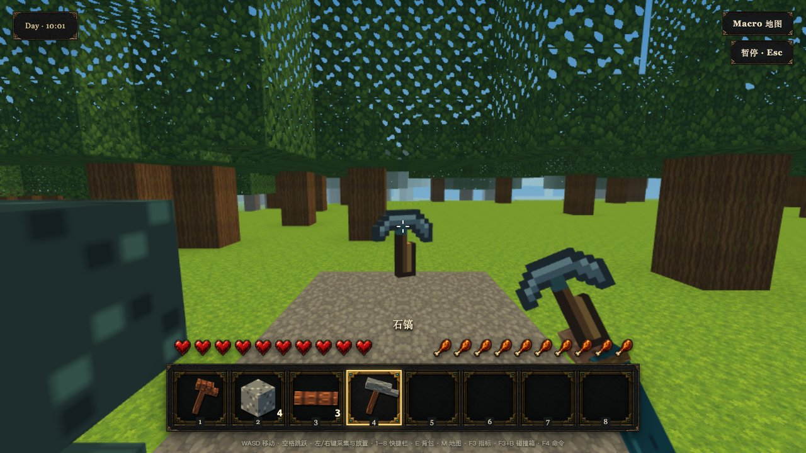

# 体素工具样板：明天从这里看

本切片让现有木斧和石镐变成有像素轮廓、真实厚度的工具，并修复挥动结束跳回握姿。手持和世界物品共享同一 Mesh；没有新增伤害规则、武器或物品格式。



## 亲自体验

在本功能分支运行 `pnpm dev`，打开命令输出的地址。选择推荐 seed `mosslight-68` 进入世界。

1. 按 F4，分别输入 `/give wood-block 2` 和 `/give stone-block 6`，再按 Esc。这里只是快速布置测试材料；正式玩法仍可自然采集。
2. 按 E，合成两次木板、一次木斧、一次石镐。点击工具，再放入当前快捷栏，或用数字键选择已有快捷槽。
3. 用鼠标观察工具侧面的厚度；按住左键采集，松开观察平滑收手。切换木斧/石镐，手掌和袖口持续保留。
4. 靠近生物并左键攻击，确认既有“攻击命中”反馈和挥动回位。该动作继续使用服务端既有命中与冷却规则。
5. 暂停后保存并返回主菜单，再继续世界，检查工具和数量保留。

丢弃目前只有 F4 的 `/drop <从0开始的槽位> 1` 调试入口，物品在脚下生成后会自动拾回。本次没有新增面向玩家的丢弃快捷键。图中的远处石镐是经生产 Store 布置的观察样板，走近后由真实权威拾取循环收回。

## 自动复现

```sh
pnpm test tests/client/voxel-tool-model.test.ts tests/client/gameplay-model-definition.test.ts tests/app/first-person-viewmodel.test.ts
SEEDLANDS_E2E_PORT=4187 pnpm exec playwright test changes/2026-09-07-voxel-tool-playable-sample/e2e/tools.spec.ts
```

截图保存在当次 `test-results`；仓库内 `evidence` 保留交付时的原始帧。截图不是帧率基准，不宣称完整美术批准。

## 对大路线留下什么

- WP05：第一组可玩的像素工具样板，木斧 404、石镐 488 个三角形，各一个渲染网格。
- WP06：现有手持/掉落两个真实消费者共享模型定义、Mesh 和资源生命周期；仍是内部第一方实现，未冻结资源包或 rig 合同。
- WP08：单次动作起止/重播和采集收手的确定性及浏览器证据；多轨道、权威阶段、冷却投影和剑战仍待独立合同。

下一步优先在这组样板上定义握点、模型支持子集和动作阶段映射，再选择一把剑/一种敌人的纵向切片；不要直接扩量全部模型或提前宣布 API v1。
