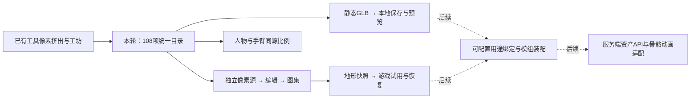
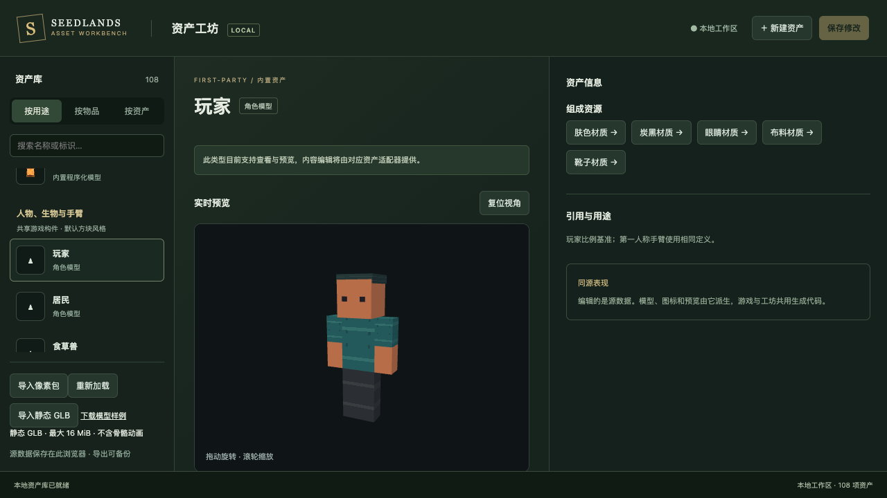
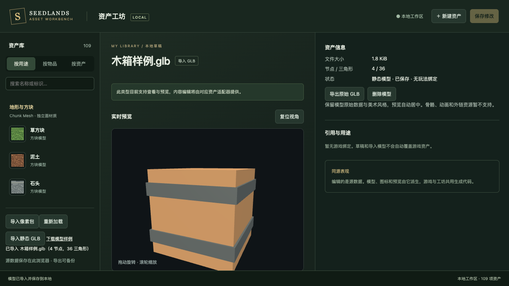
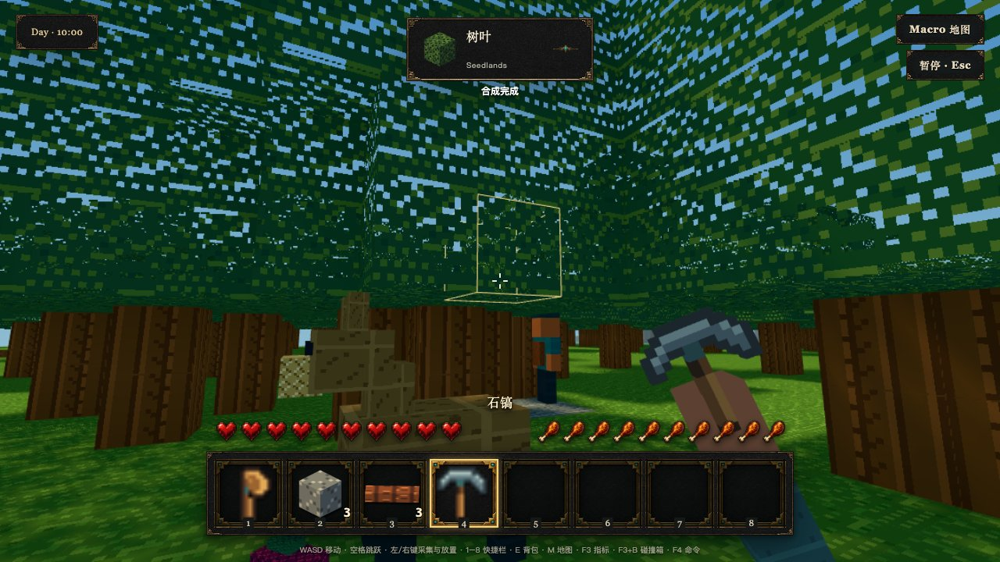

# 统一资产工坊验收路线

本轮交付的是可运行的统一资产入口：现有视觉资产可追溯，像素源可编辑，地形贴图能进入真实世界，外部静态模型可保存管理。

运行 `pnpm dev`，打开终端显示地址下的 `/asset-workbench.html`。本轮本机预览为 `http://127.0.0.1:4183/asset-workbench.html`；端口服务关闭后按上述命令重启。

## 三分钟看效果

1. **看统一目录**：按用途选“草方块”“水”“灯笼”“玩家”“居民”“玩家手臂”。模型在中间可拖动旋转、滚轮缩放，右侧能沿模型 → 材质 → 贴图追溯。108 项是资产记录总数，33 行是按用途展示数。
2. **编辑并试用**：泥土 → 泥土材质 → 泥土贴图 → 复制为草稿，选颜色绘制，保存，然后“应用贴图到游戏”。打开新游戏页面查看。继续改草稿不会影响已应用快照；“恢复此材质默认”后重新打开游戏恢复。
3. **导出图集**：在方块或像素贴图页点击“导出图集与索引”，查看生成结果，分别下载 PNG 和索引/独立源 JSON。这不是原生草稿包导入格式。
4. **导入模型**：点击“下载模型样例”，将该 GLB 通过“导入静态 GLB”选入。刷新后仍可预览；右侧可导出原始文件或删除。该模型不自动成为可放置方块或物品。
5. **看手持效果**：游戏中合成石镐/木斧，工具、快捷栏图标与掉落模型继续走同一套来源；手臂已换成同源方块比例，没有多余袖口隆起。

## 本轮与后续边界

当前只给地形贴图提供运行覆盖绑定；其他内置模型和材质可检视、依赖追溯，贴图可复制编辑。没有通用 3D 建模器或动画编辑器。默认 pixel16 是 16×16 tile，不是 16 bit 色深；旧 32/64 草稿保留。

## 实拍

这些是本机真实浏览器截图。游戏验收用 Harness 固定世界和测试数据，通过正式 World/Store 路径，不代表完整手工游玩或性能基准。
