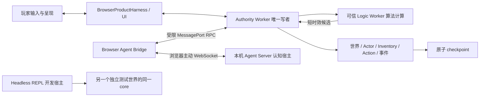

# 架构与复用决策

## 当前代码核查

本表来自 2026-09-09 源码阅读，属于静态证据，不是产品运行验收。

| 能力                | 已有入口                                                                                    | 缺口 / 本期处理                                                                                                                                                                        |
| ------------------- | ------------------------------------------------------------------------------------------- | -------------------------------------------------------------------------------------------------------------------------------------------------------------------------------------- |
| 唯一权威与固定时钟  | `packages/game-core/src/server/authority/authority-runtime.ts`、`authority-session.ts`      | 保持一个 owner；模型不能阻塞 tick 或另建世界                                                                                                                                           |
| Headless            | `packages/game-core/src/server/headless/headless-session.ts`、`scripts/server-headless.mjs` | 已是单进程多行命令循环，世界不会每行重建；仍是内存持久化、固定算法 Logic、无统一 Harness/显式 barrier/可移植 checkpoint。不能把“CLI→REPL”误写为从零加入持久进程                        |
| 浏览器 Harness      | `apps/web/src/app/game-harness.ts`                                                          | 混合世界操作、输入/画面/性能；`advanceGameplay` 明确抛错；主线程派生值不能充当权威 inspect                                                                                             |
| 算法 observation    | `server/authority/logic-observation-builder.ts`、`server/logic/logic-protocol.ts`           | 给可信 Worker 的多实体、多 Actor、POI/terrain 输入，TTL 200 ms；禁止原样转发模型，单独建立 Actor 感知投影                                                                              |
| 感知与导航          | `server/simulation/perception-runtime.ts`、`ground-navigator.ts`                            | 复用附近查询/遮挡和有界导航；感知 food/threat 偏 grazer/night-stalker，NPC 规则需补齐；未知地形不能被当空地，路径仍由正式物理解算                                                      |
| 真实 Entity / Actor | `server/gameplay/entity-store.ts`、`server/simulation/actor-state.ts`                       | 有 NPC/settler、持久标记、生命、需求和目标 POI；缺人格、认知记忆及受控 Agent lease，不能用 playerId 伪装 NPC                                                                           |
| Inventory / 玩法    | `server/gameplay/gameplay-runtime.ts`、`player-state.ts`                                    | `getInventory()` 等仍通过 `player(id)`；复用 Inventory/规则，抽出有身体 Actor 的最小访问端口，避免为 NPC 单独建作弊背包                                                                |
| Action              | `server/simulation/action-runtime.ts`、`actor-authority-rules.ts`                           | 有 pending/running/succeeded/failed/interrupted；start 自动替换旧动作，终态 Map 无显式限额。Agent 接入需仲裁与有界终态日志；食用限制 grazer、攻击限制 night-stalker 不等于玩家规则平权 |
| 授权                | `server/commands/command-contract.ts`、`server-command-executor.ts`                         | query/mutation/administrative 是粗分类，source 字段由调用方构造；不能作为外部 Agent 的最终授权。禁止转发全量 ServerCommand                                                             |
| 快照与持久化        | `server/persistence/`、`SimulationSnapshot`                                                 | 保留原子 checkpoint；扩展 NPC 角色和认知确认信息前定义版本/迁移，不把两个独立 save 叫一致                                                                                              |

相对路径以上均以 `packages/game-core/src/` 为根，明确标出的 Web/scripts 除外。相关现有测试入口：`tests/server/headless-session.test.ts`、`action-runtime.test.ts`、`poi-perception.test.ts`、`authority-checkpoint-restore.test.ts`、`item-inventory-recipe.test.ts`。新能力要补行为用例，不能仅使旧测试通过。

## 运行架构与所有者

Headless 世界和浏览器产品世界是不同实例，不能让 REPL 偷持浏览器世界的第二个写者。开发者要操作浏览器世界时，经 BrowserWorldHarness RPC 到其 Authority。Agent Server 的 Headless adapter 用于测试、场景验证或后续进程内实验；游戏内 Agent 连接只能拿到 ActorWorldPort。

| 层             | owner 与数据                                                                     | 工作                                                                      |
| -------------- | -------------------------------------------------------------------------------- | ------------------------------------------------------------------------- |
| Authority      | 全部世界事实、Actor 身份/身体、Inventory、执行状态、授权 lease、事件、checkpoint | 校验并提交；死亡/资源/物理规则；拒绝模型状态补丁                          |
| Logic Worker   | 派生观察与有界 scratch，无事实写权                                               | 感知/路径/执行候选；受 epoch、Actor revision、地形 revision 和短 TTL 约束 |
| 基础/反射仲裁  | Authority 决定优先级，算法提供建议                                               | 死亡与失效 > 受击/危险反射 > 已接纳动作 > 新 Agent 目标 > 无服务 fallback |
| Agent Server   | 一个 Actor 的认知循环、模型端口、临时上下文、预算计数                            | 根据受限事实/记忆形成目标或短计划；无 GameServer/Developer Harness 注入   |
| Browser Bridge | 连接与消息传递、客户端生命周期                                                   | 配对、绑定、速率/大小门禁、断开提示；不构造权威 observation               |
| UI / Presenter | 公开投影、动作姿态、对话事件、玩家输入                                           | 显示 NPC 在做什么以及实际后果；不能把模型“已完成”文本当事实               |

## 六层同时成立

执行层以语义 Action 接受目标，走同一材料、距离、工具、碰撞、耗时与生命约束。允许复用 Inventory、combat 和交互函数，但逐步消除内部 `player(id)` 假设；不为本期更换整个 ECS。玩家 UI 输入和 NPC 语义请求可有不同适配，最终调用相同规则 owner。

反射层：死亡立刻终止动作/撤销 lease；受击进入明确可中断窗口；路径失效停止速度并有界重算；未知 Chunk、危险或动作超时返回具名失败。需要算法计算时 Authority 先停住危险动作，不能等待 LLM 决定是否穿墙。反射优先级变更增加 `controlRevision`，此前模型决定即使迟到也不能夺回控制。

基础行为层：无 Agent Server 或预算不足时保持呼吸/受伤/生存规则、零期望移动或有界避险；不替玩家完成整个目标。可以食用自己已有的合法食物，但不能生成物品。已接受的不可逆原子效果只执行一次；断线中断持续动作后，不能回滚已经合法发生的消耗。

Agent 决策层：一次只有一个认知写者和一个模型调用；人格、需求、记忆、目标与最新观察组成上下文。目标推进以 Action 回执为依据，失败可改计划、求助或放弃；说话只是角色表达，不是提交证明。

Authority 回执层：接纳与完成分开，记录 request→decision→action→event→commit 的因果引用；被拒绝请求不能得到伪造 actionId。持久化层：保存真实身体/物品/终态及已确认认知，不保存模型隐式思考链；恢复时重新绑定并废弃旧异步响应。

## 依赖与框架选择

选择依据是到首个可验证体验的剩余集成工作，以下是静态适配判断，不是性能优越性结论。

| 方案                                                  | 与约束的关系                                                                                | 结论 / 重开条件                                                                                                                                                           |
| ----------------------------------------------------- | ------------------------------------------------------------------------------------------- | ------------------------------------------------------------------------------------------------------------------------------------------------------------------------- |
| 现有 HeadlessSession + Authority / Action / Inventory | 已有平台端口和纯逻辑；需要局部角色通用化、屏障和安全投影                                    | 主路径。复用可降低新增范围，但仍需平权合同的 RED/GREEN，不能从名字推断已支持                                                                                              |
| OpenAI Agents SDK 的薄本机宿主                        | 官方 SDK 提供 agent loop、tools、会话/状态和 provider 适配方向；不要求托管世界              | 作为首个模型宿主推荐候选，严格只注册 Actor 工具，限制单次决定；保留自己的 `CognitionProvider` 窄口，SDK 不进入 core/Web 世界状态。模型供应商未定，不把 SDK 等同锁定供应商 |
| Vercel AI SDK 薄调用                                  | 官方工具文档检索显示结构化工具和有界 loop，可作为同范围候选；本轮正文抓取失败，不能凭此淘汰 | 若实施前所选 provider 对 Agents SDK 适配不满足实际 schema/cancel/usage 合同，则在相同 adapter fixture 上核对 AI SDK；无需改世界协议                                       |
| 自建模型编排框架                                      | 会额外承担供应商调用、流、usage、超时和重试适配，当前无证据需要                             | 不采用。只写应用特有的 Actor session/预算/协议映射，这些是现有 SDK 不拥有的世界合同                                                                                       |
| 托管 Sandbox / 游戏服务器服务                         | 引入本期明确排除的每用户计算宿主，且不提供本项目权威规则                                    | 本期静态合同淘汰；后续部署需求改变时另行评估，不宣称更慢或更贵的实测结论                                                                                                  |
| 通用行为树、规划框架或换 ECS                          | 首个切面已有确定性基础，尚无必须完整迁移才能解决的缺口                                      | 先局部接缝；只有本切面无法表达/验证时重开选型，不能为了将来抽象扩大本期                                                                                                   |

[OpenAI Agents SDK 官方总览](https://developers.openai.com/api/docs/guides/agents)与[模型/供应商](https://developers.openai.com/api/docs/guides/agents/models)已于 2026-09-09 打开核对。SDK 的 tool/guardrail 不等于 Authority 的授权校验。具体包版本、许可证文件、供应链与所选模型账户可用性在 A2 安装前固定；本设计不声称完成依赖准入。[AI SDK 工具文档](https://ai-sdk.dev/docs/ai-sdk-core/tools-and-tool-calling)本轮有官方检索结果但正文未成功获取，候选状态为待核验。

## 长期接缝

未来 LOD 复用 `worldId/epoch/ActorId/simulationTime`、资源守恒、受限事件和 Action 终态；精度切换不能生成第二写者，逻辑时钟与 wall-clock 必须分开。当前存在 ACTIVE_RADIUS 等活动范围规则，不将它包装成完整模拟 LOD；本期固定测试活动范围并明示越界暂停/失败。

World AI 以后用独立主体和能力集，经事件、资源与规则效应器作用世界，不复用 NPC 的私有记忆权限。创作 Agent 使用 DeveloperWorldHarness；游戏内 Agent 使用 ActorWorldPort，不能因为两者都叫 Agent 而合并权限。未来 JS/玩法包 API 统一消费相同正式 Action/事件/存档，避免再次出现按控制者复制玩法规则。

## Agent Server 的可实施模块边界

A2 建议建立独立应用包 `apps/agent-server`（设计位置，当前不创建），与退役的 `apps/node-server` 无构建或生命周期依赖。core 只提供声明 exports 的 ActorWorldPort / 协议类型，Web 与认知宿主不互相 import。Node builtin、SDK 和网络只在应用适配，不进入 core；未来浏览器认知宿主实现同一 provider/session 接口。

| 模块                 | 输入 / 输出                                          | 生命周期与替换边界                                                                                                  |
| -------------------- | ---------------------------------------------------- | ------------------------------------------------------------------------------------------------------------------- |
| transport            | WS 或测试用 JSONL/进程内 ActorWorldPort              | 配对与连接不拥有世界；关闭时撤销 session，输出受大小和预算限制                                                      |
| actor-session        | 绑定身份、最新 observation、回执、认知缓存           | `unbound → ready → thinking → awaiting-action → ready`，异常到 fallback/disposed；同 Actor 串行，epoch 变化取消在途 |
| context-builder      | profile、goal、受限 observation、已确认记忆          | 输出有界 context；既不访问文件系统查询世界，也不把全局 Harness 当工具；预算不足优先截断低优先级旧描述并保留缺口     |
| cognition-provider   | context + Action catalog + abort signal + token 预算 | 输出一个结构化 decision（选择动作/等待、goal 提案、可选发言/记忆摘要）及 usage；SDK 外不依赖专有 session 对象       |
| decision-validator   | schema、可用动作目录、引用与额度                     | 只做预检；没有 world mutation 权，真正授权在 Authority                                                              |
| receipt-reducer      | Authority 接纳/终态/事件、memory ACK                 | 更新认知临时进度；接受回执才推进事实，checkpoint ACK 才确认可恢复记忆                                               |
| budget / diagnostics | 每次请求预留、实际 usage、取消/重试与字节            | session 总额耗尽停止新模型调用；取消后的供应商账单仍记录，不假定 abort 退费                                         |

SDK loop 每回合至多形成一个有世界效果的决定；tool 返回的 accepted Action ID 使本回合结束，终态通过下一轮 observation 唤醒。不能在同一次自动工具循环里继续猜测动作已经完成。需要发言时以角色事件单独提交且走同一速率限制，不让可选文本绕过动作/消息预算。开发启动配置固定模型 ID、供应商、端点白名单、预算、Origin 与角色绑定方式；样例只放无密钥占位，真实 API 调用在实施时按用户授权的开发凭据配置流程完成。
