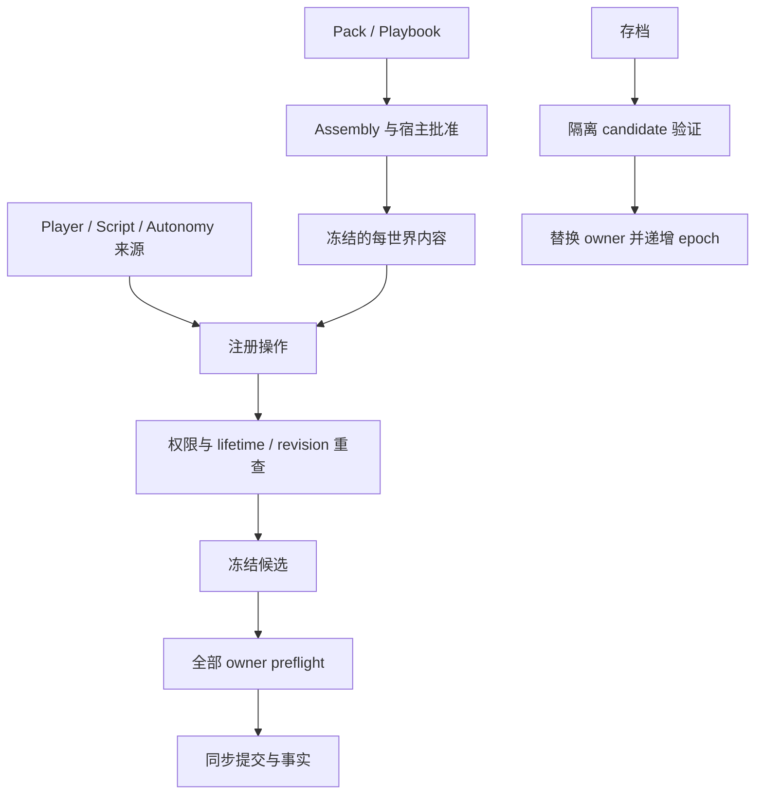

# S6 独立代码阅读与审阅记录

## Review identity 与结论范围

独立 reviewer：`s6_final_review`，请求 Sol/xhigh；按 base tree 的 Code Review Skill 只读审阅，root 将最终报告固化于此。合同 SHA-256 `c4ab1a73db2535711bb234dc35eda81a3faf40cb117e85f5fd599ff06277572e`。日期 2026-09-10。

- base / merge-base：`baeba098af506f0184b9344c04b9555f9750c20f`。
- 初始 head：`61901d38184622cc55052953281e2b00426f1477`。
- 生产修复：`50ff14c2d1a3c62cafbb3b85e18b789e33d10e9c`。
- 最终证据 head：`7c9561d94f315cbf5a4dfd8412d6fca244d576c4`。
- 最终 diff 480 文件，约 +46,581/-1,836，含 7 个二进制文件。

结果 `NO_REMAINING_FINDINGS_IN_REVIEWED_SCOPE_AFTER_FIX`。主要风险为跨 owner 原子提交、来源撤权、Station entity/voxel 双向一致性、迁移和每世界内容。本轮没有重新逐行审阅全部 S1–S3 历史 helper；覆盖账本及限制如下，不将此结论称为全量逐行审阅或可合并。

## 分层解释与阅读顺序

1. Assembly 精确选择一个 Playbook，稳定拓扑组合；重复、循环、缺 provider、版本冲突、未批准替换和越权在创建前拒绝。actor profiles、crafting、ecology 不隐式回填第一方数据。
2. `mod-api` 与 host export 分离；实际 ESM build/load 校验 manifest、lock、digest、同源和上限，导入后释放 object URL。独立样例只消费公开 API。
3. EntityStore 持有角色、库存、工位与掉落；GameServer 持有世界 voxel/chunk。已注册操作形成冻结 candidate/receipt，各 owner 重查 lifetime、revision、origin、geometry，全部 preflight 后同步 apply，再产生事实。
4. 持久 subject 区分 player、autonomy、script 和 developer；入口及延迟消费前重新检查当前权限、secondary actor、模块与 lifetime。撤权、旧引用和过期 epoch 拒绝。
5. 存档在同步 authority fence 捕获 gameplay/chunks；独立 candidate 验证 generator、composition 和 station checkpoint，失败保留当前运行时。恢复递增 epoch 拒绝迟到 Worker 数据；transfer 只移动派生数据。
6. Browser 发布当前世界 definitions/recipes/stations；Presenter 使用对应模型，工位 UI 持有 lifetime reference 并重查 revision。替代玩法覆盖真实 ESM、UI 与双向跨宿主恢复。

## Diff codemap 与关键修复

| 路径                                  | 职责与复核重点                                   |
| ------------------------------------- | ------------------------------------------------ |
| Assembly / Playbook / content modules | 每世界能力选择、provider、批准、冻结             |
| `server/gameplay/modules/*`           | 来源、候选、延迟新鲜度、事实                     |
| EntityStore / prepared mutation       | 角色、库存、工位、掉落的统一 owner               |
| `server/game-server.ts`               | 原始编辑保护、voxel owner 与 checkpoint          |
| Browser authority / Presenter / UI    | 当前 definitions、epoch、工位 lifetime、派生资源 |
| Pack builder/loader / examples        | 实际 ESM、完整性、公共导入边界                   |

`GameServer.edit()` 的 guard 位于 `game-server.ts:304-312`，`editBatch()` 位于 369-371；`gameplay-block-stations.test.ts:126-166` 验证原始创建/销毁拒绝且快照不变，以及不一致 checkpoint 不污染当前服务器。正常工位创建/拆除使用 station-aware prepared transaction；guard 不在 `World.edit` 或 `prepareVoxelEdit`。

`50ff14c` 修复：`server/gameplay/modules/combat-model.ts:18-29` 和 198-228 允许目标投影 `meleeDefinitionId: string | null`；`combat-host-environment.ts:91-119` 用 null 表示未配置；`combat-module.ts:92-105` 仅拒绝无近战定义的主动攻击者。`gameplay-registered-inventory-actions.test.ts:163-175` 覆盖无能力攻击失败且 snapshot 不变，以及玩家攻击同一目标成功扣血；不恢复 unarmed fallback。

## S1–S3 scoped review 覆盖账本

下列文件均位于当前 change。既有固定切片审阅提供当时发现与修复，本轮只对最终依赖的 owner、来源、保存、Assembly 和 Browser 关键接缝重新抽查。

| 范围                             | 记录                                                                                                                 | 提交                      |
| -------------------------------- | -------------------------------------------------------------------------------------------------------------------- | ------------------------- |
| S1                               | evidence.md、s1-evidence.md                                                                                          | 2e85898                   |
| S2 ECS/Action/Host/Save          | s2-evidence.md、s2a-evidence.md、s2b-evidence.md、s2c-action-evidence.md、s2c-host-evidence.md、s2c-save-evidence.md | 22b68c9                   |
| S2 allocator、致死恢复           | s2-review-fixes.md、s2-lethal-recovery-evidence.md                                                                   | 13b62f9、5ff491f          |
| S3 时钟/来源、跨 owner           | s3-clock-evidence.md、s3-origin-evidence.md、s3-atomic-checkpoint.md                                                 | df8a8f2、24ac343          |
| S3 攻击接纳/Needs/Combat         | s3-prepared-acceptance-checkpoint.md、s3-needs-checkpoint.md、s3-registered-combat-checkpoint.md                     | e0ceac6、37c1619、2686a5e |
| S3 Inventory/Mode                | s3-inventory-mode-checkpoint.md                                                                                      | 8475f49                   |
| S3 Block                         | s3-block-consumers-checkpoint.md                                                                                     | 2fcce5c、beb9ef2          |
| S3 Logic/Feeding/secondary actor | s3-logic-feeding-checkpoint.md、s3-secondary-actor-permissions.md                                                    | ad8d0eb、6354199          |

## 测试与证据限制

reviewer 核对六份 root 日志尾部及 SHA-256，与 `evidence/s6-local-results.json` 一致：源码 `50ff14c` 的 static 1759 passed/4 skipped、330 文件、Svelte 0/0、types；独立 build；生产 Browser 10/10；dev regression 21/21；木剑/资产/Harness 5/5；CI 同命令 10/10。后续两个 metadata commit 没有生产源码变化，不冒称已对其重新运行完整本地门禁。

三张原始 PNG 1280×720 已查看并比对 Git blob；Midscene 结构化结果 1/1、3 assertions、39.474s，只作视觉补充。reviewer 未自行运行 tests/build/Browser；4 个 Wasm binary 未反汇编或自行证明源码等价，root 的实际 Rust/TS 等价测试属于独立运行证据。没有物理 GPU、移动设备、主观音频或性能结论。远端 CI/PR/mergeability 由 root 后续另行读回，不纳入本报告结论。

## 人类复核建议

1. Assembly/provider 与宿主 allowlist：阻止隐式内容和未经批准替换的首道边界。
2. GameServer.edit/editBatch、工位联合提交及 checkpoint：ECS 和 voxel 双向一致性的关键位置。
3. Browser restore epoch 与 definitions 传播：结合真实操作核对资源销毁、恢复和自定义模型。

## 后续冷启动配置 delta 复核

同一 reviewer 在原预算内只读复核 `2c21f2f` 后的 `apps/web/vite.config.ts:16-20`，文件 SHA-256 `b52b085e246ffee8571976b39433519a907556d0f5595cae9a2e3d5b64f99187`。未发现 P0/P1/P2。当前 Vite 7.3.6 的实际源码支持 `>` 嵌套依赖解析；Web 正式依赖 core，core 正式依赖 bitecs 0.4.0，预扫描准确指向该依赖，不扩大 Web 依赖或 core 责任。optimizer 属于 dev 路径，不改 Rollup 生产输出、协议或测试拒绝规则。reviewer 未运行测试，配置字节和 root 冷启动 RED/GREEN 另行核验。

## 独立审阅 Findings

最终 `7c9561d` 在已审阅范围内，未发现剩余可证实的 P0/P1/P2 问题。

已关闭 P1：`61901d3` 无近战定义目标无法受击，由 root 首轮 full static 发现，`50ff14c` 已修复并补实际 owner 正反例。早期 Station raw edit 与旧 generator 保存问题也已在最终路径回读闭合。

Coverage：部分。本轮深读最终跨层集成、S4/S5、Combat 修复和 metadata delta；S1–S3 结合上述 scoped review 与关键接缝复核，不声称全量重审历史 helper；Wasm binary 和远端平台状态不在独立验证范围内。
