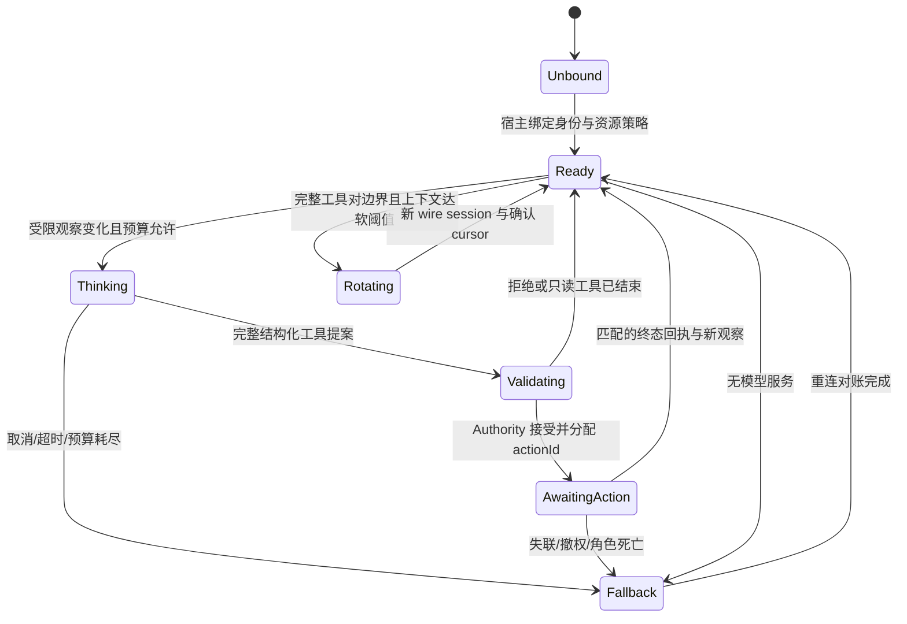

# 下一阶段：单角色认知回路与交付路线

2026-09-09 设计基线。用户的最终验收是玩家与有性格、目标、真实身体的 NPC 在浏览器共处，按同样规则交互并留下痕迹。本轮 H1/H2 提供开发底座；下面是 A1–A3 的实施合同输入，不冒充已经实现的 NPC 能力。

## 1. 核心回路与所有者

**Observe → Decide → Authorize → Execute → Receipt → Update context** 是一次闭环。Authority 拥有世界、规则、Action 和回执；认知宿主只拥有模型请求、草稿计划和短期上下文。观察里的对话、告示牌、角色记忆均是不可信内容，不得改变工具、身份或授权。

一次模型决定可以做有限只读查询；收到第一个世界 mutation 提案后立即离开模型回路，验证、提交并等待。工具先返回 `accepted + actionId`，不能返回“移动完成”。accepted 工具对写入 wire history 后结束该图段，不为凑出一句自然语言结束语再调用模型。世界的 succeeded/failed/interrupted 回执作为下一次唤醒的事件输入。长动作不占用 LLM 请求，也不以每帧轮询 LLM 等待完成。

LangGraph 节点划分为 `assemble-context → model → validate → submit → await-receipt → reconcile`；只读工具回到 model，但受步数和总 token 限制。submit 与 interrupt 必须是两个节点，恢复会重跑 interrupt 节点；真正副作用仍由统一 request ledger 去重。框架选择与实测缺口见[框架决策](framework-decision.md)。

每个被控制 Actor 同时只有一个决策 lease、一个模型请求和一个前台 Action。模型调用返回时再次核对 world epoch、Actor incarnation、control revision、policy revision 和观察有效性。过期草稿丢弃，不因为模型花过钱就执行。对已发生的合法物品消耗不回滚。

## 2. 执行频率和预算默认值

以下均为**首轮工程配置**，不是已证明最优的频率。所有上限集中配置并进入 trace/config hash；调参必须用同场景证据。

| 层              | 初始节奏                                                                                  | 谁执行 / 超限行为                                                                        |
| --------------- | ----------------------------------------------------------------------------------------- | ---------------------------------------------------------------------------------------- |
| 身体/碰撞       | 复用 Authority 物理时钟，默认 60 Hz，可用既有档位                                         | Authority；不被 LLM 调用阻塞                                                             |
| 玩法与执行      | 沿用既有玩法 lane（默认 20 Hz），Action 的导航/交互按 owner 调度                          | 同玩家规则；不新增“Agent tick”热循环                                                     |
| 反射            | 在发现死亡、受击、路径失效的当前权威提交或下一个相关 tick 处理                            | 先停止危险/无效执行，再排认知事件；不等待模型                                            |
| 基础行为        | 首版上限 5 Hz 的有界目标/路径评估，执行继续由物理驱动                                     | 无连接可 idle、避险、使用自己已有合法食物；不凭空生成物品                                |
| 观察推送        | 最多 2 Hz 合并状态；终态、死亡、玩家直接交流等事件及时投递                                | Browser Bridge 只订阅授权投影，有界缓存，重复状态不唤醒模型                              |
| 模型决定        | 事件驱动；普通事件最短间隔 5 s，合并窗口 250 ms；无新信息不调用                           | 一 Actor 一请求。正在执行时普通环境变化合并，关键失效先由反射中断                        |
| 空闲检查        | 30 s 检查一次本地需求/目标是否变化                                                        | 检查不是模型请求；有变化且预算允许才唤醒                                                 |
| 初始费用预算    | 每 Actor 活跃小时最多 120 次请求、2M 输入 token、64K 输出 token；每次最多 4096 输出 token | 三个任一先耗尽即 fallback；先预留再发送，用实际 usage 结算；unknown usage 按预留上限记账 |
| 模型 deadline   | 一次请求 20 s，整个决定 30 s，最多 3 次模型轮、4 个只读工具、1 个 mutation                | 无效结构最多 1 次纠错且计入总额；网络重试最多 1 次且不得重试世界副作用                   |
| Action deadline | 移动初值 30 s、拾取/食用 5 s；具体规则可更早失败                                          | Authority 时间而非模型 wall-clock；暂停不耗模拟 deadline，连接 lease 按 wall-clock 失效  |

受到攻击时立即处理身体和控制 revision，认知调用仍遵守并发/费用上限；“高优先级”不能突破预算。连接检测初值 5 s heartbeat、15 s lease；后台浏览器冻结不声称持续模拟，重新激活先重连与对账。本期不实现离线补算。

Flash/low 是首个模型配置候选，Pro/high 是质量对照候选。人格靠 profile/目标权重和记忆；不使用 thinking 模式下无效的 temperature 控制人格。真实延迟、成功率、每分钟 token 和玩家可感知停顿在 A2/A3 回填。预算耗尽可以让玩家看到“伙伴暂按基础行为活动”的状态，不泄露模型私有推理。

## 3. 模型工具面

工具是应用对**同一资源 API**的语义包装，不是 core 的新 Agent RPC。工具 schema 从已授权资源目录投影；Authority 仍逐请求验证，不因模型看不到工具就省略鉴权。初版只注册下表，不注册 shell、文件系统、浏览器开发全局 inspect、原始 JS、任意状态 patch。

| 工具 / 参数形状                                   | 资源和返回                                      | 界限                                                                                        |
| ------------------------------------------------- | ----------------------------------------------- | ------------------------------------------------------------------------------------------- |
| `observe({sinceCursor?})`                         | 当前主体可见状态、增量事件、新 cursor、gap      | 单次最多 32 事件、16 可见对象、8 KiB；缺口显式标记，再取授权全量投影                        |
| `inspect_visible({targetRef, fields})`            | 感知投影中的短期目标引用，可见字段白名单        | 最多 8 字段；引用不能用猜测 EntityId 绕过可见性；遮挡/消失后失效                            |
| `inventory({})`                                   | 自身物品/装备/可用数量，资源 revision           | 不给他人背包、隐藏掉落物全表或稀有资源全局坐标                                              |
| `available_actions({targetRef?})`                 | 授权且当前可执行的 Action schema、条件/失败原因 | 列出不等于预留；执行时重新验证数量、距离、视线、工具和状态                                  |
| `act({type, targetRef?, args, expectedRevision})` | 普通命令 → accepted/actionId 或具名拒绝         | 初始 move-to/pickup/eat；一轮一个 mutation；位置目标限已观察可导航区域，不能直接设速度/坐标 |
| `cancel({actionId, reason})`                      | 自己拥有控制权限的 Action 中断请求              | 中断回执才确认终止；已完成效果不回滚；不能取消别人的动作                                    |
| `say({text, targetRef?})`                         | 正常游戏交流命令、可见/可听事件                 | 最多 280 字符，按距离与频率；不是系统公告或命令注入                                         |
| `remember({claim, evidenceRefs, confidence})`     | 自身认知资源的提案，保存“相信什么”及来源        | 最多 512 字符、8 证据引用；不能把猜测提升为客观事实或写他人记忆                             |

所有 args 用版本化 JSON Schema、本地验证与 `additionalProperties:false`；数值必须有限、有界，数组/文本有长度上限。模型不能传 principalId/role/grant 作为授权依据。宿主把调用绑定为 `(worldId, epoch, principal, policyRevision, sequence, requestId)`；目标资源由命令解析器推导并验证，不能由调用方任意声明“这是只读”。

人格最小 profile 包含稳定身份描述、社交口吻、风险偏好、目标优先级；当前目标、短计划和情绪可变。玩法类型（settler/动物等）与控制方式、人类/模型标签正交；不同控制者不改变吃饭、伤害或建造规则。

## 4. 上下文组织与超长轮换

应用初始目标 8–16K 输入，32K soft / 48K hard（包含工具 schema、消息与 wire reasoning），另留 4096 输出。1M provider 容量不用于无限追加。没有可信 tokenizer 时按 UTF-8 byte 数保守估计并留 20% 余量；拿到 usage 后校准，不能按汉字数当 token 数。

| 分区                     | 软预算 | 内容与更新                                                                                   |
| ------------------------ | -----: | -------------------------------------------------------------------------------------------- |
| 稳定前缀                 |     4K | 身份/人格、规则摘要、工具 schema、权限版本；低频变动有利于前缀复用，但不声称已经获得缓存收益 |
| 确认记忆/目标            |     4K | 当前目标、确认经历、带来源的 beliefs/claims；时间与知识范围明确                              |
| 当前观察                 |     4K | 身体/需求/自身 Inventory、可见对象、可用动作、最近 Authority cursor                          |
| 最近完整交互             |     8K | 完整 tool call/result 对、终态事件、重要对话；去重但不凭空补事实                             |
| provider wire 保留与余量 |    12K | 本轮/历史私有 reasoning、协议包装及突发事件；不出现在玩家可读记忆或普通日志                  |

达到 32K、单目标结束、epoch/权限变化或旧数据不再可见时评估轮换。只在无在途模型、无悬空工具调用的边界创建新 wire session；正在动作中可保留 actionId/accepted 对和确认 cursor，不能复制一份执行器。旧 session 只保留有界、访问受控的诊断元数据，私有 reasoning 不进入游戏存档。

轮换步骤：停止新 decide → 完成/取消并丢弃未提交模型草稿 → 对账 Authority → 将事实引用、目标和近期完整交互构建为新 session 的输入 → 验证 token 上限 → 原子切换 context generation。旧 generation 的迟到响应被拒绝。新模型摘要仅是带来源的候选；若费用不足，确定性裁剪低优先级旧描述并标明遗漏，不强制调用另一模型做总结。

DeepSeek 使用 tools 时不能在同一连续 history 中删除 reasoning。轮换必须新建自洽历史；不要把被删掉 reasoning 的旧 assistant turn 继续原样发送。过大 tool result 返回摘要/分页 cursor，超长不可解析输出整轮拒绝；不能把截断 JSON 当合法 Action。

## 5. 统一身份、资源与权限

世界协议只认识 **principal / role bindings / policy / resource / operation / scope**。Web 玩家适配、开发 REPL、脚本、API 和认知宿主全部走它；Agent 只在应用产品命名中存在。世界的 domain Actor 是身体/身份概念，不是模型身份。

资源目录由领域 owner 注册：稳定 resource id、schema version、可读字段/投影、操作 schema、目标解析器、scope evaluator、执行器、事件与审计规则。配置角色只组合已注册资源权限，不能注入执行代码，也不能给不存在的资源自动授权。默认拒绝、deny 优先、未知资源/操作拒绝；开发全权是宿主明确授予的角色，不能由消息 source 字符串触发。

数据资源包括 world identity/voxel/chunk、Entity 身体、Actor 身份/需求、Inventory/装备、Action/终态、事件/trace、认知记录和 checkpoint；管理资源包括时间、场景创建、策略管理与恢复。`own`、可见、指定区域等 scope 由 Authority 的实时状态判断，跨多目标命令检查全部目标；投影发生在序列化前，错误不能泄露隐藏对象存在性。策略变更提升 revision，撤销订阅、lease 和失效在途决定。

H1/H2 实现现有世界开发资源与命令的通用策略接缝；A1 扩展普通 Actor 玩法资源、局部感知投影和可见目标引用。不能把今天的全局开发 inspect 直接挂给模型，也不把“现在已经同源可信”当未来公网安全证明。配对的本机 WebSocket 仍由浏览器主动连接；Bridge 检查帧/连接/序列，Authority 做最终授权。所有入口的 policy engine 相同，可信管理端口可用的方法集合仍与普通角色端口分离。

保存不再采用上一轮拟议的 core `agentState` 专属字段。后续由 gameplay/domain owner 版本化持有通用 Actor profile/goal/knowledge 资源、Action terminal ledger 与命令回执；这些资源同 canonical/gameplay frontier 原子冻结。SDK checkpoint、连接密钥、grant、模型私有 wire history 不进入世界真值。旧存档通过显式迁移得到空的可选认知资源，未知版本或缺少声明必需块必须拒绝，不做部分恢复。具体 schema 由 A1 spec 固定，不能偷偷在 H1/H2 改存档版本。

## 6. 接下来按什么顺序交付

| 阶段                | 可交付切面与准出                                                                                                                | 长期延续                                                           |
| ------------------- | ------------------------------------------------------------------------------------------------------------------------------- | ------------------------------------------------------------------ |
| H1/H2（本轮）       | 同一开发世界端口、持续 REPL/JSONL、Browser Authority RPC、权限接缝、时钟/屏障/trace/完整 checkpoint；分类 F3 与真实指标         | 后续所有世界能力两宿主同步，呈现能力只在 BrowserProductHarness     |
| A1                  | 正式 Actor Inventory/交互平权、move/pickup/eat、反射/fallback、局部观察、控制仲裁、终态/回执与保存迁移；用 scripted driver 验证 | 不扩通用行为树/大规划器；保证身体、资源守恒和普通规则              |
| A2                  | LangGraph + DeepSeek wire 适配、预算/上下文轮换、本机双向 Bridge、通用授权资源与重连对账；Flash/Pro 真实协议准入                | 所有模型依赖在认知宿主，可替换模型/运行位置；core 不认识 Agent     |
| A3                  | 一个玩家与一个有性格和独立目标的 NPC，拾取/食用/协作建造或采集/交流，玩家打断后调整，保存再入仍有后果                           | A1/A2/A3 是一个完整 Agent MVP 的内部里程碑，不拿孤立服务当产品交付 |
| 后续 Simulation LOD | 精度切换、休眠、离线追赶的独立合同与连续性证据                                                                                  | 复用 epoch/revision、Action、守恒和事件；不靠模型补写历史          |
| 后续 World AI       | 聚落/区域主体、预算与信息边界                                                                                                   | 新的资源主体与正常效应器，不能越权读 NPC 私密记忆或直接 patch      |

Agent MVP 的否决项：穿墙/瞬移、复制物品、知道未观察秘密、模型口述被当作已完成、重复回执重复副作用、权限标签提权、重入丢失身体/物品后果。人格通过相同情境下谨慎/冒险 profile 的可解释选择差异验证，不以“能聊天”代替。

下一阶段实施前以本方案冻结 A1–A3 的细化 spec、工作量和模型实测预算；不要求重新讨论已确定的产品目标。真实模型测试需要合法可用凭据，但 H1/H2 的完整交付不依赖模型账户。
