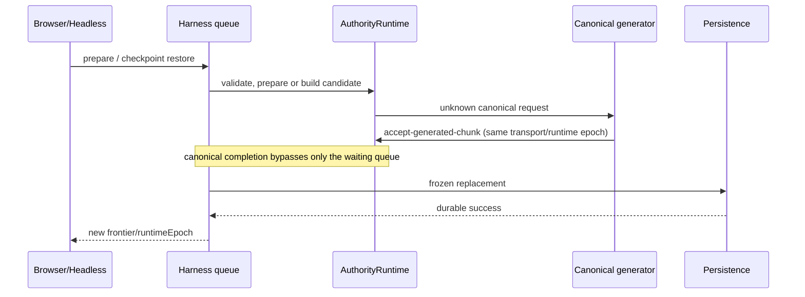

# Seedlands H1/H2 世界 Harness：独立设计与实现审阅报告

审阅日期：2026-09-09（Asia/Shanghai）  
固定审阅合同：`changes/2026-09-09-developer-world-harness/contracts/independent-review.json`  
合同 SHA-256：`e8728beb32caa35973c284cbffdaa42836f684c32df6aadbec287b4aa0ad85ab`

## Review identity 与范围

- 冻结 base：`3c93101861925b0faa89b143993059f36b5fafe3`。
- 审阅的最终源码 head：`23a0445a40d95c7b1083470ce60a487931454372`；merge-base 是 base；最终范围为 120 个路径、7788 行新增、696 行删除。
- 先审 `base..12f379d`，随后精确复审 `12f379d..e37b32b`、`e37b32b..ed9e3ae`、`ed9e3ae..6a7e270`、`6a7e270..2cec030`、`2cec030..f127d6e`、`f127d6e..96322c8`、`96322c8..23a0445`。受改或新读文件均由 `git show <SHA>:<path>` 读取，未把共享工作树 WIP 或未跟踪截图混入 source 结论。
- 规则从 frozen base 的 `AGENTS.md`、`docs/repository-structure.md`、`docs/code-map.md` 和 Seedlands Code Review Skill 取得；head 的 spec/文档不豁免自己。

本审阅没有修改生产代码、Git 或外部系统；未运行全量 suite/build/Browser，未安装依赖、调用模型或访问密钥。

## 一句话结果与风险热点

最终源码已关闭本审阅在首候选发现的授权披露、非法 Logic 状态写入和 trace 零上限问题，并补齐 Browser prepare 的真实 canonical 安装、restore 后 monotonic clock 与 epoch-local Logic tick 边界。`96322c8` 再补 Authority 绑定身份的回归断言和窄视口诊断复选框布局；`23a0445` 以 `#debug` 限定 label selector，避免全局 `#ui label` grid 规则覆盖。Root 已报告该 SHA 的无重试 UI 1 通过和截图视觉确认。本审阅的 source 复核未发现剩余可证实 P0/P1/P2；23 的 static/build 终态仍待 Root。本报告不等价于批准、合并或完整验收。

## 变更分层

### 统一 Authority 与权限

`AuthorityWorldHarness` 把 identity、inspect、prepare、command、clock、logic、actions、barrier、trace、checkpoint 收敛为结构化 `WorldHarnessResult`。权限以宿主配置的 principal/resource/operation/target 为锚，默认拒绝；Headless 和 Browser 均由唯一 `AuthorityRuntime` 持有世界事实。

最终修复将 `query-observation/query-pois/query-path` 标成 world scope 的开发查询，restricted self principal 无法获得；执行端给 range/radius/path target 256 blocks 上限。Logic mode/batch 在改变 mode 或消费候选前完整验证；`trace(read, limit:0)` 返回空数组。

### 恢复、时钟和 barrier

restore 构造候选 runtime、成功 durable persistence 替换后才 activation/暂停/清输入并交换 owner；stable transport epoch 与动态 runtime epoch 分离，旧 RPC/input/Logic 不会重标新世界。barrier 用捕获 frontier、通知和 timeout，而非 sleep；当前 Fluid 至多一个 in-flight lease，issued/settled 是连续水位。

最终 `ready()` 只读 `session.currentSnapshot`，不再以历史 start time 调用 `wake()`；paused advance 后 Logic batch 从 session 当前 physics tick 判定过期。Frozen snapshot 不保存 runtime physics tick：restore 开新 epoch，activation 增加提交，跨宿主 tick 比较必须使双方从同一 snapshot restore 后再推进。

### Browser prepare、派生 cache 与输入

Browser `world.prepare` 先发送 core harness RPC；无效请求直接结构化返回且不做产品 mesh I/O。core 成功后才一次准备 mesh，再显式请求 Authority collision baseline 安装 canonical，因而不依赖合法省略 canonical 的 mesh payload。未知 chunk 的 canonical completion 是唯一绕开 Harness operation queue 的消息：它仍在同一 Authority Worker、验证 transport/runtime epoch 后同步提交，以唤醒正在等待 canonical 的 prepare；其余普通消息仍排队。

Browser restore 重绑 Logic、snapshot gate、world seed/generator getter、mesh/audio/player consumer，generation gate 丢弃旧 compute；world edit/legacy migration 绑定当前 Authority player，而非调用方提供的旧 actor 标签。

### JSONL、诊断与框架材料

JSONL 使用白名单 RPC、单请求背压、普通行 1 MiB/restore 行 96 MiB 增量 framing，以及 typed-array 的 canonical base64。诊断区分 config/estimate/observed/unavailable：首个真实 save 前及 restore 后 storage bytes unknown，FPS 首 500ms 前 null，坏/取消 ACK 不沿用上次成功耗时。framework decision 固定 DeepSeek 客户端一手源码 commit/hash，mock probe 明确不代表真实 SDK/模型运行；嵌套 persistence Worker 的数量归因正确。

## 推荐阅读顺序与时序

1. `spec.md`、`agent-harness-design.md`、`framework-decision.md`。
2. `world-harness-contract.ts` → `authority-world-harness.ts` → `world-authorization.ts` → `gameplay-command-handler.ts`。
3. `authority-runtime.ts`、barrier/checkpoint state、`headless-session.ts`。
4. JSONL transport/CLI；随后 Browser client/worker/persistence/session/world restore。
5. diagnostics projectors/UI 和 Browser parity E2E。

## Diff codemap

| 路径 / 符号                                        | 作用                                        | owner / 关键不变量                                 |
| -------------------------------------------------- | ------------------------------------------- | -------------------------------------------------- |
| `server/harness/*`                                 | world RPC、授权、barrier、trace、checkpoint | AuthorityRuntime；structured error、frontier/epoch |
| `server/headless/*`、`scripts/headless/*`          | 无 DOM REPL/JSONL                           | 同一 Authority；bounded framing、dispose           |
| `server/authority/authority-runtime.ts`            | session/Logic/prepare/persistence           | 单 Authority writer；不回拨 clock                  |
| `client/authority/*`、`worker/authority-worker.ts` | Browser transport、baseline、restore        | stable transport epoch + runtime epoch             |
| `app/world/*`、`browser-worker-session.ts`         | Browser 派生消费者                          | restore generation 丢弃旧派生                      |
| diagnostics/UI/compute files                       | F3 可见投影                                 | observed/estimated/unavailable 分离                |
| framework experiment/docs                          | 决策与限制                                  | 一手来源；无真实模型运行声称                       |

## 测试与证据边界

### 本审阅实际执行

- 校验独立审阅合同 SHA-256 为 `e872...85ab`。
- 对候选 JSONL/CLI 做过连续 RPC 定点复现：`inspect(null)` 得 `WORLD_REQUEST_INVALID`，后续 `identity()` 成功，进程退出码 0。它只证明该畸形输入的连续性。
- 尝试 `pnpm vitest run tests/app/debug-diagnostics.test.ts tests/compute/kernel-diagnostics.test.ts`，pnpm 在无 TTY 依赖目录清理前置检查以 `ERR_PNPM_ABORTED_REMOVE_MODULES_DIR_NO_TTY` 中止；未安装、未改依赖、未重试，记为 `NOT_RUN`。

### Root/实现方执行（本审阅未重跑）

- 首候选 `12f379d` 的无重试 Browser 有两项失败，root coverage 1157 通过/4 失败；失败没有被当作通过证据。
- `e37b32b` 无重试 UI 通过，但跨 seed canonical 仍为 6→0；`ed9e3ae` 又暴露 restore response 的 monotonic clock failure；`6a7e270` 暴露真实 prepare queue dependency；这些失败均保留，分别导致 baseline refresh、read-only ready/current tick、canonical completion queue exception 与对称 restore fixture 修正。
- Root 报告 `f127d6e` 的真实 Playwright 无重试 Browser 两项均通过（11.7s）：跨 seed canonical=6、Headless↔Browser 往返 world/actor/action/frontier、restore/run/PointerLock/KeyW，及 UI 流程。`96322c8` 的 Harness 两项无重试通过（11.9s）、资产两项通过（6.4s）；`23a0445` 的 UI 无重试一项通过（5.0s）且截图由 Root 视觉确认。三组证据按各自 SHA 记录，不能合称为 23 的全套 Browser 验收。本审阅没有运行浏览器，故都属于 Root 的执行证据，而非自身测量。
- Root 另报告：`96322c8` production source 的独立 build 通过；FULL_CHROMIUM/SWIFTSHADER/Low 近战门禁 1 通过（12.1s）、旧 combo 软件环境 1 通过（10.4s），隔离 base `3c931`/当前 source 的原 Chrome 对照各 1 通过（6.7s/5.3s）。首次 old-browser regression 的 19/20 与一项失败保留为历史证据，但没有可归因到本变更的复现。`23a0445` 的 static/build 正由 Root 重跑。

### 仍未覆盖

未逐行穷尽最终 120 路径：CI/README/工具配置、部分浏览器产品和既有回归测试只作 diff/read ledger 级检查；未验证真实 SDK/模型、故障注入的 IndexedDB 崩溃原子性、完整 suite/build 或 Root 尚未完成的 23 static/build。未跟踪 `changes/.../evidence/` 截图不属于 `23a0445` source。

## 最终 source 哈希复核

下表是 final head 已重新阅读的首候选关键文件与后续增量，均由 `git show 23a0445:<path> | shasum -a 256` 得出。

| 路径                                                                   | SHA-256                                                            |
| ---------------------------------------------------------------------- | ------------------------------------------------------------------ |
| `packages/game-core/src/server/authority/authority-runtime.ts`         | `6f4f2ff16e39ec3720514e8f62cc045e628bde81ed5381f971aeaf4a198c9220` |
| `packages/game-core/src/server/harness/authority-world-harness.ts`     | `a97495e3fb3eada96a2c785d59aa78c8065a3ea63031bf27caacf1ee271fda19` |
| `packages/game-core/src/server/harness/world-authorization.ts`         | `79ef077041cdc0319e6770a7bf205c8e0e92ee9c83ed1f5391d7a8d7ad79c949` |
| `packages/game-core/src/server/harness/world-harness-state.ts`         | `10098ab5c3f67cf54a0ab72b0a6f7a7e69bbbbfc380fe0e82eff235197864b66` |
| `packages/game-core/src/server/harness/world-harness-validation.ts`    | `675e2f4f73d54f69948e4ed55f04a5b20e044d613ba7b6b1fdf6f60e4f138b87` |
| `packages/game-core/src/server/commands/gameplay-command-handler.ts`   | `5fb8bf9503ce5a9424eeb0318c28fcbe322881142dde4354f44e64f870f25b6d` |
| `apps/web/src/worker/authority-worker.ts`                              | `5276fc7fcead79bde14647622b8604ca80e1a83b2af479ad64c5cc46c6ea82d1` |
| `apps/web/src/client/authority/browser-authority-client.ts`            | `1046a9a4482bb72384a4afdd412754e7ea8283ad81b5c8c8482f7ecea0b51c6a` |
| `apps/web/src/client/authority/browser-authority-chunk-client.ts`      | `1641d7bb9322473af5462203a211a247143c3f4764f3280cc9135d6614303a9a` |
| `apps/web/src/client/authority/authority-collision-baseline-client.ts` | `63a9119a670abc630b48990fe2473673baaddc280e8ac58a06a6671353d6643f` |
| `changes/.../e2e/browser-world-parity.spec.ts`                         | `fd5bd7b4b7533b2d7e46c1405796e1a35af24d770adf27d24167667a328826ef` |
| `changes/.../spec.md`                                                  | `77b038da61aeab42a4fefe52353b07e367337f124bb1f086862af141a8ba007d` |
| `changes/.../implementation-harness.md`                                | `0f2b7b4bd49832492474b66e7d8d7c468f19fafd40428341496906886a5ae6ad` |
| `apps/web/src/app/ui/runtime-diagnostics.svelte`                       | `7fea9883eab7b2a9712d3fc9967f2cee7343ebfa0424baa0a106946b274a899e` |
| `tests/app/world-authority-commit-routing.test.ts`                     | `6ff05edc69eeeb5f784ecae768fb9f990266d0861930380c92544d7bd9f1ab70` |

## 120 路径覆盖账本

状态定义：**深读**＝沿入口、状态/错误链和消费者阅读；**diff 读**＝核对 diff 与职责、未作逐行语义审查；**生成/资料**＝只核对来源/合同；**未覆盖**＝本轮没有有意义阅读。原始候选为114路径；后续修复和最终 UI/绑定身份回归断言使范围扩展为120路径。

- [diff 读] M `.github/workflows/ci.yml`
- [diff 读] M `.ls-lint.yml`
- [diff 读] M `.prettierignore`
- [diff 读] M `README.md`
- [diff 读] M `README.zh-CN.md`
- [深读] M `apps/web/src/app/browser-worker-session.ts`
- [diff 读] A `apps/web/src/app/experimental/game-runtime-diagnostics.ts`
- [diff 读] M `apps/web/src/app/game-frame-loop.ts`
- [diff 读] M `apps/web/src/app/game-harness.ts`
- [diff 读] M `apps/web/src/app/game-ui-projection.ts`
- [diff 读] M `apps/web/src/app/game.ts`
- [diff 读] M `apps/web/src/app/player/player-controller.ts`
- [diff 读] M `apps/web/src/app/ui/app-root.svelte`
- [深读] A `apps/web/src/app/ui/debug-diagnostics.ts`
- [深读] A `apps/web/src/app/ui/runtime-diagnostics.svelte`
- [diff 读] M `apps/web/src/app/ui/ui-contracts.ts`
- [深读] A `apps/web/src/app/world/browser-world-restore.ts`
- [深读] M `apps/web/src/app/world/world-runtime.ts`
- [深读] M `apps/web/src/client/authority/authority-collision-baseline-client.ts`
- [深读] A `apps/web/src/client/authority/browser-authority-chunk-client.ts`
- [diff 读] M `apps/web/src/client/authority/browser-authority-client-contract.ts`
- [深读] M `apps/web/src/client/authority/browser-authority-client.ts`
- [diff 读] M `apps/web/src/client/authority/browser-logic-client.ts`
- [深读] A `apps/web/src/client/compute/compute-worker-diagnostics.ts`
- [深读] M `apps/web/src/client/compute/compute-worker-pool.ts`
- [深读] M `apps/web/src/client/persistence/browser-chunk-persistence.ts`
- [diff 读] A `apps/web/src/client/persistence/browser-frozen-snapshot-write.ts`
- [diff 读] M `apps/web/src/compute/kernel-memory.ts`
- [diff 读] A `apps/web/src/worker/authority-worker-bootstrap.ts`
- [diff 读] A `apps/web/src/worker/authority-worker-ingress.ts`
- [diff 读] A `apps/web/src/worker/authority-worker-persistence.ts`
- [diff 读] A `apps/web/src/worker/authority-worker-response.ts`
- [深读] M `apps/web/src/worker/authority-worker.ts`
- [diff 读] M `apps/web/src/worker/compute-worker-entry-lifecycle.ts`
- [diff 读] M `apps/web/src/worker/fluid-compute-worker.ts`
- [diff 读] M `apps/web/src/worker/game-logic-worker.ts`
- [diff 读] M `apps/web/src/worker/persistence-frozen-save.ts`
- [diff 读] M `apps/web/src/worker/persistence-worker-protocol.ts`
- [diff 读] M `apps/web/src/worker/persistence-worker.ts`
- [diff 读] M `apps/web/src/worker/world-worker.ts`
- [diff 读] M `changes/2026-09-09-browser-agent-mvp-design/acceptance.md`
- [diff 读] M `changes/2026-09-09-browser-agent-mvp-design/agent-protocol.md`
- [diff 读] M `changes/2026-09-09-browser-agent-mvp-design/architecture.md`
- [diff 读] M `changes/2026-09-09-browser-agent-mvp-design/harness-contract.md`
- [深读] A `changes/2026-09-09-developer-world-harness/agent-harness-design.md`
- [diff 读] A `changes/2026-09-09-developer-world-harness/contracts/framework-sources.json`
- [diff 读] A `changes/2026-09-09-developer-world-harness/contracts/independent-review.json`
- [diff 读] A `changes/2026-09-09-developer-world-harness/contracts/parent.json`
- [diff 读] A `changes/2026-09-09-developer-world-harness/contracts/world-runtime.json`
- [深读] A `changes/2026-09-09-developer-world-harness/e2e/browser-world-parity.spec.ts`
- [深读] A `changes/2026-09-09-developer-world-harness/e2e/runtime-diagnostics.spec.ts`
- [diff 读] A `changes/2026-09-09-developer-world-harness/estimates.md`
- [深读] A `changes/2026-09-09-developer-world-harness/experiments/framework/README.md`
- [深读] A `changes/2026-09-09-developer-world-harness/experiments/framework/dsh-source.json`
- [生成/资料] A `changes/2026-09-09-developer-world-harness/experiments/framework/package-lock.json`
- [深读] A `changes/2026-09-09-developer-world-harness/experiments/framework/package.json`
- [深读] A `changes/2026-09-09-developer-world-harness/experiments/framework/probe.mjs`
- [深读] A `changes/2026-09-09-developer-world-harness/experiments/framework/registry.json`
- [深读] A `changes/2026-09-09-developer-world-harness/experiments/framework/result.json`
- [深读] A `changes/2026-09-09-developer-world-harness/framework-decision.md`
- [深读] A `changes/2026-09-09-developer-world-harness/implementation-harness.md`
- [diff 读] A `changes/2026-09-09-developer-world-harness/implementation-report.md`
- [深读] A `changes/2026-09-09-developer-world-harness/spec.md`
- [diff 读] M `docs/code-map.md`
- [diff 读] A `docs/developer-world-harness.md`
- [diff 读] M `docs/living-world-alignment.md`
- [diff 读] M `docs/product-positioning.md`
- [diff 读] M `package.json`
- [diff 读] M `packages/game-core/src/compute/authority-worker-protocol.ts`
- [diff 读] M `packages/game-core/src/runtime/active-monotonic-clock.ts`
- [diff 读] A `packages/game-core/src/server/authority/authority-logic-candidates.ts`
- [diff 读] A `packages/game-core/src/server/authority/authority-logic-intent-acceptance.ts`
- [深读] M `packages/game-core/src/server/authority/authority-mutation-preparation.ts`
- [diff 读] A `packages/game-core/src/server/authority/authority-physics-input.ts`
- [diff 读] M `packages/game-core/src/server/authority/authority-runtime-options.ts`
- [深读] M `packages/game-core/src/server/authority/authority-runtime.ts`
- [diff 读] M `packages/game-core/src/server/authority/authority-session-advance.ts`
- [diff 读] M `packages/game-core/src/server/authority/authority-session.ts`
- [diff 读] M `packages/game-core/src/server/authority/logic-observation-builder.ts`
- [diff 读] M `packages/game-core/src/server/chunk-residency.ts`
- [diff 读] M `packages/game-core/src/server/commands/command-contract.ts`
- [深读] M `packages/game-core/src/server/commands/gameplay-command-handler.ts`
- [diff 读] M `packages/game-core/src/server/fluid/fluid-transaction.ts`
- [diff 读] M `packages/game-core/src/server/game-server-types.ts`
- [diff 读] M `packages/game-core/src/server/game-server.ts`
- [深读] A `packages/game-core/src/server/harness/authority-world-harness.ts`
- [深读] A `packages/game-core/src/server/harness/world-authorization.ts`
- [深读] A `packages/game-core/src/server/harness/world-barrier-runtime.ts`
- [diff 读] A `packages/game-core/src/server/harness/world-harness-contract.ts`
- [diff 读] A `packages/game-core/src/server/harness/world-harness-errors.ts`
- [深读] A `packages/game-core/src/server/harness/world-harness-jsonl.ts`
- [diff 读] A `packages/game-core/src/server/harness/world-harness-operations.ts`
- [深读] A `packages/game-core/src/server/harness/world-harness-state.ts`
- [深读] A `packages/game-core/src/server/harness/world-harness-validation.ts`
- [diff 读] A `packages/game-core/src/server/headless/headless-clock-scheduler.ts`
- [diff 读] A `packages/game-core/src/server/headless/headless-command-result.ts`
- [diff 读] A `packages/game-core/src/server/headless/headless-session-advance.ts`
- [深读] M `packages/game-core/src/server/headless/headless-session.ts`
- [diff 读] M `packages/game-core/src/server/logic/logic-protocol.ts`
- [diff 读] M `packages/game-core/src/server/persistence/game-save-runtime.ts`
- [深读] A `scripts/headless/jsonl-transport.ts`
- [深读] M `scripts/server-headless.mjs`
- [未覆盖] M `tests/app/collision-debug-ui.test.ts`
- [深读] A `tests/app/debug-diagnostics.test.ts`
- [深读] M `tests/app/world-authority-commit-routing.test.ts`
- [深读] A `tests/client/browser-authority-world-harness.test.ts`
- [未覆盖] M `tests/client/browser-chunk-persistence.test.ts`
- [未覆盖] M `tests/client/browser-logic-client.test.ts`
- [未覆盖] A `tests/client/compute-worker-diagnostics.test.ts`
- [深读] A `tests/compute/kernel-diagnostics.test.ts`
- [深读] M `tests/server/authority-runtime.test.ts`
- [深读] M `tests/server/fluid-transaction.test.ts`
- [深读] M `tests/server/gameplay-command-persistence.test.ts`
- [未覆盖] A `tests/server/headless-jsonl-transport.test.ts`
- [未覆盖] M `tests/server/server-command.test.ts`
- [未覆盖] M `tests/server/server-headless-cli.test.ts`
- [深读] M `tests/server/simulation-command-persistence.test.ts`
- [深读] A `tests/server/world-harness-session.test.ts`
- [深读] A `tests/server/world-resource-authorization.test.ts`
- [diff 读] M `tsconfig.test.json`

## 人类复核建议

1. 首次 Root 旧浏览器 melee 回归曾有 1/20 失败（第 2 段连招出现但 7 点伤害文案在 5 秒内未观察到）。随后三个独立门禁/对照均通过，尚无证据归因本变更；若再现，独立 gate 应采集 Authority combat lastResult、双方位置/LOS、physics tick/commit 与 UI 文案后判因。
2. 如需证明 IndexedDB 失败原子性，应注入第二阶段 persistence I/O 失败，验证旧磁盘集合和旧 runtime 均可继续使用；本审阅只验证了源码顺序和成功 Browser 路径。
3. A1 真正的受感知局部投影尚未实现；当前 query-observation/POI/path 是受 world scope 与 256 blocks 上限约束的开发查询。

## 独立审阅 Findings

最终 source `23a0445a40d95c7b1083470ce60a487931454372` 未发现可证实的 P0/P1/P2 问题。

首候选的三个 finding 已在精确增量中关闭：

- self actor 授权导致 observation/POI/path 全局披露（P1）：`e37b32b` 将三类请求转为 world scope，并在执行端设 256 blocks 上限、补 restricted policy/边界测试。
- 非法 Logic mode 改写自动运行状态（P1）：`e37b32b` 的 `validateWorldLogicRequest()` 在状态写入和候选消费前拒绝非法 mode/batch，并有状态不变测试。
- `trace(limit:0)` 返回全部记录（P2）：`e37b32b` 对零直接返回空数组并补测试。

后续集成失败也已按精确 source 复核闭合：`ed9e3ae` 让 Browser prepare 先走 core 再刷新 collision baseline，`6a7e270` 让 ready 只读 current snapshot 且 Logic 读取当前 tick，`2cec030` 让同 Authority writer 的 canonical completion 能解除 prepare queue 依赖，`f127d6` 让跨宿主 tick 比较采用对称 restore 生命周期。`96322c8` 的测试确认 `World.edit`、`editBatch`、`restoreLegacyChanges` 都把 Authority 已绑定 player identity 交给 `editWorld`，不信任 batch 的 actorId；其 UI CSS 把 collision checkbox 的 label/input 固定为同一 flex 行。`23a0445` 再将该 label selector 限于 `#debug`，消除全局 `#ui label` grid cascade 的覆盖。Root 的无重试 Browser 证据分别来自 f127、963、23，具体范围如上；该运行结果不替代本审阅未执行的完整门禁。

覆盖状态：部分。高风险 Harness/Headless/Browser restore、授权、JSONL、诊断、framework source 与最终增量均已深读；逐路径账本如上。未逐行覆盖完整 120 路径，未执行全量 suite/build/Browser；Root 已报告 963 build、追加近战门禁和 23 UI 截图证据，23 static/build 重跑终态仍不在本审阅结论内。
