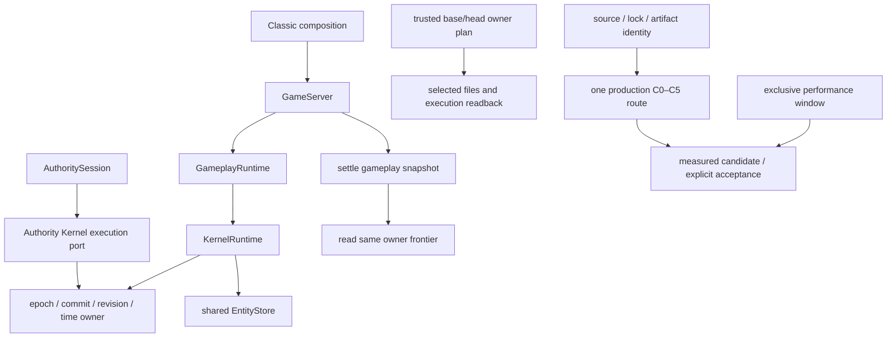

# Kernel / stdlib / Harness 定向审阅与闭合记录

## 身份与范围

独立审阅 base 为 `c18a890c7f97f76421e13565ec628d8c50a942da`。最后一轮固定审阅对象为 `5824a63610a7ef9d8a66cde8dadc34d50b564f16`，tree `13beaffb061f05e3986337f6906f40fc21607fe2`；它是本地不可变审阅对象，不是交付提交。规则从 base tree 读取，变更中的规则没有豁免自身。

独立审阅按唯一 owner、事务容量、候选恢复、对象别名、资源释放、事件及 lifetime、provider、保存 frontier、Harness 身份与选择、CI、断言迁移顺序展开。它没有逐行审阅全部约1150项迁移；770项纯移动及422个确定性测试以摘要/标题/断言账本辅助定位，不冒充逐项语义等价。最终小增量由主集成 owner 直接复核，执行证据在 delivery-snapshot 单独绑定实际源码。

## 架构与阅读地图

| 路径或符号                                                               | 责任与副作用                               | 复核重点                                                  |
| ------------------------------------------------------------------------ | ------------------------------------------ | --------------------------------------------------------- |
| `packages/kernel/src/execution/`                                         | 唯一 revision/time 与模块 checkpoint owner | identity复制冻结，codec输入输出隔离，逆序dispose          |
| `packages/kernel/src/runtime/world-runtime.ts`                           | 中性实体、组件候选、事件及lifetime         | clone边界、失败前拒绝、有界outbox/ack、无ABA              |
| `packages/stdlib/src/server/gameplay/gameplay-kernel-runtime.ts`         | Kernel分配真实EntityStore与模块状态        | 无第二套权威ECS                                           |
| `packages/stdlib/src/server/authority/`                                  | 多频调度经同一Kernel state推进             | 所有提交源容量预检先于clock/queue/body写入；pause债务一致 |
| `packages/stdlib/src/server/composition/behavior-capability-dispatch.ts` | provider同步callback与操作预算             | start/continue/cancel finally关闭lease，共用128上限       |
| `packages/stdlib/src/server/gameplay/modules/`                           | 真实注册机制和有界queue flush              | 新排入Block动作同轮结算也计入上界                         |
| `packages/stdlib/src/server/persistence/game-save-runtime.ts`            | snapshot先结算、后读取frontier             | 普通与portable envelope与live owner一致                   |
| `playbooks/classic/`、`apps/web/`                                        | 显式玩法与浏览器组合根                     | 生产Pack、Worker、Wasm、真实输入和恢复                    |
| `packages/eslint-plugin/`                                                | 独立规则、配置和测试命令                   | 不进入根Vitest projects                                   |
| `scripts/harness/`、CI                                                   | 可信影响选择、产物和执行回执               | 未知保守full-new，漏跑/错产物/篡改计划硬失败              |

## 已确认合同

独立审阅确认单一Kernel runtime、EntityStore、时钟/frontier装配；候选恢复先验证再发布，legacy存档仅按可信精确身份接纳；保存先结算队列后读取frontier。组件/模块codec、事件、checkpoint、删除钩子和值读取有复制边界；失败候选尝试逆序释放所有owner。全局lifetime high-water避免删除、目录压平及恢复后的旧引用复用。事件队列有明确容量、带epoch/sequence确认及恢复合同。

Authority原recovery、physics、pickup、schedule、Combat、Character提交源已计入确定性上界。provider每个callback最多128次调用，过期invoke拒绝、resolveTarget返回null，finally关闭lease，无法跨callback累计额度。每个节点最多start/continue一次及cancel一次；多角色死亡与zero-windup额外提交由共享lifecycle预算覆盖，不能孤立理解为每个operation严格只有两次提交。

Harness通过可信base/head与owner选择具体文件，再核对执行报告；根无测试、集成/工程/全流程归Web、ESLint独立维护符合用户追加合同。Classic回执验证同一次attempt的完整C0–C5、实际输入、Worker/Wasm执行和mesh可见消费；sourceDigest包含HTML/测试，source与dist字节分别核验。性能候选需要窗口receipt、采样时段、measurement摘要和同一身份，生成候选不等于接受数值基线。

## 证据与覆盖边界

最终完整static为444 files /2295 tests PASS，覆盖最后pause/provider/queued Block改动；world行覆盖率96.98%。最终static、构建、Classic与性能样本见 [Delivery Snapshot](delivery-snapshot.md)。历史125个浏览器文件/202个用例仍有GAP/PARTIAL，唯一Classic不证明hydration、全部视觉/工坊、长soak、真实模型或外网等价保护。

旧snapshot/combat flush局部失败来自base已有路径，按批准spec记录为KNOWN_BASELINE_FAILURE；没有扩大成玩法重写。NPC死亡后的binding诊断也在base已有相同cancel/context路径；当前fixture已隔离玩家拆台与NPC活动，必须由新生产线路确认。

## 人类复核建议

1. 优先看Authority预检到实际提交源的对应关系，以及接近序号上限的无副作用拒绝。
2. 对照save先结算后读frontier与候选恢复发布点，核对错误checkpoint不改变live owner。
3. 将最终Classic回执与历史GAP账本一起阅读，不以一次线路PASS泛化全部产品保护。

## 独立审阅 Findings

最后固定审阅对象仍有一个P1：预检仅统计已有breakAction，漏掉本次queue flush新建、同次advance完成的Block动作。N个queued begin、无active break时，实际Block路径为N次begin、1次advance、2N次finish，共3N+1；旧局部预算2N+2会低估，接近MAX_SAFE_INTEGER时可能先写后失败。

最小修复已落盘并完成执行读回：queue flush与其上界复用64常量，Block settlement加上本轮可能的新begin数。新增真实GameServer用例准备64玩家、不同voxel和一次性listener queue，清除当前break后同轮完成，比较实际sequence delta与预检上界。主集成已直接复核这处增量：实际flush与上界复用同一64常量，注册操作flush先冻结本轮count。真实旧公式故障注入RED为实际196次提交、上界144；按字节恢复新源码后5/5 GREEN，最终完整static亦覆盖该用例。最后固定P1已闭合，详细回执见evidence/queued-block-red.json及日志。

覆盖状态：部分；独立审阅不是全局LGTM、产品验收或合并批准。
