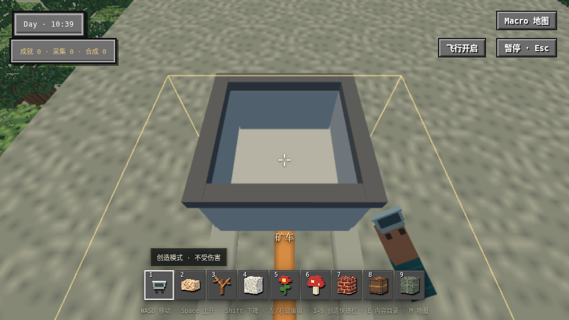

# 原生矿车保存重开实际呈现 checkpoint88

精确 source `c889f40554e592e30c4035143756b6adfd5c741f` / sourceDigest `34aee033f80932818f77e40eae078156427409240be2e5ffac426b23641de6c3` / artifact `efd549f30cc12570084c5742f33bbe9de2b3e522582dafe114a68600ffd5a580`。production bytes未变，类型/范围lint/格式/frozen证据字节检查与identified build PASS。

run `pr41-restored-cart-presentation-browser88-01` 原唯一spec的native纵向用例39.9s PASS/runner43.5s，receipt NON_MAIN/PASS、attempts空。原120000/10000ms和全部原右键/持W/Shift右键、位置/乘员、保存page.reload、旧epoch1 stale与新epoch2 current断言保持。增强只在恢复后等待现有模型ready/实际presented位置，再用首次native左键取得PointerLock、原18次鼠标瞄准，把恢复矿车放入真实画面；转向后pose/rider/reference保持。

Root实际查看下图：灰色空矿车在准星中央、矿车HUD与轨道可见，debug面板未遮挡。模型ready/位置数值不能代替该静止画面；这里没有连续视觉运动、整帧收益、统一lighting、所有运输或194矩阵通过结论。旧native82/83和旧mainFAIL不改。

原始PNG362671bytes/SHA256 `3b7a8d7b17689f0d0091c34ceb645e7a9a2a38e2c30f80b74b1a3a2f6684cc28`，public复制保持原字节。JSON原始附件85607bytes/SHA256 `4f3ea2fa6b6b55933714a337b8b00366aa8684aabd97c6813bd67bf69d091b47`与完整HTML保留私有`/workspace/pr41-recovery-20261008-root-01/browser88-*`；PASS配置不保留trace，未伪造trace。第一次PNG提取因重复引用FAIL空目录保留，第二次两个PNG引用逐一读取后rawSHA一致才去重，唯一JSON身份验证通过。

本地c889未推送，远端34fee5f1的CI407仍自然运行；此局部PASS不替代远端结果。长期docs baseline不变：无新生产owner/协议，仅强化原产品验收观察。
