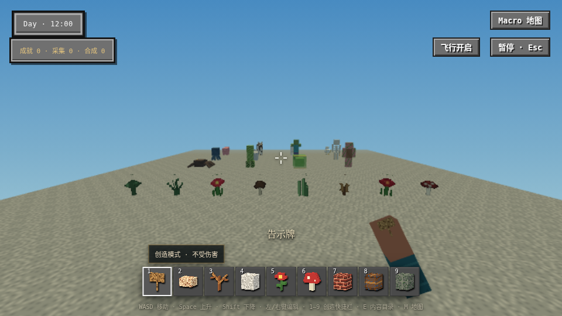
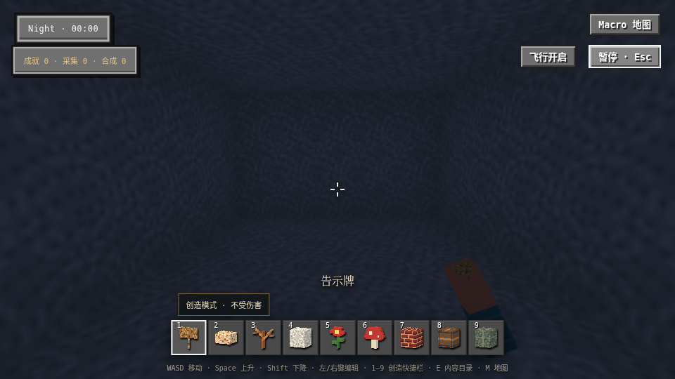
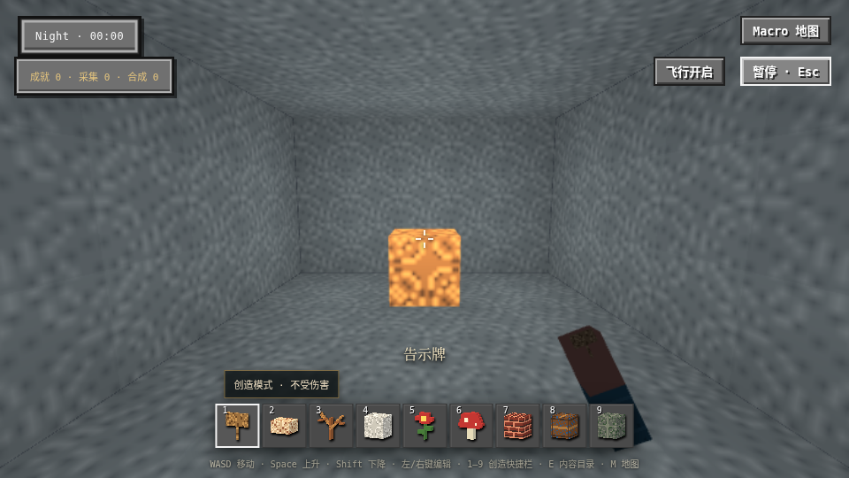

# 质量预算保留相机配置 checkpoint90

生产修复 `47aa9eb2207bbc047df68cdcefef0ebd03d6b7d7` 移除AdvancedVisualEffects按质量选择tone mapper的覆盖，保留相机既有tone mapping与曝光。相机默认值在实际PlayCanvas2.21.4源码为LINEAR，所以当前low取值保持；medium/high先前强制NEUTRAL/ACES的行为被移除，旧画面可能改变。Pack-owned配置仍待接线，完整lighting没有通过。

实际构造函数反例：ACES3被旧low改为LINEAR0，曝光1.25未变，RED1FAIL/5PASS；修复后6PASS。既有静态合同定向1PASS，其余5项未运行；类型/lint/格式/冻结字节5/5/路径/commit hook/build PASS。

精确47aa/sourceDigest9be0e5b2/artifact399aea0a的原唯一visual用例2.9分钟PASS、runner3.0分钟，NON_MAIN、attempts空。原240000ms、原场景/输入/质量/断言保持。Root查看三张原始PNG，昼间模型/植物可见，夜间室内无源与glowstone画面亮度有可见差异；静止图片不证明完整统一受光、真实像素矩阵、中高档质量或性能。

validation.json记录精确身份、原始附件字节和结果。私有browser90-visual-01保留完整HTML及原始JSON/PNG，公共PNG为本次原始字节。复用未触及的stdlib/headless既有完整结果，未重复全量测试。长期docs baseline不变：这是既定合同的局部owner修复。
