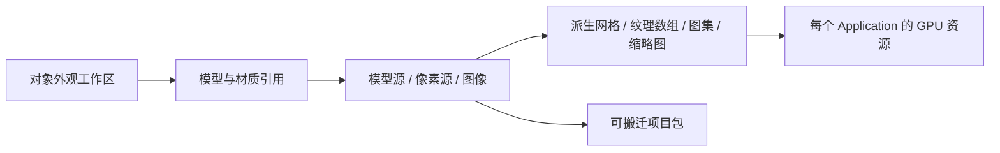

# 对象外观与资产生产

入口为 `asset-workbench.html`，执行 `pnpm dev` 后访问。游戏与外观中心分别构建，遵循相同部署 base。外观中心不启动世界、Worker 或 Pointer Lock。

## 资源层次



默认从对象进入，同页查看模型、材质槽、像素源与用途；编辑材质保留预览视角。内置对象组织模型、材质与图像资产，覆盖当前登记的第一方物品、非空气方块、人物与生物、第一人称手臂及UI图像。资源库以3D模型、材质、图像作主分类，来源筛选独立。内部适配类型保留为实现细节。

| 来源                   | 当前编辑与使用能力                                                          |
| ---------------------- | --------------------------------------------------------------------------- |
| 16/32/64像素源         | 新建、复制、绘制、调色、调整尺寸、删除未引用草稿、图集导出                  |
| 像素挤出模型           | 厚度、握持点与贴图引用；木斧/石镐/木剑应用到现有游戏绑定                    |
| 内置方块与灯笼         | 同源面材质编辑；放置、手持、掉落和图标共享几何与UV约定                      |
| 角色、手臂、浆果与木板 | 共享材质编辑，或复制为对象专用材质/贴图；动作部件保持独立                   |
| 静态/骨骼GLB           | 导入、校验、片段预览/角色绑定、稳定ID重导入、随项目备份；材质外部制作并内嵌 |
| PNG/JPEG图像           | 独立管理、替换与预览；内置图像覆盖在下次进入世界生效                        |

方块使用固定FaceMaterial批次，当前不开放对象专用面材质：共享编辑同步所有引用，项目校验拒绝不能正确执行的私有绑定。任意GLB不会因导入而获得物品、碰撞、放置或玩法能力。玩家全身模型提供同源人形参考，第一人称游戏显示其手臂。

## 编辑、应用与恢复

1. 选择对象与模型/放置/手持/掉落上下文，点击材质的“编辑贴图”在旁边绘制。
2. 保存草稿只更新浏览器中的编辑项目。撤销/重做作用于当前编辑历史。
3. 应用时保存完整资源快照并为已登记物品生成高清缩略图。下次进入世界读取该快照；已运行世界不热切换。
4. 恢复上一版或默认外观更新应用快照；失败保留此前可用版本。多标签用revision检查，冲突不覆盖本地草稿。

内置ID通过用户覆盖保存，源定义不被修改。专用材质同时复制像素源并记录模型槽位绑定；修改共享或专用源后，旧派生缩略图失效。

## 像素、缩略图与打包

默认16×16是美术采样尺度，不是16bit色深，也不是所有图片的尺寸上限。像素源保存稳定ID、revision、尺寸、调色板与索引，最多32色，索引0为透明。32/64源保留原始细节。地形纹理数组按本次最大源尺寸分配，较小源最近邻扩大，避免降采样；层ID继续对应已登记的FaceMaterial。GLSL使用重复采样器处理平铺，不在UV上人为引入`fract`导数断点。

缩略图由同一个PlayCanvas模型预览渲染到512×512透明PNG。默认图在`apps/web/public/assets/item-thumbnails/`，编辑后的图保存在应用快照；它们独立于模型源分辨率。工具源使用32×32及显式像素密度；旧资产省略密度时保持16单位语义。GUI按实际轮廓正交取景，尺寸与材质遵循[物品视觉设计规范](item-visual-design.md)。显式替换已登记物品图标图像可覆盖相应图标。重新生成仓库默认图：

```sh
pnpm dev --host 127.0.0.1
node scripts/assets/render-item-thumbnails.mjs --url=http://127.0.0.1:5173/
```

脚本使用独立浏览器上下文，不读取用户草稿；需可用Playwright Chromium或通过`SEEDLANDS_CHROME_PATH`指定浏览器。材质变更后应重新生成默认图，不能手绘另一套模型图标。

图集PNG与索引由像素源编译，按稳定ID排序、1px扩边，适用于最近邻且无mipmap的消费者。游戏继续用纹理数组，不能把图集的普通全图mipmap当成等价替换。图集导出保留独立源、schema/content/compiler版本；它与完整项目包是不同产物。

完整项目包为schemaVersion=1的JSON，包含当前编辑源覆盖、材质绑定、派生缩略图及动画角色绑定及GLB原始字节/ID/revision。导入先整体校验，再用同一IndexedDB事务写入项目与模型；导入为草稿，应用仍需显式操作。当前包上限96MiB，模型上限16个，单GLB上限16MiB。包不包含世界、玩法注册或GPU对象，不支持的schema明确拒绝。

## 存储和运行边界

`seedlands-appearance-project`拥有draft/applied/previous、项目revision及项目GLB记录。旧原生库首次读入为草稿，旧地形已应用覆盖迁移为等价应用快照，旧库保留；旧GLB可读取，完整导出汇总可见模型。浏览器清理站点数据会删除本地项目，跨机器维护应导出项目包。

游戏启动通过`load-appearance-runtime.ts`装载一个已应用快照，再创建地形、实体、手臂和图标。CPU定义与物品网格编译位于client/presentation；World及碰撞权威保持原职责。普通地形保持Chunk Mesh；灯笼与方块物品从同一体素描述编译并共享缓存网格。实例化仍是实验，不作为默认路径。

GPU纹理、网格与材质由Application拥有，不持久化、不跨WebGL context共享。引用计数保护缓存网格，预览切换释放旧场景及GLB容器，异步陈旧结果不能挂载。镜头、光照与场景AO不同，预览与游戏不要求截图逐像素相同，但源、UV、材质参数和动作适配必须一致。

## 外部模型

GLB支持自包含glTF2.0、索引三角形、内嵌PNG/JPEG与已有受支持材质扩展；最多256节点、10万实例三角形、纹理单边4096、合计16Mi像素。支持最多8套skin、每套128个joint、32个命名片段、合计256条通道/10万关键帧、单片段120秒。节点/蒙皮引用、骨骼索引、权重和采样时间先校验再加载。拒绝外链、形变、稀疏访问器及压缩几何/纹理。重导入保留用户选择的逻辑ID、增加revision；失败保留原文件。预览仅在外层居中与缩放，原始字节和根变换不变。

含动画的GLB可在同一预览中选择片段，并将idle、move、attack、hurt绑定给grazer、night-stalker或settler。已应用与上一版外观各自保存当时完整模型库的Blob快照；重导入只更新模型草稿，点击应用后才切换下次游戏启动的模型与绑定。恢复上一版会将草稿与模型库一起切回该已应用版本，避免合并两版模型而超出容量；被替换的已应用版本仍保留为上一版，删除模型会清理三份项目状态中的绑定；已运行世界保留启动时快照。攻击动画按权威前摇、命中、恢复阶段定位；片段不提交伤害。缺少绑定的旧外观继续使用既有模型。当前不做任意骨架重定向、多轨道或root motion。

可复现体素模型示例与CLI流程见[Blender资产生产](blender-asset-production.md)。来源及许可见[ASSETS](../ASSETS.md)。
