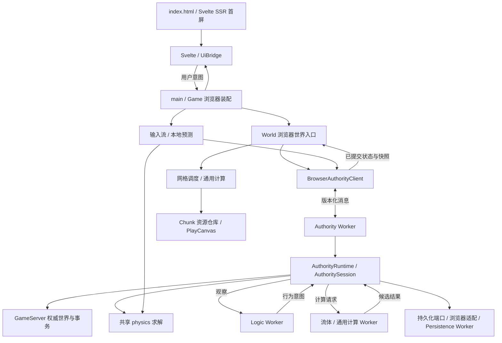

# 代码地图

本页回答“从哪里开始读、某项行为由谁负责”。目录归属见[仓库结构规范](repository-structure.md)，宏观取舍见[长期目标与路线图](living-world-alignment.md)，运行方式与当前能力见 [README](../README.zh-CN.md)。

核对日期：2026-09-10；世界产品为 Web 与 game-core，独立 Agent Server 通过受限角色协议接入，Node Dedicated 仍归档退出。这是人工核对的导航，不是自动生成的完整依赖图；后续移动入口或改变职责时应同步维护。

首屏由 [prerender-entry.ts](../apps/web/src/app/ui/prerender-entry.ts) 在开发请求或构建前调用同一个 `AppRoot` 生成，浏览器入口随后对该 DOM 做严格 hydration；生成与注入脚本位于 `apps/web/scripts/prerendered-start-screen.*`。

## 第一次阅读的顺序

不必先遍历全部文件或历史 change。先沿下面的链路建立概念，再按问题进入局部。

| 顺序 | 入口                                                                                                                                                               | 先理解什么                                                |
| ---- | ------------------------------------------------------------------------------------------------------------------------------------------------------------------ | --------------------------------------------------------- |
| 1    | [main.ts](../apps/web/src/app/main.ts)                                                                                                                             | 浏览器组合入口：画布、UI、音频、Game 与应用外壳如何接起来 |
| 2    | [application-shell.ts](../apps/web/src/app/application-shell.ts)、[game.ts](../apps/web/src/app/game.ts)                                                           | 菜单与会话生命周期，以及游戏各子系统的装配                |
| 3    | [browser-worker-session.ts](../apps/web/src/app/browser-worker-session.ts)                                                                                         | 浏览器本地会话与 Worker 如何启动、通信和释放              |
| 4    | [authority-runtime.ts](../packages/game-core/src/server/authority/authority-runtime.ts)、[game-server.ts](../packages/game-core/src/server/game-server.ts)         | 权威世界、命令、事务、存档与会话的组合；谁拥有真值        |
| 5    | [authority-session.ts](../packages/game-core/src/server/authority/authority-session.ts)                                                                            | 独立时钟、固定步长、玩家输入与物理推进                    |
| 6    | [world-runtime.ts](../apps/web/src/app/world/world-runtime.ts)                                                                                                     | 浏览器如何请求世界、提交编辑并调度可见 Chunk              |
| 7    | [mesh-task-scheduler.ts](../apps/web/src/app/world/mesh-task-scheduler.ts)、[chunk-resource-repository.ts](../apps/web/src/app/world/chunk-resource-repository.ts) | 网格任务与 GPU 资源分别由谁管理                           |
| 8    | [ui-bridge.ts](../apps/web/src/app/ui/ui-bridge.ts)、[app-root.svelte](../apps/web/src/app/ui/app-root.svelte)                                                     | 游戏状态如何投影到界面，用户意图如何回传                  |

## 当前目录速览

以下为现状，省略文件和部分子目录，不代表拟议的新布局。

```text
apps/
  agent-server/           @seedlands/agent-server：认知、模型、PG 工作区与 Node 连接宿主
  web/                    @seedlands/web：浏览器产品、Vite 配置与公开资产
    src/app/              浏览器组合、输入、PlayCanvas 表现、streaming 与 Svelte UI
    src/client/           客户端协议适配、预测、镜像、持久化与表现计算
    src/compute/          浏览器 Wasm kernel 与内存适配
    src/worker/           浏览器 Worker 入口、传输与生命周期适配
packages/
  cognition-protocol/     @seedlands/cognition-protocol：Web/Agent 共享认知传输合同
  game-core/              @seedlands/game-core：无 DOM/WebWorker/Node ambient 的共享逻辑
    src/server/           权威世界、规则、协议、存档与 Headless 开发会话
    src/compute/          纯计算任务、完整 Authority 输入门禁
    src/world/            体素、坐标、确定性生成、网格与编解码
    src/physics/          身体形状、碰撞、恢复与物理解算
    src/runtime/          时钟、调度、任务队列、会话协议与窄平台端口
tests/                    按模块组织的单元测试、架构门禁与长期 E2E
changes/                  每次变更的合同、需求 E2E 与交付证据
docs/                     跨变更的长期目标、来源、代码地图和目录规范
scripts/                  工程、Harness 与无浏览器启动脚本
apps/web/public/assets/   静态图片等公开资源
harness/baseline.json     受版本控制的 Harness 基线
```

## 运行链路与状态归属

图中的箭头表示主要调用或数据流，Worker 两侧通过消息通信；它不是全部静态 import 的分层约束。



Node Dedicated 的产品接线、文件存储、网络镜像、五入口构建和可玩 E2E 已从活跃树归档退出，恢复入口见[研究归档](change-archive.md#node-dedicated-server-研究归档)。本地图不再将其列为当前开发入口。

Headless 工程入口 [server-headless.mjs](../scripts/server-headless.mjs) 通过 [Headless 平台适配](../scripts/headless/node-core-platform.ts) 注入端口并创建同一 [HeadlessSession](../packages/game-core/src/server/headless/headless-session.ts)。世界事实和命令仍进入 AuthorityRuntime，开发宿主不持有第二份世界。共享 [WorldHarnessPort](../packages/game-core/src/server/harness/world-harness-contract.ts) 与 [AuthorityWorldHarness](../packages/game-core/src/server/harness/authority-world-harness.ts) 处理开发操作和资源授权；Node REPL/JSONL 的 I/O 与二进制编码在 [jsonl-transport.ts](../scripts/headless/jsonl-transport.ts)。使用和证据见[世界开发 Harness](developer-world-harness.md)。 Headless 平台适配由根 [tsconfig.tools.json](../tsconfig.tools.json) 纳入 `pnpm typecheck`，只使用 ES2022/Node 类型并经声明的 workspace 开发依赖读取 core exports。

浏览器的 `window.__seedlandsHarness.world` 经 BrowserAuthorityClient → Authority Worker 进入同一世界端口；恢复只替换 Worker 内的 owner。F3 分类面板位于 [runtime-diagnostics.svelte](../apps/web/src/app/ui/runtime-diagnostics.svelte)，只读投影位于 [debug-diagnostics.ts](../apps/web/src/app/ui/debug-diagnostics.ts)；Wasm 调用/内存计数由 [KernelMemory](../apps/web/src/compute/kernel-memory.ts) 随计算任务 ACK 传回，不另开遥测轮询 RPC。

最容易混淆的几个名称：

- **`World`** 定义在 [app/world/world-runtime.ts](../apps/web/src/app/world/world-runtime.ts)，是浏览器侧 streaming、编辑请求与网格协调入口。它不拥有另一套权威体素世界。
- **`GameServer`** 持有权威 Chunk 与玩法状态，`editBatch()` 进入事务提交路径。浏览器编辑经 World / Authority 端口到达这里；不要直接改渲染副本。
- **`AuthorityRuntime` / `AuthoritySession`** 组合权威服务并安排时间、输入和物理推进。浏览器实例由 Authority Worker 持有；无浏览器会话复用同一核心。[authority-state-version.ts](../packages/game-core/src/server/authority/authority-state-version.ts) 只捕获和比较状态版本，不取得提交权。
- **`packages/game-core/src/world/`** 是纯世界算法与数据，不等于 `World` 类；[storage.ts](../packages/game-core/src/world/storage.ts) 是存档编解码，不是游戏服务实例。
- **`client`** 是客户端角色，不保证所有文件都不依赖浏览器；其中有 Worker 创建与持久化适配。类型引用也不等于运行时状态所有权。
- **`apps/web/src/worker`** 是浏览器执行入口与传输适配；复用的纯计算实现在 `packages/game-core/src/compute`。

## 按问题找代码与证据

表中测试是定位入口，不表示只跑这一项即可交付；验收范围仍由当前 spec 决定。

| 想理解或修改               | 实现入口                                                                                                                                                                                                                                                                                                                                     | 验证入口                                                                                                                                                                      |
| -------------------------- | -------------------------------------------------------------------------------------------------------------------------------------------------------------------------------------------------------------------------------------------------------------------------------------------------------------------------------------------- | ----------------------------------------------------------------------------------------------------------------------------------------------------------------------------- |
| 世界 seed、地形与网格      | [voxel.ts](../packages/game-core/src/world/voxel.ts)、[macro-world.ts](../packages/game-core/src/world/macro-world.ts)、[mesh.ts](../packages/game-core/src/world/mesh.ts)                                                                                                                                                                   | [world 测试](../tests/world/)                                                                                                                                                 |
| 挖掘、放置与批量事务       | [GameServer](../packages/game-core/src/server/game-server.ts)、[world-transaction-commit.ts](../packages/game-core/src/server/world-transaction-commit.ts)                                                                                                                                                                                   | [事务测试](../tests/server/world-mutation-transaction.test.ts)、[浏览器提交路由](../tests/app/world-authority-commit-routing.test.ts)                                         |
| 玩家输入、预测与权威物理   | [player-controller.ts](../apps/web/src/app/player/player-controller.ts)、[local-player-prediction.ts](../apps/web/src/client/local-player-prediction.ts)、[authority-session.ts](../packages/game-core/src/server/authority/authority-session.ts)、[physics](../packages/game-core/src/physics/)                                             | [物理求解](../tests/physics/step-body.test.ts)、[预测测试](../tests/client/local-player-prediction.test.ts)、[真实游玩基线](../tests/e2e/regression/world-play.spec.ts)       |
| Chunk 加载、网格更新与卸载 | [world-runtime.ts](../apps/web/src/app/world/world-runtime.ts)、[mesh-task-scheduler.ts](../apps/web/src/app/world/mesh-task-scheduler.ts)、[chunk-resource-repository.ts](../apps/web/src/app/world/chunk-resource-repository.ts)                                                                                                           | [任务调度](../tests/app/mesh-task-scheduler.test.ts)、[资源释放](../tests/app/chunk-resource-repository.test.ts)                                                              |
| Worker 排队与计算          | [browser-compute-runtime.ts](../apps/web/src/client/compute/browser-compute-runtime.ts)、[compute-worker-pool.ts](../apps/web/src/client/compute/compute-worker-pool.ts)、[compute-task-queue.ts](../packages/game-core/src/runtime/compute-task-queue.ts)、[world-compute-task.ts](../packages/game-core/src/compute/world-compute-task.ts) | [计算运行时](../tests/client/browser-compute-runtime.test.ts)、[计算任务](../tests/worker/compute-worker-task.test.ts)                                                        |
| 水的规则与画面             | [server/fluid](../packages/game-core/src/server/fluid/)、[water-experience.ts](../apps/web/src/app/gameplay/water-experience.ts)、[water-surface-transition.ts](../apps/web/src/app/scene/water-surface-transition.ts)                                                                                                                       | [流体提交](../tests/app/world-fluid-commit.test.ts)、[水面过渡](../tests/app/water-surface-transition.test.ts)                                                                |
| 光照、材质、反射与质量档位 | [voxel-materials.ts](../apps/web/src/app/scene/voxel-materials.ts)、[advanced-visual-effects.ts](../apps/web/src/app/scene/advanced-visual-effects.ts)、[quality-profile.ts](../apps/web/src/app/scene/quality-profile.ts)                                                                                                                   | [光照规则](../tests/app/advanced-lighting.test.ts)、[水面反射](../tests/app/water-reflection-plane.test.ts)；视觉语义另查所属 change                                          |
| 背包、合成、生物与自主行为 | [gameplay](../packages/game-core/src/server/gameplay/)、[simulation](../packages/game-core/src/server/simulation/)、[gameplay-entity-presenter.ts](../apps/web/src/app/gameplay/gameplay-entity-presenter.ts)                                                                                                                                | [物品与合成](../tests/server/item-inventory-recipe.test.ts)、[动作运行时](../tests/server/action-runtime.test.ts)、[实体表现](../tests/app/gameplay-entity-presenter.test.ts) |
| 菜单、HUD、交互与音频      | [app/ui](../apps/web/src/app/ui/)、[application-shell.ts](../apps/web/src/app/application-shell.ts)、[app/audio](../apps/web/src/app/audio/)、[client/audio](../apps/web/src/client/audio/)                                                                                                                                                  | [UI 桥接](../tests/app/ui-bridge.test.ts)、[外壳状态机](../tests/client/shell-controller.test.ts)、[音频生命周期](../tests/app/reference-audio-lifecycle.test.ts)             |
| 保存、恢复与退出会话       | [server/persistence](../packages/game-core/src/server/persistence/)、[browser-chunk-persistence.ts](../apps/web/src/client/persistence/browser-chunk-persistence.ts)、[persistence-worker.ts](../apps/web/src/worker/persistence-worker.ts)                                                                                                  | [检查点恢复](../tests/server/authority-checkpoint-restore.test.ts)、[浏览器持久化](../tests/client/browser-chunk-persistence.test.ts)                                         |
| Headless 世界开发与验证    | [server-headless.mjs](../scripts/server-headless.mjs)、[headless-session.ts](../packages/game-core/src/server/headless/headless-session.ts)                                                                                                                                                                                                  | [无浏览器会话](../tests/server/headless-session.test.ts)；持续 REPL / JSONL 与共享 world 端口；H1/H2 验收见 [change](../changes/2026-09-09-developer-world-harness/spec.md)   |
| 调试、性能与边界门禁       | [game-harness.ts](../apps/web/src/app/game-harness.ts)、[performance-telemetry.ts](../apps/web/src/client/presentation/performance-telemetry.ts)、[eslint.config.mjs](../eslint.config.mjs)                                                                                                                                                  | [governance](../tests/governance/)、[浏览器性能样本](../tests/e2e/benchmark/initial-world.spec.ts)                                                                            |

## 主世界工位、矿石与可再生食物

- [inventory-pointer-model.ts](../packages/game-core/src/server/gameplay/modules/inventory-pointer-model.ts) 计算库存、工位和 Actor 游标的交互候选；现有注册运行时授权并原子提交。[browser-inventory-pointer.ts](../apps/web/src/app/gameplay/browser-inventory-pointer.ts) 将意图绑定 Actor/工位身份后串行发送；[inventory-pointer-gestures.ts](../apps/web/src/app/ui/inventory-pointer-gestures.ts) 管理可取消的手势，[inventory-slot.svelte](../apps/web/src/app/ui/primitives/inventory-slot.svelte) 供背包和工位共用。
- [inventory-pointer-contract.ts](../packages/game-core/src/server/gameplay/modules/inventory-pointer-contract.ts) 拥有纯合同与校验；[gameplay-inventory-pointer.ts](../packages/game-core/src/server/gameplay/gameplay-inventory-pointer.ts) 路由注册组合或旧宿主路径。[inventory-cursor-settlement.ts](../packages/game-core/src/server/gameplay/modules/inventory-cursor-settlement.ts) 复用归包/掉落规则，[gameplay-runtime-lifecycle.ts](../packages/game-core/src/server/gameplay/gameplay-runtime-lifecycle.ts) 收拢实体移除、运行时清理与注册 Actor 请求绑定。
- [ecs-station-state.ts](../packages/game-core/src/server/gameplay/ecs-station-state.ts) 与 [entity-store.ts](../packages/game-core/src/server/gameplay/entity-store.ts) 拥有工作台、箱子和熔炉的组件、身份与快照；[prepared-entity-mutation.ts](../packages/game-core/src/server/gameplay/prepared-entity-mutation.ts) 原子提交库存、工位、掉落和销毁。
- [station-actions-module.ts](../packages/game-core/src/server/gameplay/modules/station-actions-module.ts) 注册公开操作和炉体时钟；[registered-station-runtime.ts](../packages/game-core/src/server/gameplay/modules/registered-station-runtime.ts) 适配实际 ECS owner、权限和最终校验；[block-station-effects.ts](../packages/game-core/src/server/gameplay/modules/block-station-effects.ts) 连接正常放置/采集。第一方配方位于 [overworld/stations.ts](../packages/game-core/src/server/gameplay/playbooks/overworld/stations.ts)。
- [station-world-integrity.ts](../packages/game-core/src/server/station-world-integrity.ts) 校验体素/组件一致性，[station-world-residency.ts](../packages/game-core/src/server/station-world-residency.ts) 复用既有 canonical pin；[server-chunk-restore.ts](../packages/game-core/src/server/server-chunk-restore.ts) 统一持久化 chunk 准入构造。[headless-checkpoint-candidate.ts](../packages/game-core/src/server/headless/headless-checkpoint-candidate.ts) 在替换 owner 前准备并验证恢复候选。
- [station-player-view.ts](../packages/game-core/src/server/gameplay/station-player-view.ts) 只投影玩家已获授权且可达的工位；[browser-stations.ts](../apps/web/src/app/gameplay/browser-stations.ts) 保存界面选择身份；[station-panel.svelte](../apps/web/src/app/ui/station-panel.svelte) 与 [station-ui-projector.ts](../apps/web/src/app/ui/station-ui-projector.ts) 显示权威槽位、配方和进度。
- [ore-generation.ts](../packages/game-core/src/world/ore-generation.ts) 定义 V4 煤/铁矿石 hash，TS 与 Rust 使用同一规则并保留 V2/V3；[asset-progression-sources.ts](../apps/web/src/client/presentation/asset-progression-sources.ts) 提供成长物品的内置像素素材。
- [forage-module.ts](../packages/game-core/src/server/gameplay/modules/forage-module.ts) 通过已有逻辑时钟注册可再生食物；[registered-forage-runtime.ts](../packages/game-core/src/server/gameplay/modules/registered-forage-runtime.ts) 只观察已载入体素并提交 ECS 掉落，不生成远处地形。[gameplay-entity-metrics.ts](../packages/game-core/src/server/gameplay/gameplay-entity-metrics.ts) 保持动态实体指标与静态工位分离。

## 阅读依赖时的注意点

当前不存在一张“目录只向下依赖”的完整 DAG。例如：

- [headless-session.ts](../packages/game-core/src/server/headless/headless-session.ts) 调用 `compute/world-compute-task.ts` 中的纯计算实现；这不是在 Node 中启动浏览器 Worker。
- [authority-worker.ts](../apps/web/src/worker/authority-worker.ts) 使用 `client/persistence/browser-chunk-persistence.ts` 接入浏览器存储。文件属于客户端适配层，但调用方可以是后台 Worker。
- 客户端碰撞镜像与网格准备会引用服务端流体数据工具；浏览器与 Worker 也引用服务端协议类型。拆协议或共享模块前，应区分类型依赖、纯计算依赖和权威写入权限。

因此，未来目录整理应先聚合已有职责，再通过单独 spec 处理真正的模块边界变化，不能只根据文件名前缀批量移动。

## 当前实现与历史来源

- 当前可玩 MVP 的意图和交付记录：[可玩世界 MVP](../changes/2026-09-05-playable-world-mvp/spec.md)。
- 独立循环与统一物理：[原始合同](../changes/2026-09-06-independent-loops-unified-physics/spec.md)与[执行记录](../changes/2026-09-06-independent-loops-unified-physics/execution.md)配合阅读；不要只用合同早期状态判断当前完成度。
- 早期拆分的背景：[应用模块边界](../changes/2026-09-04-app-module-boundaries/spec.md)。其中历史路径不保证与当前一致。
- 下一阶段的目标与决策：[长期对齐](living-world-alignment.md)。Node Dedicated 已固定研究归档；后续按共享世界 Harness、浏览器单 NPC Agent、LOD、World AI 顺序推进，不能把设计目标当作当前已完成的能力。

## 资产工坊独立入口

- [asset-workbench.html](../apps/web/asset-workbench.html) → [asset-workbench/main.ts](../apps/web/src/app/asset-workbench/main.ts) → Svelte 工坊；不经过游戏 bootstrap。
- [asset-catalog.ts](../apps/web/src/client/presentation/asset-catalog.ts)、[asset-package.ts](../apps/web/src/client/presentation/asset-package.ts)：统一资源/用途、原生数据校验与依赖。
- [pixel-model-resource.ts](../apps/web/src/app/gameplay/pixel-model-resource.ts)：游戏与工坊共享的像素 GPU 资源；[preview-scene.ts](../apps/web/src/app/asset-workbench/preview-scene.ts) 只组合检视场景。
- [asset-workbench-store.ts](../apps/web/src/client/persistence/asset-workbench-store.ts)：旧版原生资产库兼容读取；当前项目快照由下述 appearance-project-store 持有。
- 适配范围与来源规则见[资产工坊](asset-workbench.md)。

统一视觉资产补充入口：

- [visual-asset-catalog.ts](../apps/web/src/client/presentation/visual-asset-catalog.ts)：地形、角色、材质及 UI 引用；[terrain-assets.ts](../apps/web/src/client/presentation/terrain-assets.ts) 与 [model-material-definitions.ts](../apps/web/src/client/presentation/model-material-definitions.ts) 为独立像素源。
- [texture-pack.ts](../apps/web/src/client/presentation/texture-pack.ts)、[terrain-pack-store.ts](../apps/web/src/client/persistence/terrain-pack-store.ts)：确定性图集与显式地形快照；世界存档不参与。
- [actor-model-definitions.ts](../apps/web/src/client/presentation/actor-model-definitions.ts)、[builtin-actor-models.ts](../apps/web/src/app/gameplay/builtin-actor-models.ts)：游戏和工坊共享构件与人形比例。
- [glb-model.ts](../apps/web/src/client/presentation/glb-model.ts)、[glb-model-store.ts](../apps/web/src/client/persistence/glb-model-store.ts)、[glb-model-resource.ts](../apps/web/src/app/gameplay/glb-model-resource.ts)：外部静态/骨骼模型的校验、二进制持久化与 PlayCanvas 资源生命周期。GLB 校验按 `glb-model-contract.ts`、`glb-model-document.ts`、`glb-model-animation-validation.ts` 和 `glb-model-texture-validation.ts` 分离合同、文档、动画和纹理职责。

对象外观入口以 `appearance-center.svelte` 组合对象导航、材质与像素编辑、完整项目导入导出。`appearance-project.ts`校验引用与覆盖，`appearance-project-store.ts`拥有draft/applied/previous及项目模型事务，`appearance-project-state.ts`解码持久化状态，`appearance-model-validation.ts`负责模型与片段引用校验；旧库保留迁移/读取兼容。游戏经 `load-appearance-runtime.ts` 在创建GPU资源前装载应用快照，`item-mesh-definition.ts`从既有体素描述编译物品网格，`appearance-thumbnails.ts`生成同引擎高清图标。可复现生产脚本位于 `scripts/assets/`。

## 物品与权威动作

- core 的 `server/gameplay/item-registry.ts` 和 `recipe-registry.ts` 持有类型化物品能力与配方定义；`combat-runtime.ts` 持有分阶段攻击执行器，`gameplay-combat.ts` 负责玩家命令与执行器的组合。模型名称与外观绑定不参与伤害判定。
- `app/ui/combat-ui-projector.ts` 与 `client/presentation/combat-viewmodel-pose.ts` 将权威阶段投影到 HUD 和第一人称动作，不推进权威时间。`app/gameplay/model-animation.ts` 将同一动作事实定位到骨骼片段。
- `server/gameplay/ecs-entity-owner.ts` 以每世界 bitECS 实例持有稳定实体身份、位置/速度/生命和 actor 组件；`EntityStore` 保留空间查询与兼容门面。`ecs-actor-components.ts` / `ecs-actor-state.ts` 定义需求、库存/装备、控制与玩家状态访问，`PlayerState` 转发到同一组件 owner。内部 EID 不进入协议或存档。
- `gameplay-snapshot.ts` 的 V4 组件 codec 保存稳定 ID/lifetime；`simulation/action-identity.ts` 将动作和战斗引用绑定到当前 epoch。Authority 在观察、接收与执行前复核身份，恢复后不能使用旧组件访问器或旧控制输入。旧 V1/V2/V3 由显式迁移保留。

PR17 与近战集成时，地图开关和图层切换的浏览器控制委托给既有 [game-runtime-controls.ts](../apps/web/src/app/game-runtime-controls.ts)，`Game` 保持装配入口并满足文件规模门禁；地图状态仍归 `UiBridge`。

## 可组合 Pack 的装配接缝（S1）

- `packages/game-core/src/server/composition/`：每世界 Pack/module 依赖、注册与公开作者合同。作者只消费 `@seedlands/game-core/mod-api`；宿主负责装配和创建绑定 principal、原始 Actor 与 Pack 来源的执行入口。
- `scripts/pack-integrity.mjs`：本地构建 Pack 在执行入口前的文件与锁摘要检查；不提供任意 URL 市场或恶意代码隔离。
- `scripts/eslint/pack-api-boundary-rule.mjs` 与 `tests/governance/pack-api-boundary.test.ts`：第一方 Playbook 到内部实现的导入负例门禁。
- `tests/server/composition/`、`tests/scripts/pack-integrity.test.ts`：装配、授权和真实产物加载合同。当前仍未把整个现有 GameplayRuntime 迁成标准模块；ECS、完整玩法与浏览器旅程状态以[本期合同](../changes/2026-09-09-composable-overworld-playbook/spec.md)为准。

## 可组合玩法内容与执行

`server/gameplay/playbooks/overworld/` 保存默认 Playbook 的物品、配方、方块定义与版本化旧 ID 映射；只经 `mod-api` 消费标准机制。`server/gameplay/modules/` 保存可复用机制；`server/composition/` 的注册操作、状态提交与逻辑生命周期由宿主绑定权限后执行。旧自由函数在迁移期读取同一份第一方定义，不能另维护内容副本。

`server/gameplay/modules/actor-vitals-runtime.ts` 与 `block-interaction-runtime.ts` 承接原 GameplayRuntime 的生命和方块流程，迁移中的规则 owner 仍以当前 spec 为准。`server/authority/actor-movement-projection.ts` 派生模式/飞行版本并防止旧输入重放；`authority-gameplay-view.ts` 投影实际每世界内容。Browser `worker/pack-loader.ts` 与 Headless 共用构建产物身份，`scripts/build-gameplay-packs.mjs` 生成被忽略的 ESM/manifest/lock。

`server/composition/execution-origin.ts` 保存稳定主体来源合同，actor/system 执行在 `authorized-execution.ts` 与 `registered-operations.ts` 分离。`server/gameplay/modules/world-ruleset-state.ts` 拥有每世界只读 Ruleset；`gameplay-module-schedule.ts` 将显式宿主 service 授权、唯一组合玩法时钟与 V4 存档 frontier 接入 GameplayRuntime。默认 Needs 由 `needs-module.ts`、`needs-rules-module.ts` 和 `needs-state-port.ts` 经分片状态事务执行；`gameplay-system-authority.ts` 提供 Browser/Headless 显式调度策略。Combat 的 `combat-module.ts` 与 `combat-rules-module.ts` 产生只读候选；`registered-combat-runtime.ts`、`combat-state-port.ts` 和 `combat-host-environment.ts` 组合当前权限、ECS 投影与预提交。`gameplay-actor-authority.ts` 明确玩家、NPC 和脚本的稳定主体；`headless-gameplay-authority.ts` 在 Headless 恢复和命令入口复用当前策略。完整迁移准出继续以当前 change 为准。

`server/gameplay/melee-definition-registry.ts` 保存纯近战定义 schema、注册与限制；CombatRuntime 保留旧导出门面并拥有动作状态。`server/world-edit-runtime.ts` 组合普通编辑与流体 sidecar，`server/prepared-world-edit.ts` 为有界玩法事务提供单方块预校验参与者；现有单编辑结果构造复用 `single-world-edit.ts`。

`server/gameplay/gameplay-combat-callbacks.ts` 保留未组合宿主的伤害适配与共用几何检查；`gameplay-mode-landing.ts` 将玩法体素读取适配到既有安全落地查询。`server/simulation/prepared-combat-effects.ts` 预提交 Action、观察记录和 NPC 行为变化，`prepared-combat-damage.ts` 预提交生命、掉落和实体移除。

`server/simulation/combat-action-snapshot.ts` 校验 Combat/Action 生命周期关联、规范化旧 V3 重复目标，并在命令/逻辑观察边界派生当前目标。

`server/simulation/prepared-death-effects.ts` 在 ECS 死亡提交前准备 Combat 取消和 Action 终态。`server/gameplay/prepared-entity-mutation.ts` 的 series 将多个有界片段纳入同一 allocator 预检；`prepared-combat-mutation.ts` 拥有不调用伤害回调的延迟命中候选，`combat-origin.ts` 与 `combat-pending-hit.ts` 保存可重授权的来源和待命中合同。

`server/gameplay/combat-request-candidate.ts` 预备新攻击或连招缓冲，不触发伤害；`server/simulation/action-runtime.ts` 的 prepared start 在写入前构造旧动作替换和新动作，供跨 owner 接受协调使用。

`server/gameplay/gameplay-runtime-contracts.ts` 定义玩法宿主注入端口与操作结果，原 `gameplay-runtime.ts` 保留类型重导出以兼容当前调用方。

`server/gameplay/modules/inventory-action-model.ts` 与 `inventory-actions-module.ts` 定义六类纯库存操作候选及 actor/item 资源；`registered-inventory-runtime.ts` 核对当前来源、观察和候选，并预提交 ECS、物品实体及 Combat 取消。`server/commands/inventory-module-command.ts` 保留真实命令调用者的绑定。`mode-state-port.ts` 与 `mode-runtime.ts` 预备模式、落点、速度和不兼容 Action 的统一变更。

`server/gameplay/gameplay-domain-adapters.ts` 将既有库存、生命和未组合方块门面的实例端口集中装配，仍共享同一 ECS/Gameplay owner。`block-actions-module.ts` 与 `block-rules-module.ts` 分开纯方块候选和显式配置的规则；其 capability 目录也是已装配世界方块定义查询的来源；`registered-block-runtime.ts`、`block-state-port.ts`、`block-origin-environment.ts`、`block-host-commit.ts` 负责真实当前来源、投影和世界/库存/掉落预提交。普通命令通过 `server/commands/block-module-command.ts` 保留实际宿主绑定并交付真实世界回执。迁移准出状态继续以本期 change 为准。

`server/gameplay/gameplay-registered-adapters.ts` 装配 Inventory、Combat、Block 与 Feeding 的注册宿主端口。`modules/feeding-model.ts`、`feeding-actions-module.ts` 与 `feeding-rules-module.ts` 分开纯投影候选、操作和显式默认规则；`registered-feeding-runtime.ts` 统一 ECS needs、world-item 与 `simulation/prepared-feeding-effects.ts` 的即时 Eat/Combat/自治效果。脚本 Logic 由 AuthorityWorldHarness 将实际主体绑定送达 AuthorityRuntime 和这些 owner，默认开发者主体在宿主间稳定，别名和授权仍由当前宿主决定。

`server/composition/secondary-resource-authorization.ts` 检查跨资源操作对原始角色资源的调用者及模块 execute 授权；Inventory、Block、Combat 即时提交及延迟来源重绑定共享该检查，不把主目标执行授权扩展为角色写入权。

`server/gameplay/modules/crafting-provider.ts` 定义冻结的匹配输入、槽位扣料计划与共享库存事务；`recipe-crafting-module.ts` 通过同一 capability 分别准入标准和自定义匹配器。`server/composition/product-playbooks.ts` 对三个仓库内产品示例施加独立宿主权限；当前替代 Pack 源在 `changes/2026-09-09-composable-overworld-playbook/examples/`，仅消费公开 mod-api。`scripts/build-gameplay-packs.mjs` 按明确示例名构建锁定 ESM，Browser 和 Headless 读取同一产物合同。

`server/gameplay/actor-profile.ts` 校验并冻结每世界角色档案、玩家默认近战及可选初始生态；第一方数值归 `playbooks/overworld/actors.ts`。`server/starter-ecology-bootstrap.ts` 仅在装配声明生态时准备已有营地/角色/食物布局，组合世界缺失该配置不会隐式生成默认内容。角色生命、掉落、感知食物和模型表现分别沿权威档案与当前世界物品定义解析。

## NPC 行为与认知接缝

- `server/composition/behavior-capability-registry.ts` 拥有每世界冻结的能力目录、provider/参数/持续状态合同；`server/gameplay/modules/behavior-registry-module.ts` 提供可选标准模块。作者只通过 `mod-api` 注册与编排，示例和长期边界见 [NPC 行为与认知](npc-behavior-and-memory.md)。
- `behavior-capability-validation.ts` 负责有界JSON和参数合同，`behavior-capability-dispatch.ts` 将冻结provider绑定到只读Actor上下文与受限操作端口；能力目录、执行和恢复仍由同一registry注册源驱动。
- `behavior-capability-admission.ts` 校验requiredOperations和host-approved模块操作许可；`character-behavior-admission.ts` 在安装/候选出生/恢复阶段使用同源Actor准入，`character-behavior-operation.ts` 为标准身体技能构造领域操作请求。真实目标和规则仍由既有权威operation执行链校验。
- `server/simulation/character-runtime.ts` 组合绑定 Actor 的行为控制，`character-behavior-runtime.ts` 推进树，`character-behavior-skills.ts` 处理标准生活动作；身体数据仍由 `ecs-actor-components.ts` / `ecs-actor-state.ts` 持有。`gameplay-character-control.ts` 处理角色请求与出生，`gameplay-character-domain.ts` 将 provider 权限绑定到既有领域操作，不另建库存和 needs owner。
- `character-navigation.ts` 从当前角色的局部感知与共享身体形状构造实体避障约束，`ground-navigator.ts` 在既有有界地面寻路中消费该约束；最终位移与碰撞仍由权威物理推进，不移动或禁用障碍物。
- `character-snapshot-runtime.ts` 验证并恢复行为组件与墓碑，`autonomy-snapshot-validation.ts` 处理动作/自主状态检查，`gameplay-runtime-checkpoint.ts` 负责 Gameplay 候选恢复与迁移边界；它们不拥有独立的权威身体状态。
- `ecs-entity-components.ts` / `ecs-component-storage.ts` 管理既有bitECS列及槽清理，`ecs-actor-mode-state.ts` 负责Actor模式组件访问，`entity-spatial-buckets.ts` 维护现有局部空间索引。`autonomy-prepared-effects.ts` 保持既有候选Action效果的准备/提交边界；`character-observation-runtime.ts` 与validation/types辅助文件分别负责局部观察、校验与数据合同。
- `runtime/character-control-protocol.ts` / `behavior-control-protocol.ts` 是无模型角色协议；`AuthorityWorldHarness` 提供可信开发入口，Web 的 `browser-character-control-port.ts` 和 `client/character/` 提供绑定角色接线。Agent 不获得全局 Harness。
- `apps/agent-server/src/resident-agent.ts` / `resident-factory.ts` 分别处理常驻认知和出生配方，`workspace/` 拥有 PG 记忆与认知分支，`node/resident-host.ts` 处理 loopback 会话。`client/persistence/application-checkpoint.ts` / `cognition-timeline.ts` 将世界与认知 checkpoint 配对。
- `apps/agent-server/src/gateway-response.ts` 在构造模型消息前限制实际响应流及工具字段；`resident-request-budget.ts` / `resident-agent.ts` 拥有每逻辑轮工具批次准入。`resident-runtime-codec.ts` 是调度初始化与认知导入共用的恢复校验；`workspace/content-codec.ts` 保持普通写入和portable导入内容限额一致。`packages/cognition-protocol/src/checkpoint-protocol.ts` 提供中立认知清单头合同，应用V2的pairHash不替代PG内部语义校验。
- `apps/agent-server/src/node/resident-host-births.ts` 管理同socket最多三个独立、可取消的出生请求，避免模型等待进入控制消息串行链；Factory在事务外生成，短事务只负责幂等重读、预算复核与提交。
- `apps/web/src/app/gameplay/companion/` 组合产品角色会话，`companion-panel.svelte` / `character-behavior-panel.svelte` 只显示角色和行为树。`scripts/model-gateway/` 是独立工程适配，上游凭据不进入 core、Pack 或浏览器。
- `apps/web/src/worker/authority-worker-runtime-lifecycle.ts` 收拢 Worker runtime 的初始化/释放与同一 owner 的接线；`authority-worker-direct-logic*.ts` 维护 Authority→Logic 的直接通道和候选新鲜度。控制消息和测试时钟走各自边界，不因认知网络等待而阻塞身体模拟。
