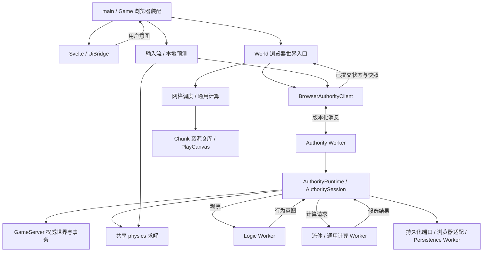

# 代码地图

本页回答“从哪里开始读、某项行为由谁负责”。目录归属见[仓库结构规范](repository-structure.md)，宏观取舍见[长期目标与路线图](living-world-alignment.md)，运行方式与当前能力见 [README](../README.zh-CN.md)。

核对日期：2026-09-06；context-engineering 目录基线。这是人工核对的导航，不是自动生成的完整依赖图；后续移动入口或改变职责时应同步维护。

## 第一次阅读的顺序

不必先遍历全部文件或历史 change。先沿下面的链路建立概念，再按问题进入局部。

| 顺序 | 入口                                                                                                                                             | 先理解什么                                                |
| ---- | ------------------------------------------------------------------------------------------------------------------------------------------------ | --------------------------------------------------------- |
| 1    | [main.ts](../src/app/main.ts)                                                                                                                    | 浏览器组合入口：画布、UI、音频、Game 与应用外壳如何接起来 |
| 2    | [application-shell.ts](../src/app/application-shell.ts)、[game.ts](../src/app/game.ts)                                                           | 菜单与会话生命周期，以及游戏各子系统的装配                |
| 3    | [browser-worker-session.ts](../src/app/browser-worker-session.ts)                                                                                | Authority、Logic、计算 Worker 如何启动、通信和释放        |
| 4    | [authority-runtime.ts](../src/server/authority/authority-runtime.ts)、[game-server.ts](../src/server/game-server.ts)                             | 权威世界、命令、事务、存档与会话的组合；谁拥有真值        |
| 5    | [authority-session.ts](../src/server/authority/authority-session.ts)                                                                             | 独立时钟、固定步长、玩家输入与物理推进                    |
| 6    | [world-runtime.ts](../src/app/world/world-runtime.ts)                                                                                            | 浏览器如何请求世界、提交编辑并调度可见 Chunk              |
| 7    | [mesh-task-scheduler.ts](../src/app/world/mesh-task-scheduler.ts)、[chunk-resource-repository.ts](../src/app/world/chunk-resource-repository.ts) | 网格任务与 GPU 资源分别由谁管理                           |
| 8    | [ui-bridge.ts](../src/app/ui/ui-bridge.ts)、[app-root.svelte](../src/app/ui/app-root.svelte)                                                     | 游戏状态如何投影到界面，用户意图如何回传                  |

## 当前目录速览

以下为现状，省略文件和部分子目录，不代表拟议的新布局。

```text
src/
  app/                 浏览器组合、输入、PlayCanvas 表现、streaming
    scene/             场景、材质、昼夜、光照、反射与水面表现
    world/             浏览器世界、streaming、网格与 Chunk GPU 资源
    player/            玩家输入、控制、碰撞调试与第一人称表现
    gameplay/          浏览器 gameplay、实体资源、目标/破坏与水体验
    audio/             音频播放与生命周期
    shaders/           着色器代码
    ui/                Svelte 界面、桥接、组件与运行期样式
  client/              客户端协议适配、预测、镜像、持久化与表现计算
    authority/         Authority/Logic 客户端、协议、镜像与传输
    compute/           计算运行时、Worker 池与网格快照
    persistence/       浏览器存档、加载与 persistence Worker 契约
    presentation/      表现计算、性能遥测、模型和资产 URL
    audio/             音频策略与事件计算
    shell/             应用外壳状态机
  server/              权威世界与游戏规则
    authority/         会话调度、物理推进、权威运行时与端口
    commands/          命令解析与执行
    fluid/             流体候选计算、校验与提交
    gameplay/          玩家、实体、物品、合成与玩法状态
    logic/             逻辑观察与意图协议
    persistence/       权威存档契约、协调与内存实现
    simulation/        自主行为、感知、导航和初始生态
    headless/          无浏览器运行入口
  world/               体素、坐标、确定性生成、网格与编解码纯逻辑
  physics/             身体形状、碰撞、恢复与物理求解纯逻辑
  runtime/             时钟、调度、任务队列与会话协议
  worker/              Worker 入口、消息协议及现存计算辅助实现
tests/                 按模块组织的单元测试、架构门禁与长期 E2E
changes/               每次变更的合同、需求 E2E 与交付证据
docs/                  跨变更的长期目标、来源、代码地图和目录规范
scripts/               工程、Harness 与无浏览器启动脚本
public/assets/         静态图片与首屏样式
harness/baseline.json  受版本控制的 Harness 基线
```

## 运行链路与状态归属

图中的箭头表示主要调用或数据流，Worker 两侧通过消息通信；它不是全部静态 import 的分层约束。



最容易混淆的几个名称：

- **`World`** 定义在 [app/world/world-runtime.ts](../src/app/world/world-runtime.ts)，是浏览器侧 streaming、编辑请求与网格协调入口。它不拥有另一套权威体素世界。
- **`GameServer`** 持有权威 Chunk 与玩法状态，`editBatch()` 进入事务提交路径。浏览器编辑经 World / Authority 端口到达这里；不要直接改渲染副本。
- **`AuthorityRuntime` / `AuthoritySession`** 组合权威服务并安排时间、输入和物理推进。浏览器实例由 Authority Worker 持有；无浏览器会话复用同一核心。
- **`src/world/`** 是纯世界算法与数据，不等于 `World` 类；[storage.ts](../src/world/storage.ts) 是存档编解码，不是游戏服务实例。
- **`client`** 是客户端角色，不保证所有文件都不依赖浏览器；其中有 Worker 创建与持久化适配。类型引用也不等于运行时状态所有权。
- **`worker`** 是执行环境入口。现状还包含协议和可复用计算实现，不能把所有文件都理解成只在 Worker 中执行。

## 按问题找代码与证据

表中测试是定位入口，不表示只跑这一项即可交付；验收范围仍由当前 spec 决定。

| 想理解或修改                      | 实现入口                                                                                                                                                                                                                                                                            | 验证入口                                                                                                                                                                      |
| --------------------------------- | ----------------------------------------------------------------------------------------------------------------------------------------------------------------------------------------------------------------------------------------------------------------------------------- | ----------------------------------------------------------------------------------------------------------------------------------------------------------------------------- |
| 世界 seed、地形与网格             | [voxel.ts](../src/world/voxel.ts)、[macro-world.ts](../src/world/macro-world.ts)、[mesh.ts](../src/world/mesh.ts)                                                                                                                                                                   | [world 测试](../tests/world/)                                                                                                                                                 |
| 挖掘、放置与批量事务              | [GameServer](../src/server/game-server.ts)、[world-transaction-commit.ts](../src/server/world-transaction-commit.ts)                                                                                                                                                                | [事务测试](../tests/server/world-mutation-transaction.test.ts)、[浏览器提交路由](../tests/app/world-authority-commit-routing.test.ts)                                         |
| 玩家输入、预测与权威物理          | [player-controller.ts](../src/app/player/player-controller.ts)、[local-player-prediction.ts](../src/client/local-player-prediction.ts)、[authority-session.ts](../src/server/authority/authority-session.ts)、[physics](../src/physics/)                                            | [物理求解](../tests/physics/step-body.test.ts)、[预测测试](../tests/client/local-player-prediction.test.ts)、[真实游玩基线](../tests/e2e/regression/world-play.spec.ts)       |
| Chunk 加载、网格更新与卸载        | [world-runtime.ts](../src/app/world/world-runtime.ts)、[mesh-task-scheduler.ts](../src/app/world/mesh-task-scheduler.ts)、[chunk-resource-repository.ts](../src/app/world/chunk-resource-repository.ts)                                                                             | [任务调度](../tests/app/mesh-task-scheduler.test.ts)、[资源释放](../tests/app/chunk-resource-repository.test.ts)                                                              |
| Worker 排队与计算                 | [browser-compute-runtime.ts](../src/client/compute/browser-compute-runtime.ts)、[compute-worker-pool.ts](../src/client/compute/compute-worker-pool.ts)、[compute-task-queue.ts](../src/runtime/compute-task-queue.ts)、[world-compute-task.ts](../src/worker/world-compute-task.ts) | [计算运行时](../tests/client/browser-compute-runtime.test.ts)、[计算任务](../tests/worker/compute-worker-task.test.ts)                                                        |
| 水的规则与画面                    | [server/fluid](../src/server/fluid/)、[water-experience.ts](../src/app/gameplay/water-experience.ts)、[water-surface-transition.ts](../src/app/scene/water-surface-transition.ts)                                                                                                   | [流体提交](../tests/app/world-fluid-commit.test.ts)、[水面过渡](../tests/app/water-surface-transition.test.ts)                                                                |
| 光照、材质、反射与质量档位        | [voxel-materials.ts](../src/app/scene/voxel-materials.ts)、[advanced-visual-effects.ts](../src/app/scene/advanced-visual-effects.ts)、[quality-profile.ts](../src/app/scene/quality-profile.ts)                                                                                     | [光照规则](../tests/app/advanced-lighting.test.ts)、[水面反射](../tests/app/water-reflection-plane.test.ts)；视觉语义另查所属 change                                          |
| 背包、合成、生物与自主行为        | [gameplay](../src/server/gameplay/)、[simulation](../src/server/simulation/)、[gameplay-entity-presenter.ts](../src/app/gameplay/gameplay-entity-presenter.ts)                                                                                                                      | [物品与合成](../tests/server/item-inventory-recipe.test.ts)、[动作运行时](../tests/server/action-runtime.test.ts)、[实体表现](../tests/app/gameplay-entity-presenter.test.ts) |
| 菜单、HUD、交互与音频             | [app/ui](../src/app/ui/)、[application-shell.ts](../src/app/application-shell.ts)、[app/audio](../src/app/audio/)、[client/audio](../src/client/audio/)                                                                                                                             | [UI 桥接](../tests/app/ui-bridge.test.ts)、[外壳状态机](../tests/client/shell-controller.test.ts)、[音频生命周期](../tests/app/reference-audio-lifecycle.test.ts)             |
| 保存、恢复与退出会话              | [server/persistence](../src/server/persistence/)、[browser-chunk-persistence.ts](../src/client/persistence/browser-chunk-persistence.ts)、[persistence-worker.ts](../src/worker/persistence-worker.ts)                                                                              | [检查点恢复](../tests/server/authority-checkpoint-restore.test.ts)、[浏览器持久化](../tests/client/browser-chunk-persistence.test.ts)                                         |
| 无浏览器运行与后续 Dedicated 起点 | [server-headless.mjs](../scripts/server-headless.mjs)、[headless-session.ts](../src/server/headless/headless-session.ts)                                                                                                                                                            | [无浏览器会话](../tests/server/headless-session.test.ts)；当前入口不等于已实现网络 Dedicated Server                                                                           |
| 调试、性能与边界门禁              | [game-harness.ts](../src/app/game-harness.ts)、[performance-telemetry.ts](../src/client/presentation/performance-telemetry.ts)、[eslint.config.mjs](../eslint.config.mjs)                                                                                                           | [governance](../tests/governance/)、[浏览器性能样本](../tests/e2e/benchmark/initial-world.spec.ts)                                                                            |

## 阅读依赖时的注意点

当前不存在一张“目录只向下依赖”的完整 DAG。例如：

- [headless-session.ts](../src/server/headless/headless-session.ts) 调用 `worker/world-compute-task.ts` 中的纯计算实现；这不是在 Node 中启动浏览器 Worker。
- [authority-worker.ts](../src/worker/authority-worker.ts) 使用 `client/persistence/browser-chunk-persistence.ts` 接入浏览器存储。文件属于客户端适配层，但调用方可以是后台 Worker。
- 客户端碰撞镜像与网格准备会引用服务端流体数据工具；浏览器与 Worker 也引用服务端协议类型。拆协议或共享模块前，应区分类型依赖、纯计算依赖和权威写入权限。

因此，未来目录整理应先聚合已有职责，再通过单独 spec 处理真正的模块边界变化，不能只根据文件名前缀批量移动。

## 当前实现与历史来源

- 当前可玩 MVP 的意图和交付记录：[可玩世界 MVP](../changes/2026-09-05-playable-world-mvp/spec.md)。
- 独立循环与统一物理：[原始合同](../changes/2026-09-06-independent-loops-unified-physics/spec.md)与[执行记录](../changes/2026-09-06-independent-loops-unified-physics/execution.md)配合阅读；不要只用合同早期状态判断当前完成度。
- 早期拆分的背景：[应用模块边界](../changes/2026-09-04-app-module-boundaries/spec.md)。其中历史路径不保证与当前一致。
- 下一阶段的目标与决策：[长期对齐](living-world-alignment.md)。Node Dedicated、AgentServer 和插件体系是演进路线，不能当作当前已存在的源码模块。

## 资产工坊独立入口

- [asset-workbench.html](../asset-workbench.html) → [asset-workbench/main.ts](../src/app/asset-workbench/main.ts) → Svelte 工坊；不经过游戏 bootstrap。
- [asset-catalog.ts](../src/client/presentation/asset-catalog.ts)、[asset-package.ts](../src/client/presentation/asset-package.ts)：统一资源/用途、原生数据校验与依赖。
- [pixel-model-resource.ts](../src/app/gameplay/pixel-model-resource.ts)：游戏与工坊共享的像素 GPU 资源；[preview-scene.ts](../src/app/asset-workbench/preview-scene.ts) 只组合检视场景。
- [asset-workbench-store.ts](../src/client/persistence/asset-workbench-store.ts)：旧版原生资产库兼容读取；当前项目快照由下述 appearance-project-store 持有。
- 适配范围与来源规则见[资产工坊](asset-workbench.md)。

统一视觉资产补充入口：

- [visual-asset-catalog.ts](../src/client/presentation/visual-asset-catalog.ts)：地形、角色、材质及 UI 引用；[terrain-assets.ts](../src/client/presentation/terrain-assets.ts) 与 [model-material-definitions.ts](../src/client/presentation/model-material-definitions.ts) 为独立像素源。
- [texture-pack.ts](../src/client/presentation/texture-pack.ts)、[terrain-pack-store.ts](../src/client/persistence/terrain-pack-store.ts)：确定性图集与显式地形快照；世界存档不参与。
- [actor-model-definitions.ts](../src/client/presentation/actor-model-definitions.ts)、[builtin-actor-models.ts](../src/app/gameplay/builtin-actor-models.ts)：游戏和工坊共享构件与人形比例。
- [glb-model.ts](../src/client/presentation/glb-model.ts)、[glb-model-store.ts](../src/client/persistence/glb-model-store.ts)、[glb-model-resource.ts](../src/app/gameplay/glb-model-resource.ts)：外部静态模型的校验、二进制持久化与 PlayCanvas 资源生命周期。

对象外观入口以 `appearance-center.svelte` 组合对象导航、材质与像素编辑、完整项目导入导出。`appearance-project.ts`校验引用与覆盖，`appearance-project-store.ts`拥有draft/applied/previous及项目模型事务；旧库保留迁移/读取兼容。游戏经 `load-appearance-runtime.ts` 在创建GPU资源前装载应用快照，`item-mesh-definition.ts`从既有体素描述编译物品网格，`appearance-thumbnails.ts`生成同引擎高清图标。可复现生产脚本位于 `scripts/assets/`。
