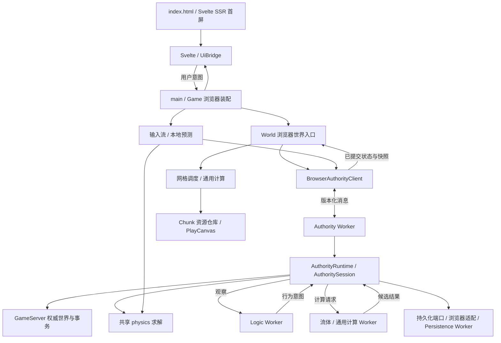

# 代码地图

本页回答“从哪里开始读、某项行为由谁负责”。目录归属见[仓库结构规范](repository-structure.md)，宏观取舍见[长期目标与路线图](living-world-alignment.md)，运行方式与当前能力见 [README](../README.zh-CN.md)。

核对日期：2026-09-09；活跃产品为 Web、game-core 与本机认知服务，Node Dedicated 已归档退出。这是人工核对的导航，不是自动生成的完整依赖图；后续移动入口或改变职责时应同步维护。

首屏由 [prerender-entry.ts](../apps/web/src/app/ui/prerender-entry.ts) 在开发请求或构建前调用同一个 `AppRoot` 生成，浏览器入口随后对该 DOM 做严格 hydration；生成与注入脚本位于 `apps/web/scripts/prerendered-start-screen.*`。

## 第一次阅读的顺序

不必先遍历全部文件或历史 change。先沿下面的链路建立概念，再按问题进入局部。

| 顺序 | 入口                                                                                                                                                               | 先理解什么                                                |
| ---- | ------------------------------------------------------------------------------------------------------------------------------------------------------------------ | --------------------------------------------------------- |
| 1    | [main.ts](../apps/web/src/app/main.ts)                                                                                                                             | 浏览器组合入口：画布、UI、音频、Game 与应用外壳如何接起来 |
| 2    | [application-shell.ts](../apps/web/src/app/application-shell.ts)、[game.ts](../apps/web/src/app/game.ts)                                                           | 菜单与会话生命周期，以及游戏各子系统的装配                |
| 3    | [browser-worker-session.ts](../apps/web/src/app/browser-worker-session.ts)                                                                                         | 浏览器本地会话与 Worker 如何启动、通信和释放              |
| 4    | [authority-runtime.ts](../packages/game-core/src/server/authority/authority-runtime.ts)、[game-server.ts](../packages/game-core/src/server/game-server.ts)         | 权威世界、命令、事务、存档与会话的组合；谁拥有真值        |
| 5    | [authority-session.ts](../packages/game-core/src/server/authority/authority-session.ts)                                                                            | 独立时钟、固定步长、玩家输入与物理推进                    |
| 6    | [world-runtime.ts](../apps/web/src/app/world/world-runtime.ts)                                                                                                     | 浏览器如何请求世界、提交编辑并调度可见 Chunk              |
| 7    | [mesh-task-scheduler.ts](../apps/web/src/app/world/mesh-task-scheduler.ts)、[chunk-resource-repository.ts](../apps/web/src/app/world/chunk-resource-repository.ts) | 网格任务与 GPU 资源分别由谁管理                           |
| 8    | [ui-bridge.ts](../apps/web/src/app/ui/ui-bridge.ts)、[app-root.svelte](../apps/web/src/app/ui/app-root.svelte)                                                     | 游戏状态如何投影到界面，用户意图如何回传                  |

## 当前目录速览

以下为现状，省略文件和部分子目录，不代表拟议的新布局。

```text
apps/
  web/                    @seedlands/web：浏览器产品、Vite 配置与公开资产
    src/app/              浏览器组合、输入、PlayCanvas 表现、streaming 与 Svelte UI
    src/client/           客户端协议适配、预测、镜像、持久化与表现计算
    src/compute/          浏览器 Wasm kernel 与内存适配
    src/worker/           浏览器 Worker 入口、传输与生命周期适配
packages/
  game-core/              @seedlands/game-core：无 DOM/WebWorker/Node ambient 的共享逻辑
    src/server/           权威世界、规则、协议、存档与 Headless 开发会话
    src/compute/          纯计算任务、完整 Authority 输入门禁
    src/world/            体素、坐标、确定性生成、网格与编解码
    src/physics/          身体形状、碰撞、恢复与物理解算
    src/runtime/          时钟、调度、任务队列、会话协议与窄平台端口
tests/                    按模块组织的单元测试、架构门禁与长期 E2E
changes/                  每次变更的合同、需求 E2E 与交付证据
docs/                     跨变更的长期目标、来源、代码地图和目录规范
scripts/                  工程、Harness 与无浏览器启动脚本
apps/web/public/assets/   静态图片等公开资源
harness/baseline.json     受版本控制的 Harness 基线
```

## 运行链路与状态归属

图中的箭头表示主要调用或数据流，Worker 两侧通过消息通信；它不是全部静态 import 的分层约束。



Node Dedicated 的产品接线、文件存储、网络镜像、五入口构建和可玩 E2E 已从活跃树归档退出，恢复入口见[研究归档](change-archive.md#node-dedicated-server-研究归档)。本地图不再将其列为当前开发入口。

Headless 工程入口 [server-headless.mjs](../scripts/server-headless.mjs) 通过 [Headless 平台适配](../scripts/headless/node-core-platform.ts) 注入端口并创建同一 [HeadlessSession](../packages/game-core/src/server/headless/headless-session.ts)。世界事实和命令仍进入 AuthorityRuntime，开发宿主不持有第二份世界。共享 [WorldHarnessPort](../packages/game-core/src/server/harness/world-harness-contract.ts) 与 [AuthorityWorldHarness](../packages/game-core/src/server/harness/authority-world-harness.ts) 处理开发操作和资源授权；Node REPL/JSONL 的 I/O 与二进制编码在 [jsonl-transport.ts](../scripts/headless/jsonl-transport.ts)。使用和证据见[世界开发 Harness](developer-world-harness.md)。 Headless 平台适配由根 [tsconfig.tools.json](../tsconfig.tools.json) 纳入 `pnpm typecheck`，只使用 ES2022/Node 类型并经声明的 workspace 开发依赖读取 core exports。

浏览器的 `window.__seedlandsHarness.world` 经 BrowserAuthorityClient → Authority Worker 进入同一世界端口；恢复只替换 Worker 内的 owner。F3 分类面板位于 [runtime-diagnostics.svelte](../apps/web/src/app/ui/runtime-diagnostics.svelte)，只读投影位于 [debug-diagnostics.ts](../apps/web/src/app/ui/debug-diagnostics.ts)；Wasm 调用/内存计数由 [KernelMemory](../apps/web/src/compute/kernel-memory.ts) 随计算任务 ACK 传回，不另开遥测轮询 RPC。

最容易混淆的几个名称：

- **`World`** 定义在 [app/world/world-runtime.ts](../apps/web/src/app/world/world-runtime.ts)，是浏览器侧 streaming、编辑请求与网格协调入口。它不拥有另一套权威体素世界。
- **`GameServer`** 持有权威 Chunk 与玩法状态，`editBatch()` 进入事务提交路径。浏览器编辑经 World / Authority 端口到达这里；不要直接改渲染副本。
- **`AuthorityRuntime` / `AuthoritySession`** 组合权威服务并安排时间、输入和物理推进。浏览器实例由 Authority Worker 持有；无浏览器会话复用同一核心。
- **`packages/game-core/src/world/`** 是纯世界算法与数据，不等于 `World` 类；[storage.ts](../packages/game-core/src/world/storage.ts) 是存档编解码，不是游戏服务实例。
- **`client`** 是客户端角色，不保证所有文件都不依赖浏览器；其中有 Worker 创建与持久化适配。类型引用也不等于运行时状态所有权。
- **`apps/web/src/worker`** 是浏览器执行入口与传输适配；复用的纯计算实现在 `packages/game-core/src/compute`。

## 按问题找代码与证据

表中测试是定位入口，不表示只跑这一项即可交付；验收范围仍由当前 spec 决定。

| 想理解或修改               | 实现入口                                                                                                                                                                                                                                                                                                                                     | 验证入口                                                                                                                                                                      |
| -------------------------- | -------------------------------------------------------------------------------------------------------------------------------------------------------------------------------------------------------------------------------------------------------------------------------------------------------------------------------------------- | ----------------------------------------------------------------------------------------------------------------------------------------------------------------------------- |
| 世界 seed、地形与网格      | [voxel.ts](../packages/game-core/src/world/voxel.ts)、[macro-world.ts](../packages/game-core/src/world/macro-world.ts)、[mesh.ts](../packages/game-core/src/world/mesh.ts)                                                                                                                                                                   | [world 测试](../tests/world/)                                                                                                                                                 |
| 挖掘、放置与批量事务       | [GameServer](../packages/game-core/src/server/game-server.ts)、[world-transaction-commit.ts](../packages/game-core/src/server/world-transaction-commit.ts)                                                                                                                                                                                   | [事务测试](../tests/server/world-mutation-transaction.test.ts)、[浏览器提交路由](../tests/app/world-authority-commit-routing.test.ts)                                         |
| 玩家输入、预测与权威物理   | [player-controller.ts](../apps/web/src/app/player/player-controller.ts)、[local-player-prediction.ts](../apps/web/src/client/local-player-prediction.ts)、[authority-session.ts](../packages/game-core/src/server/authority/authority-session.ts)、[physics](../packages/game-core/src/physics/)                                             | [物理求解](../tests/physics/step-body.test.ts)、[预测测试](../tests/client/local-player-prediction.test.ts)、[真实游玩基线](../tests/e2e/regression/world-play.spec.ts)       |
| Chunk 加载、网格更新与卸载 | [world-runtime.ts](../apps/web/src/app/world/world-runtime.ts)、[mesh-task-scheduler.ts](../apps/web/src/app/world/mesh-task-scheduler.ts)、[chunk-resource-repository.ts](../apps/web/src/app/world/chunk-resource-repository.ts)                                                                                                           | [任务调度](../tests/app/mesh-task-scheduler.test.ts)、[资源释放](../tests/app/chunk-resource-repository.test.ts)                                                              |
| Worker 排队与计算          | [browser-compute-runtime.ts](../apps/web/src/client/compute/browser-compute-runtime.ts)、[compute-worker-pool.ts](../apps/web/src/client/compute/compute-worker-pool.ts)、[compute-task-queue.ts](../packages/game-core/src/runtime/compute-task-queue.ts)、[world-compute-task.ts](../packages/game-core/src/compute/world-compute-task.ts) | [计算运行时](../tests/client/browser-compute-runtime.test.ts)、[计算任务](../tests/worker/compute-worker-task.test.ts)                                                        |
| 水的规则与画面             | [server/fluid](../packages/game-core/src/server/fluid/)、[water-experience.ts](../apps/web/src/app/gameplay/water-experience.ts)、[water-surface-transition.ts](../apps/web/src/app/scene/water-surface-transition.ts)                                                                                                                       | [流体提交](../tests/app/world-fluid-commit.test.ts)、[水面过渡](../tests/app/water-surface-transition.test.ts)                                                                |
| 光照、材质、反射与质量档位 | [voxel-materials.ts](../apps/web/src/app/scene/voxel-materials.ts)、[advanced-visual-effects.ts](../apps/web/src/app/scene/advanced-visual-effects.ts)、[quality-profile.ts](../apps/web/src/app/scene/quality-profile.ts)                                                                                                                   | [光照规则](../tests/app/advanced-lighting.test.ts)、[水面反射](../tests/app/water-reflection-plane.test.ts)；视觉语义另查所属 change                                          |
| 背包、合成、生物与自主行为 | [gameplay](../packages/game-core/src/server/gameplay/)、[simulation](../packages/game-core/src/server/simulation/)、[gameplay-entity-presenter.ts](../apps/web/src/app/gameplay/gameplay-entity-presenter.ts)                                                                                                                                | [物品与合成](../tests/server/item-inventory-recipe.test.ts)、[动作运行时](../tests/server/action-runtime.test.ts)、[实体表现](../tests/app/gameplay-entity-presenter.test.ts) |
| 菜单、HUD、交互与音频      | [app/ui](../apps/web/src/app/ui/)、[application-shell.ts](../apps/web/src/app/application-shell.ts)、[app/audio](../apps/web/src/app/audio/)、[client/audio](../apps/web/src/client/audio/)                                                                                                                                                  | [UI 桥接](../tests/app/ui-bridge.test.ts)、[外壳状态机](../tests/client/shell-controller.test.ts)、[音频生命周期](../tests/app/reference-audio-lifecycle.test.ts)             |
| 保存、恢复与退出会话       | [server/persistence](../packages/game-core/src/server/persistence/)、[browser-chunk-persistence.ts](../apps/web/src/client/persistence/browser-chunk-persistence.ts)、[persistence-worker.ts](../apps/web/src/worker/persistence-worker.ts)                                                                                                  | [检查点恢复](../tests/server/authority-checkpoint-restore.test.ts)、[浏览器持久化](../tests/client/browser-chunk-persistence.test.ts)                                         |
| Headless 世界开发与验证    | [server-headless.mjs](../scripts/server-headless.mjs)、[headless-session.ts](../packages/game-core/src/server/headless/headless-session.ts)                                                                                                                                                                                                  | [无浏览器会话](../tests/server/headless-session.test.ts)；持续 REPL / JSONL 与共享 world 端口；H1/H2 验收见 [change](../changes/2026-09-09-developer-world-harness/spec.md)   |
| 调试、性能与边界门禁       | [game-harness.ts](../apps/web/src/app/game-harness.ts)、[performance-telemetry.ts](../apps/web/src/client/presentation/performance-telemetry.ts)、[eslint.config.mjs](../eslint.config.mjs)                                                                                                                                                  | [governance](../tests/governance/)、[浏览器性能样本](../tests/e2e/benchmark/initial-world.spec.ts)                                                                            |

## 阅读依赖时的注意点

当前不存在一张“目录只向下依赖”的完整 DAG。例如：

- [headless-session.ts](../packages/game-core/src/server/headless/headless-session.ts) 调用 `compute/world-compute-task.ts` 中的纯计算实现；这不是在 Node 中启动浏览器 Worker。
- [authority-worker.ts](../apps/web/src/worker/authority-worker.ts) 使用 `client/persistence/browser-chunk-persistence.ts` 接入浏览器存储。文件属于客户端适配层，但调用方可以是后台 Worker。
- 客户端碰撞镜像与网格准备会引用服务端流体数据工具；浏览器与 Worker 也引用服务端协议类型。拆协议或共享模块前，应区分类型依赖、纯计算依赖和权威写入权限。

因此，未来目录整理应先聚合已有职责，再通过单独 spec 处理真正的模块边界变化，不能只根据文件名前缀批量移动。

## 当前实现与历史来源

- 当前可玩 MVP 的意图和交付记录：[可玩世界 MVP](../changes/2026-09-05-playable-world-mvp/spec.md)。
- 独立循环与统一物理：[原始合同](../changes/2026-09-06-independent-loops-unified-physics/spec.md)与[执行记录](../changes/2026-09-06-independent-loops-unified-physics/execution.md)配合阅读；不要只用合同早期状态判断当前完成度。
- 早期拆分的背景：[应用模块边界](../changes/2026-09-04-app-module-boundaries/spec.md)。其中历史路径不保证与当前一致。
- 下一阶段的目标与决策：[长期对齐](living-world-alignment.md)。Node Dedicated 已固定研究归档；后续按共享世界 Harness、浏览器单 NPC Agent、LOD、World AI 顺序推进，不能把设计目标当作当前已完成的能力。

## 资产工坊独立入口

- [asset-workbench.html](../apps/web/asset-workbench.html) → [asset-workbench/main.ts](../apps/web/src/app/asset-workbench/main.ts) → Svelte 工坊；不经过游戏 bootstrap。
- [asset-catalog.ts](../apps/web/src/client/presentation/asset-catalog.ts)、[asset-package.ts](../apps/web/src/client/presentation/asset-package.ts)：统一资源/用途、原生数据校验与依赖。
- [pixel-model-resource.ts](../apps/web/src/app/gameplay/pixel-model-resource.ts)：游戏与工坊共享的像素 GPU 资源；[preview-scene.ts](../apps/web/src/app/asset-workbench/preview-scene.ts) 只组合检视场景。
- [asset-workbench-store.ts](../apps/web/src/client/persistence/asset-workbench-store.ts)：旧版原生资产库兼容读取；当前项目快照由下述 appearance-project-store 持有。
- 适配范围与来源规则见[资产工坊](asset-workbench.md)。

统一视觉资产补充入口：

- [visual-asset-catalog.ts](../apps/web/src/client/presentation/visual-asset-catalog.ts)：地形、角色、材质及 UI 引用；[terrain-assets.ts](../apps/web/src/client/presentation/terrain-assets.ts) 与 [model-material-definitions.ts](../apps/web/src/client/presentation/model-material-definitions.ts) 为独立像素源。
- [texture-pack.ts](../apps/web/src/client/presentation/texture-pack.ts)、[terrain-pack-store.ts](../apps/web/src/client/persistence/terrain-pack-store.ts)：确定性图集与显式地形快照；世界存档不参与。
- [actor-model-definitions.ts](../apps/web/src/client/presentation/actor-model-definitions.ts)、[builtin-actor-models.ts](../apps/web/src/app/gameplay/builtin-actor-models.ts)：游戏和工坊共享构件与人形比例。
- [glb-model.ts](../apps/web/src/client/presentation/glb-model.ts)、[glb-model-store.ts](../apps/web/src/client/persistence/glb-model-store.ts)、[glb-model-resource.ts](../apps/web/src/app/gameplay/glb-model-resource.ts)：外部静态/骨骼模型的校验、二进制持久化与 PlayCanvas 资源生命周期。GLB 校验按 `glb-model-contract.ts`、`glb-model-document.ts`、`glb-model-animation-validation.ts` 和 `glb-model-texture-validation.ts` 分离合同、文档、动画和纹理职责。

对象外观入口以 `appearance-center.svelte` 组合对象导航、材质与像素编辑、完整项目导入导出。`appearance-project.ts`校验引用与覆盖，`appearance-project-store.ts`拥有draft/applied/previous及项目模型事务，`appearance-project-state.ts`解码持久化状态，`appearance-model-validation.ts`负责模型与片段引用校验；旧库保留迁移/读取兼容。游戏经 `load-appearance-runtime.ts` 在创建GPU资源前装载应用快照，`item-mesh-definition.ts`从既有体素描述编译物品网格，`appearance-thumbnails.ts`生成同引擎高清图标。可复现生产脚本位于 `scripts/assets/`。

## 物品与权威动作

- core 的 `server/gameplay/item-registry.ts` 和 `recipe-registry.ts` 持有类型化物品能力与配方定义；`combat-runtime.ts` 持有分阶段攻击执行器，`gameplay-combat.ts` 负责玩家命令与执行器的组合。模型名称与外观绑定不参与伤害判定。
- `app/ui/combat-ui-projector.ts` 与 `client/presentation/combat-viewmodel-pose.ts` 将权威阶段投影到 HUD 和第一人称动作，不推进权威时间。`app/gameplay/model-animation.ts` 将同一动作事实定位到骨骼片段。
- 有界 ECS 组件化尚未准入；当前实体状态仍由 `EntityStore` 的既有实现持有，不能将动作与动画扩展视为 ECS 迁移完成。

PR17 与近战集成时，地图开关和图层切换的浏览器控制委托给既有 [game-runtime-controls.ts](../apps/web/src/app/game-runtime-controls.ts)，`Game` 保持装配入口并满足文件规模门禁；地图状态仍归 `UiBridge`。

## 单 NPC 认知路线

从 [角色协议](../packages/game-core/src/runtime/character-control-protocol.ts) 读跨宿主合同，再读 core `server/simulation/character-runtime.ts` 的身体/目标/记忆所有权、[浏览器 Bridge](../apps/web/src/client/character/controller-bridge.ts) 的绑定和迟到消息门禁、[伙伴会话](../apps/web/src/app/gameplay/companion/companion-session.ts) 的玩家入口。`apps/agent-server/src/` 的图、调度、上下文和模型适配只产生提案；世界由 Authority 提交。行为与记忆决策见[现行认知基线](living-npc-cognition.md)。

认知传输合同位于 `packages/cognition-protocol/src/index.ts`，由 Web 与 Agent Server 消费；只依赖 core 公开角色类型，core 不反向依赖。模型状态、上下文窗口和 token 用量不进入权威世界协议。角色执行在 `character-runtime.ts`、`character-goal-runtime.ts`、`character-runtime-types.ts` 和 `character-runtime-validation.ts` 按执行、目标、状态与输入验证分工。
