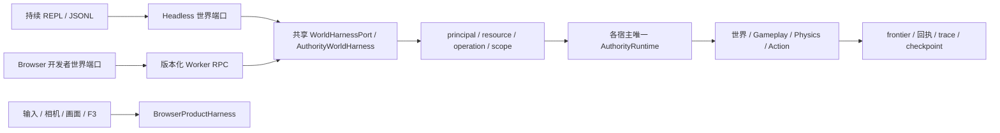

# 世界开发 Harness

当前实现与验收状态见 [H1/H2 change](../changes/2026-09-09-developer-world-harness/spec.md)。共享世界端口服务于可信开发；模型角色不会获得此端口的全局权限。下一阶段的认知回路、频率、工具、上下文和框架选择见[单角色认知方案](../changes/2026-09-09-developer-world-harness/agent-harness-design.md)。

## 两层能力

`WorldHarnessPort` 是 Headless 与 Browser 共用的 DeveloperWorldHarness 合同。身份、权威查询、场景构造、命令、模拟时间、Logic、Action、屏障、trace、checkpoint 都从 Authority 执行，返回 `{ok, data/error, frontier}`。frontier 包含世界、epoch、revision、提交序列和物理 tick；不要把主线程镜像当权威查询。

BrowserProductHarness 保留 `window.__seedlandsHarness` 的玩家输入、摄像机、画面、音频与性能方法；其 `.world` 是共享世界端口。纯呈现能力不会搬进 Headless。Headless 与浏览器各自创建独立世界，只有 checkpoint 数据可转移，不共享可变 runtime。

运行 `pnpm dev`，在开发页面 URL 添加 `?harness` 并进入世界后，可在浏览器控制台使用 `await window.__seedlandsHarness.world.identity()`。普通玩家入口不自动暴露这个全局开发对象；F3 诊断本身不要求开启全局开发端口。



## 开发 REPL 与 JSONL

```sh
pnpm server:headless -- --seed my-world
```

TTY 进入 Node 自带 JavaScript REPL，支持多行与 top-level await；世界初始暂停，`world` 在整个会话内稳定存在。`.command /seed` 调用原 slash 命令，`.exit` 释放宿主。`--repl` 可显式选择 REPL；没有 TTY 或加 `--json` 时进入 JSONL/slash 兼容模式。

```js
await world.identity();
await world.prepare({ kind: 'chunk', chunk: [0, 0, 0] });
await world.command({ type: 'set-block', position: [1, 30, 1], voxel: 4 });
await world.inspect({ kind: 'voxel', position: [1, 30, 1] });
await world.clock({ kind: 'advance', elapsedMs: 1000 });
const saved = await world.checkpoint({ kind: 'export' });
if (saved.ok) await world.checkpoint({ kind: 'restore', snapshot: saved.data.snapshot });
await world.clock({ kind: 'run' });
await world.clock({ kind: 'pause' });
```

`run` 启用宿主正常时间推进；`advance` 只在 paused 接受，不是改天时。新场景用正常 command 组合，inspect 不隐式生成未知 Chunk，需要显式 prepare。命令的 `data.success` 是领域结果，外层 `ok` 表示 Harness 操作执行结果，调用者两者都应检查。

JSONL 请求示例：

```json
{"protocolVersion":1,"requestId":1,"method":"identity","args":[]}
{"protocolVersion":1,"requestId":2,"method":"clock","args":[{"kind":"advance","elapsedMs":1000}]}
```

每行一个版本化请求/响应，requestId 用于关联；command 的 sequence 用于权威去重，不能把 requestId 当已完成证明。只分派白名单方法，不 eval 字符串。单请求处理配合 stdin/stdout 背压，普通行上限 1 MiB，完整 checkpoint restore 行上限 96 MiB；超限行丢弃到下一个换行，后续请求继续。EOF 不隐式保存。

JSONL checkpoint 的 Uint16 体素数组采用 `u16le-base64`，Uint8 流体数组采用 `u8-base64`，带 byteLength；恢复严格验证类型、容量和 canonical base64，再交 core 校验完整 snapshot。不能用普通 JSON.stringify 的数字键对象替代 typed array。进程内与 Browser MessagePort 保持原生 typed arrays。

保存格式仍是既有 `FrozenGameSaveSnapshot`，没有 SDK/模型专属字段。开发导出不等于把文件写入磁盘；Headless persistence 是内存适配，要持久保留需保存返回的完整包。浏览器恢复需要通过候选验证并替换完整保存集合，不能把目标世界旧的额外 Chunk 拼进源 snapshot。

## Logic、Action、屏障与 trace

使用 `world.logic({kind:'mode', mode:'scripted'})` 关闭自动算法候选竞争，再通过 `observe` 取得当前 Logic 观察、`submit` 提交批次。切回 automatic 或恢复后旧候选失效。这里是开发观察，不是模型角色的局部感知接口。

`world.actions({entityId})` / `{actionId}` 查询真实动作；组合参数必须与实际 owner 一致。成功、失败、中断来自执行器，不能由调用脚本直接宣称成功。`world.barrier({kind,frontier,timeoutMs})` 绑定有限 frontier：committed、settled 和 checkpoint ACK 分开，超时/旧 epoch 是明确错误；不用 sleep 推断完成。

`world.trace({kind:'read',limit:64})` 读取有界开发操作 trace，`export` 导出 JSONL。当前 trace 描述 Harness 操作及提交引用，不是未来角色认知日志，也不是所有世界事件的永久档案。长期 Agent 的因果事件 ledger 在 A1/A2 单独实现。

## 权限和可见性

宿主配置 principal 与策略，请求不能自己设角色。身份标签只是配置选择器，授权由资源、操作和 scope 决定；未知身份/资源默认拒绝。命令目录必须穷尽并从真实命令目标派生授权，多目标命令逐项检查，不能授权 self 后返回任意他人 action。

权限配置不改变世界规则。允许执行拾取/攻击等交互，不等于允许瞬移、直接 patch 体素或获取隐藏信息。当前开发 inspect 是全局工具；面向普通 Actor 的字段投影、感知目标引用和认知资源在 A1 增加，不能提前对模型开放整个开发端口。

## F3 运行诊断

F3 打开分类仪表板并释放 Pointer Lock，世界继续正常运行；单击世界恢复操控。六类为概览、世界、调度、渲染、Wasm、内存，支持紧凑布局和滚动；碰撞箱、接触点、传感器与旧地理信息保留在折叠区。

面板以 4 Hz 投影已有诊断。Authority、Logic、Compute 和嵌套 Persistence 是 Web Worker；不把 Worker 数当作 OS 线程。每个计算槽位展示任务状态与耗时；Wasm 计数、同步核耗时与实际线性内存随任务 ACK 更新，实例重建后归零。正在执行任务的年龄是主线程经历时间，不能叫 Worker CPU 时间。

观测、配置、估算和未知分开标记。JS heap 的非标准估计、网格字节估计、Wasm 线性内存、持久化大小有不同范围，不能相加冒充进程总内存。OS 线程数、CPU 使用率、GPU/跨 Worker 堆没有可用测量时明确未提供。本轮没有性能优化或加速倍率结论。
