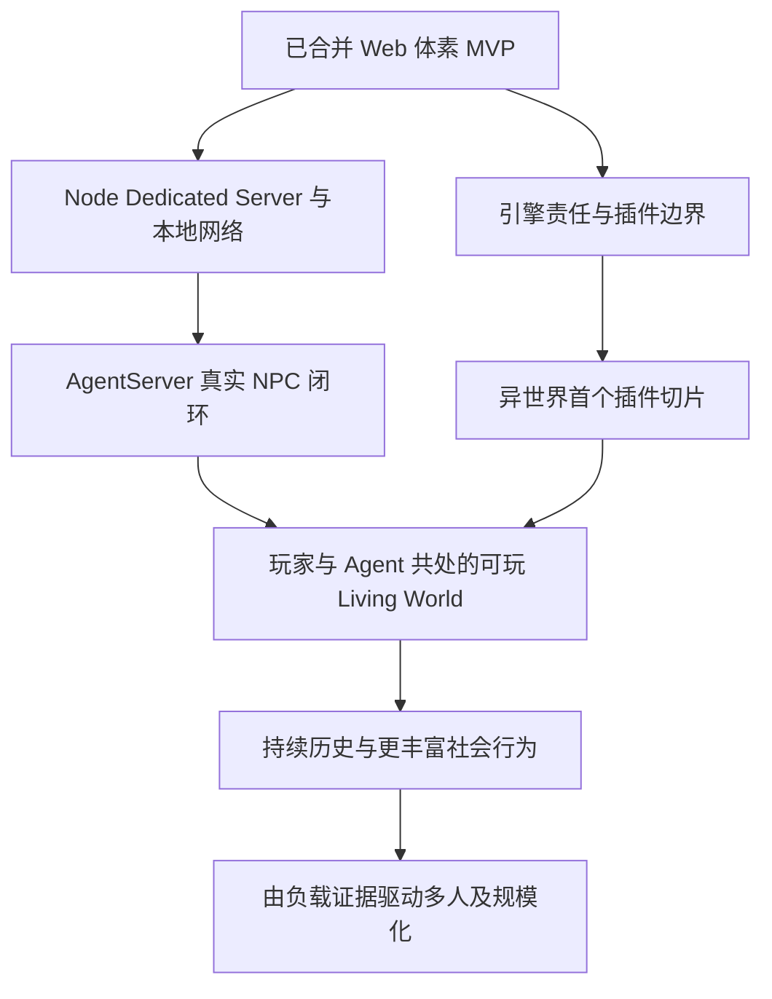

# Living World：长期目标、决策背景与演进路线

> 核心方向：**a voxel sandbox for agents**。
>
> 更新日期：2026-09-06。当前阶段：Web 体素 MVP 已合入主分支，进入收尾与两路并行探索的交界。
>
> **资料状态：对齐初稿，尚未完成 Project 全量核对。** 本轮用户明确指示与仓库状态已经核实；历史讨论目前只读到项目目录、会话预览及部分正文，另读取本机保存的架构方案。本文逐项区分事实、历史方案与建议，缺失历史不能被当作共识。完整范围见[来源与缺口](living-world-sources.md)。

## 一、后续会话先理解什么

我们最终要让 Agent 在一个可持续存在、可观察、可行动、会留下真实后果的世界里生活。体素沙盒提供世界的物质与交互基础；异世界游戏提供第一种完整体验；浏览器原型已经证明这一底座可以做成可玩的产品。[S0][S1][S3]

下一阶段有两个并行方向：

1. **Node Dedicated Server → AgentServer → Living World 可行性。** 先让权威世界脱离浏览器，在本地网络运行，再接入真实 Agent，证明观察、思考、行动、结果与记忆的完整闭环。[S0][S2]
2. **冻结 voxel engine 边界 → 插件系统边界 → 异世界首个 MVP。** 通过具体游戏验证引擎与内容的分工，让后续世界规则和玩法有明确扩展位置。[S0]

两条路线最终在同一个真实世界会合：Agent 通过正式能力参与插件定义的玩法，玩家可以进入、观察和改变这个世界。下一步价值在于证明这条闭环；具体协议、插件 API、模型供应商和集群形态仍应由相应 change 给出证据。

## 二、长期价值与完成态

### 2.1 世界作为 Agent 的行动环境

世界需要提供足够明确的因果关系：获取材料、移动、建造、进食、战斗和交往会改变真实状态，其他参与者可以感知这些变化。Agent 的自然语言表达应与执行结果相连，不能仅凭说过“我完成了”就形成世界事实。[S3][S4]

人的输入、Agent 意图与 API 操作应汇入同一权威边界，并产生一致、可追溯的结果。后续世界记忆建立在已发生的事实之上。统一事实来源不意味着所有角色能读取相同的秘密：观察仍受身份、感知范围和资源权限约束。[S5][S6]

### 2.2 第一种游戏体验：异世界

仓库已表达的 Seedlands 愿景包括：剑与魔法的开放世界、统一自然法则、自主居民、持续后果，以及可通过转生延续的生命。早期方案进一步提出源质、聚居地、人格 NPC、动态世界事件、灵魂日记和世界意志。[S1][S3]

其中，日记用于整理经历和提供自由引导；世界意志通过世界规则允许的效应器影响生态与事件。早期方案强调这些内容，但原始完整世界观文件仍待读取。六界、寿命、转生及源质的具体规则不能凭本初稿自行补全。

**两个 MVP 必须分清：**已合并的是可玩的 Web 体素沙盒 MVP；接下来要验证的是承载 Agent 与异世界内容的纵向 MVP。前者的交付不等于后者已经成立。

### 2.3 两种 Agent 自主性

| 对象             | 追求的自主性                                                 | 依靠的条件                                                  |
| ---------------- | ------------------------------------------------------------ | ----------------------------------------------------------- |
| 游戏内 Agent     | 在能力、认知和世界规则约束下持续形成意图、执行动作、更新记忆 | 真实感知、异步 Action、权威回执、持久身份、上下文连续性     |
| 开发与架构 Agent | 理解长期目标后自主选择路径、实现并验证，减少重复解释目标     | 本文、历史决策样本、当前源码、SDD、Harness 和可恢复交付记录 |

早期 Minecraft 开发讨论已经提出自主编译、运行真实客户端/服务端、联调与独立验证的闭环。这说明“平台是否便于 Agent 自己开发和验证”也是选型依据的一部分。[S3][S7]

### 2.4 长期成功的观察方式

以下是从既有方向归纳的宏观判断标准，尚不是新的生产验收合同：

- 玩家离开后，常驻世界仍能按明确规则继续运行；重新进入时看到可解释的变化。
- NPC 的承诺、记忆、当前行动和可见行为一致；中断、失败、遗忘与误解有来源。
- 玩家与 Agent 使用同一套世界规则，能互相影响；权威服务决定实际结果。
- 不同玩法可以通过清晰的扩展边界表达，异世界内容不需要不断侵入所有底层模块。
- 新的技术投入能缩短上述体验的验证路径，或解决已有证据证明的瓶颈。

## 三、为什么经过这些技术选择

### 3.1 决策链与当前证据

| 阶段                 | 当时问题与所探索路径                                          | 保留下来的价值                                    | 当前判断与资料边界                                                                      |
| -------------------- | ------------------------------------------------------------- | ------------------------------------------------- | --------------------------------------------------------------------------------------- |
| Minecraft 生态探索   | 村民 AI、渲染与 LOD、Rustcraft、Pumpkin、网络栈               | 成熟沙盒提供可交互世界和丰富架构样本              | 已确认讨论存在；具体优劣结论待正文核对，不能声称已采用某 Mod 或提出 PR                  |
| Minecraft 异世界 MVP | NeoForge 物理权威 + 世界脑；未来逐项迁移 Pumpkin              | 物理事实与认知分工、合法提案、语义记忆、纵向切片  | 早期方案已读部分正文；此实现载体已被当前 Web 主线替代，不恢复为当前任务                 |
| Agent 开发环境       | 真实 MC 客户端/服务端 Harness；探索容器、WASM、EaglerPorts    | 快速隔离实例、自主迭代、全链路验证和平台边界      | 用户明确提出类似 FaaS 的开发 sandbox；Java → Web 边界讨论已见预览；最终转向动机仍待原文 |
| 自建 Web 体素底座    | TypeScript / Vite / PlayCanvas，自有世界与玩法逻辑            | 浏览器可玩、纯逻辑测试、权威状态、独立演进        | 实现与合并已核实；不能仅凭实现反推全部历史理由                                          |
| 逻辑 C/S 与 Headless | 先确定所有权，同进程直接调用，后续再引入真实网络              | 共用一个 GameServer，避免两套世界和过早序列化成本 | 已读标为 Accepted 的历史架构文件；“暂缓网络”现已进入下一阶段                            |
| 数据与性能           | TypedArray / SoA 优先，WASM 独立 A/B；观察 trace 再调整线程   | 数据布局、执行环境和优化收益分别取证              | SoA/WASM 是用户预览中明确原则；不代表全仓已完成 SoA 或 WASM 迁移                        |
| MVP 产品化           | 生存、算法 NPC、Svelte UI、视听与输入；继而统一物理和独立时钟 | 基础能力变成可玩的整体，真实交互暴露底层问题      | 已合并；证据需按具体 change 和源码版本阅读                                              |
| 下一阶段             | Dedicated + Agent；引擎边界 + 插件 + 异世界                   | 把技术底座接回长期价值                            | 本轮用户明确的两路方向，具体实现另写合同                                                |

### 3.2 为什么是体素沙盒

已确认用户把“体素沙盒作为载体的原因”列为必须恢复的历史背景；目前没有读到这一选择的完整原始论证。[S0]

基于现有目标可以形成一个**待原文验证的解释**：体素提供结构化、可编辑的物质世界，有限规则可以组合出建设与破坏的持久后果，既支持人类直观游玩，也支持 Agent 通过结构化接口观察和行动。这个解释不能冒充当时对 2D、Minecraft 或其他载体的全部比较结论。

后续恢复时应补齐：为什么没有止步于文字/2D Agent 社会；体素的可塑性与游戏体验分别承担什么价值；它是否是长期固定载体，还是当前最合适的验证方式。

### 3.3 为什么从 Minecraft 到 Web 自建

已看到的线索依次是：Minecraft 异世界方案 → 自主开发 Harness → 不希望每次依赖完整本机 MC 客户端 → 容器/WASM sandbox 探索 → EaglerPorts 平台边界 → Web 体素实现。[S3][S7][S8][S9]

可确认的是，**开发验证闭环与平台边界参与了讨论**。尚不能确认性能、许可证、分发成本、技术熟悉度、可控性等因素各自的权重，也不能将其写成用户当时明确的淘汰理由。待补全原文后，应以“当时约束—比较选项—决定—代价—重开条件”的形式补齐。

### 3.4 PlayCanvas 与自建部分各负责什么

当前采用 PlayCanvas 承担浏览器渲染、GPU 资源和表现生命周期；项目自己拥有确定性体素世界、Chunk 数据和网格逻辑、权威规则、统一物理、独立时钟及领域协议。[S1][S10]

这形成一个可继续沿用的边界：通用渲染能力与游戏的权威语义分开。自写 shader 和体素物理并不等于要重建整个通用渲染器或物理引擎。

**为何最终选择 PlayCanvas，而非 Three.js、Babylon.js、Godot 或其他组合，原始完整比较尚未读到。**现有文件可以证明采用结果，不能证明全部选型原因。[S11]

### 3.5 可复用的决策方法

1. 先定义真实目标和最小可验证闭环，再决定增加多少基础设施。
2. 提前稳定权威与数据所有权；部署、线程、语言和传输可以分阶段演进。
3. 热点数据布局与 WASM 迁移分别实施、分别比较；不能把多项优化捆在一起无法归因。
4. 渲染帧率、物理时钟、逻辑决策和模型调用有不同节奏；模型思考不能冻结世界。
5. 优先保留正式 Query / Command / Action 的可复用语义；不同入口不各写一套业务规则。
6. 阶段性选择应附重开条件：当产品需求或测量证据变化，更新决策，不把历史阶段约束永久化。

这些方法来源于 C/S、Agent Runtime、WASM 讨论预览和本轮用户方向；尚待完整 Project 阅读交叉核对。

## 四、当前进度与重点里程碑

### 4.1 已验证的代码基点

2026-09-06 通过 `git ls-remote origin refs/heads/main` 只读确认远端 main 为 **`3938eed27793cd342558165d061792ab9f12dd2a`**，提交主题为“交付可玩沙盒 MVP 与统一物理及独立循环 (#7)”。[S1]

本次只做文档与源码核对，没有复跑产品测试。下述已实现判断来自该提交的 README、源码与交付记录；历史测试数字仍属于原版本证据。独立循环的执行记录确认 A1–A12 准出，最终生产候选为 `2257aff`：记录有 734 项单测通过、4 项跳过、22 项需求浏览器用例和 9 项长期基线通过；必需视觉证据另有其来源版本。原 spec 保留批准时内容，不能把其中“待实施”误读为当前状态。

| 里程碑                                  | 状态                            | 已有结果 / 下一步边界                                                                                     |
| --------------------------------------- | ------------------------------- | --------------------------------------------------------------------------------------------------------- |
| 确定性 Web 世界与工程闭环               | 已合并                          | 世界生成、Chunk、正式编辑、存档、浏览器渲染与分层验证；运行能力以 README 为准                             |
| 权威 C/S、事务、持久化、命令和 Headless | 已合并                          | 对应历史 Change 4–7；服务端可离开渲染执行，不等于已交付网络 Dedicated Server                              |
| 生存与算法生物/NPC                      | 已合并                          | 对应历史 Change 8–9；感知、导航、Action、需求与 POI 有底座，不含 LLM AgentServer                          |
| 可玩 Web MVP                            | 已合并，用户确认进入收尾        | 生存建造、视听、UI、存退等整体闭环；不是完整异世界产品                                                    |
| 独立循环与统一物理                      | 已合并；执行记录确认准出        | 权威 Worker、逻辑 Worker、计算与持久化 Worker、统一碰撞与客户端预测；原 spec 的旧“待实施”不能独自代表现状 |
| Node Dedicated Server / 本地网络        | 下一阶段                        | 网络适配、编解码与包成本、进程退出后的持久存储、连接生命周期仍需正式验证                                  |
| AgentServer 真实 NPC 闭环               | 有历史方案，尚未在当前 MVP 接入 | 历史 Change 10 是设计输入，不能直接当作当前已批准的实现合同                                               |
| 引擎边界冻结与插件系统                  | 用户明确的下一阶段方向          | 当前代码模块化不等于已有稳定插件 API；需用异世界首个 MVP 验证                                             |
| 区域/世界 Agent、历史社会、长寿与转生   | 长期愿景                        | 不以现有算法日程、基础存档或一段模型对话声称完成                                                          |
| 持久多人世界与模拟岛扩展                | 长期演进方向                    | 不把多人、MMO、跨进程模拟岛写成当前能力                                                                   |

不提供一个“整个项目已完成百分之多少”的数字：引擎可行性、Agent 可行性、异世界体验和规模化能力是不同问题。

### 4.2 当前证据入口

- [当前能力与操作](../README.zh-CN.md)：唯一面向运行和现有能力的说明。
- [可玩 MVP 父合同](../changes/2026-09-05-playable-world-mvp/spec.md)：总体范围、阶段修订与历史证据。
- [算法生物与 NPC](../changes/2026-09-05-creature-npc-algorithmic-foundation/spec.md)：模型接入前的确定性底座。
- [独立循环与统一物理合同](../changes/2026-09-06-independent-loops-unified-physics/spec.md)、[执行记录](../changes/2026-09-06-independent-loops-unified-physics/execution.md)：联合阅读，避免只读旧阶段文字。
- [Headless 实现](../src/server/headless/headless-session.ts)、[权威运行时](../src/server/authority/authority-runtime.ts)：本次核对的实际实现边界。

## 五、两条并行路线

以下里程碑是根据本轮方向整理的**建议拆分与完成信号**，不构成已批准的技术 spec，也不预选 wire protocol、数据库或插件加载方式。

### 5.1 A 线：让世界常驻，再让 Agent 生活其中

| 阶段                     | 要回答的问题                          | 最小完成信号                                                                                               |
| ------------------------ | ------------------------------------- | ---------------------------------------------------------------------------------------------------------- |
| A1 Node Dedicated Server | 同一权威世界能否脱离浏览器可靠运行？  | Node 权威进程 + 本地网络 Web 客户端；编辑/动作一致；断连后世界行为明确；重启恢复有证据                     |
| A2 网络与运行成本        | 进程分离带来什么收益和成本？          | 同负载对照浏览器与 Node，分别报告模拟耗时、序列化/解码 CPU、包体、吞吐、延迟与内存；不能预设 Node 必然更快 |
| A3 真实 Agent 纵向闭环   | NPC 能否根据当前事实形成并执行意图？  | 玩家交流 → 有范围的观察 → 模型/上下文 → 正式 Action → 完成/失败回执 → 记忆更新 → 可见行为                  |
| A4 长期连续性            | 世界变化后 Agent 能否保持身份与承诺？ | 跨会话/重启一致；推理期间目标变化会重新验证；异步等待可恢复；预算与失败降级可观察                          |
| A5 更广泛 Living World   | 多个个体能否通过世界形成持续互动？    | 信息通过世界内渠道传播，个体/聚居地/区域层级各自有边界；逐步验证历史后果                                   |

历史 Agent 方案值得继承的设计输入包括：Agent = Model + Harness；世界模拟与动作执行属于 GameServer；虚拟 Workspace 与 Session 分离；跨 Session 以 revision 同步；单 Agent 认知写入串行，多 Agent 可并行；异步 Action 通过回调恢复；模型推理期间世界继续运行。[S4]

早期文件提出 Small / Large Tier、稳定前缀、Context Epoch 和记忆压缩。它们是后续方案的参考样本；具体模型、token 数、调度参数、存储与依赖必须重新核对，不能继承过时产品型号为强制要求。

### 5.2 B 线：明确引擎与插件边界，以异世界验证

| 阶段                  | 要回答的问题                                 | 最小完成信号                                                                     |
| --------------------- | -------------------------------------------- | -------------------------------------------------------------------------------- |
| B1 引擎边界盘点       | 哪些是通用体素能力，哪些属于游戏规则与内容？ | 列出核心所有权、扩展点、正式变更路径和仍有耦合的位置；通过具体内容示例验证       |
| B2 最小插件合同       | 内容如何注册、获得能力并与世界一致运行？     | 最小内容插件可被加载、验证、执行和停用；生命周期、依赖、错误与保存兼容有明确约定 |
| B3 异世界首个纵向切片 | 插件边界能否承载真实玩法？                   | 从世界设定挑一个有价值的规则—行动—后果闭环，由插件落地并能真实游玩               |
| B4 边界检验           | 新内容能否沿既定方式扩展？                   | 再增加一个有差异的小功能，确认不是为第一个插件硬编码的伪通用接口                 |

“冻结”应在后续合同中明确版本和范围。建议冻结的是经过实际切片验证的责任与契约；出现缺口时通过可追溯的版本变更修订，不能为了保持表面冻结而添加绕过权威的数据写入路径。

插件受统一权威约束：人、AI 与 API 的修改汇入正式世界入口，并形成可追溯事实。控制面如何与领域规则扩展配合、如何暴露观察和事件、哪些能力允许注册，仍须补读《体素项目阶段规划》全文后确定。[S5]

### 5.3 并行与汇合



两路可以各自研究和验证，但接入同一个世界前需要共同确认身份、Query / Command / Action、事件/回执、版本、保存和错误语义。该清单是协调建议，接口名称与目录尚未冻结。

应避免 A 线另建一套 Agent 专用世界操作，B 线另建一套可绕过权威的插件写入机制。每个接入点应由一个明确的 change 持有合同，依赖方复用。

## 六、长期架构方向与延后事项

### 6.1 稳定所有权，保留部署演进空间

```text
玩家输入 / Agent 意图 / API 请求
                  ↓
        身份与作用范围 / 正式能力边界
                  ↓
       GameServer 验证、模拟与权威提交
                  ↓
       事实、动作结果、快照、语义事件
           ↙                    ↘
  客户端表现与交互          Agent 观察与记忆
```

此图描述长期语义，不声称所有层已经在当前版本实现。完整资源授权、Agent 上下文与世界记忆仍属于未来工作。

### 6.2 模拟岛与计算资源

《Godot Web与生产架构》的用户末条预览明确提出：workload 按模拟计算而非 Chunk 边界划分；模拟岛是负载，worker 是计算资源；通过图划分减少岛间竞争。[S12]

这意味着 Chunk 的存储/渲染单位和模拟调度单位不能直接画等号。完整讨论尚未读取，因此图算法、岛迁移、一致性、跨节点拓扑及触发条件仍待核实。当前多个浏览器 Worker 不等于已经实现这种生产级调度。

### 6.3 不自动提前实施的事项

WASM 默认后端、Godot/原生客户端迁移、复杂分布式集群、全世界常驻全精度模拟、完整六界和社会经济，需要产品价值或实测瓶颈推动。讨论过一个方向不意味着它自动进入近期范围。

同时，旧文档的“不做 Dedicated Server / AgentServer”只定义原 MVP 的终点。用户已宣布下一阶段，后续不能再用旧 MVP 的排除项否定新方向。

## 七、长期对齐如何增强自主性

### 7.1 与 SDD 分工

| 材料                     | 回答的问题                                   | 更新时机                               |
| ------------------------ | -------------------------------------------- | -------------------------------------- |
| 本文                     | 为什么做、往哪里走、当前阶段、哪些价值要保持 | 方向确认、里程碑完成、关键约束变化     |
| 来源与历史决策           | 为什么当时选这条路、哪些假设已过期           | 补齐原文、推翻旧假设、形成新的重要选择 |
| `changes/*/spec.md`      | 本次具体改变什么、怎样验证、实际交付了什么   | 每次具体变更与准出                     |
| README / 源码 / 测试输出 | 现在实际能做什么、怎样运行、证据如何         | 真实实现与验证发生变化                 |

架构 Agent 应先提出与长期目标一致的最小路径，自主处理已授权范围内的实现取舍、可逆验证与资料补齐；不用反复询问已经明确的长期方向。具体任务仍遵循 `AGENTS.md` 的 Agile / Breaking / Exploration 边界与当轮用户授权。

本次没有取消精确 spec review，没有批准实现尚未评审的新公开契约、持久化格式或高影响变更，也没有把过去某次任务的特殊授权扩大为永久授权。

### 7.2 做新技术决策前的五个问题

1. 这项工作服务 A 线、B 线还是已确认的收尾问题？它推进什么玩家/Agent 可见结果？
2. 当前代码是否已经提供相同的世界权威、动作或数据能力？能否复用？
3. 此时最重要的不确定性是什么，用什么最小实验消除？
4. 比较的是数据布局、算法、运行环境、传输还是表现？如何隔离变量？
5. 完成后留下什么版本绑定的证据，失败时保留哪条恢复路径？

若无法把改动与价值、现有约束或瓶颈联系起来，先缩小提案或补证据。若需要改变核心产品方向、已确认必达体验或授权边界，再向用户说明具体分歧。

### 7.3 更新规则

新里程碑完成时更新状态、提交与证据入口；重要决策记录当时问题、选项、取舍、代价和重开条件。正文只保留当前方向，历史反转保留来源链接和原因，不堆叠互相矛盾的“当前状态”。

本初稿恢复顺序：先完成[来源索引](living-world-sources.md)中的未读正文与附件，补齐体素/Minecraft/Web/PlayCanvas 的真实选择原因，再消除本文“待核对”项。资料缺口消除前，不将本初稿作为这些历史动机的唯一权威。

## 八、来源

`S0` 至 `S18` 的标题、链接、资料层级和读取范围统一维护在[Living World 来源与缺口](living-world-sources.md)。正文使用这些编号回溯依据；编号本身不表示全部原文已经读取。
