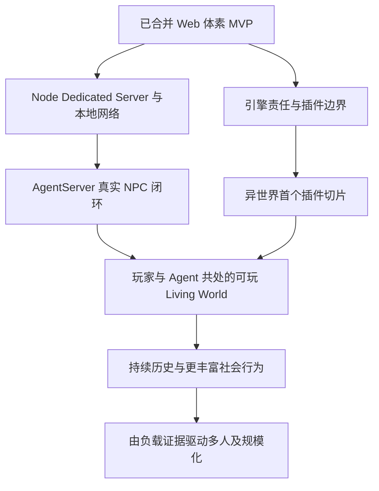

# Living World：长期目标、决策背景与演进路线

> 核心方向：**a voxel sandbox for agents**。
>
> 更新日期：2026-09-06。当前阶段：Web 体素 MVP 已合入主分支，进入收尾与两路并行探索的交界。
>
> **资料状态：对齐初稿，尚未完成 Project 全量核对。** 本轮用户明确指示与仓库状态已经核实；已通过 AppleScript 保存网页正文，并从历史任务记录恢复部分原始消息；已补齐 Minecraft、2D 与自建 3D 体素选择的关键用户原话、PlayCanvas 回顾，以及插件、规模化和 UI 的重要讨论。部分会话中段、项目来源与附件仍未完整取得，另有本机保存的架构方案。本文逐项区分事实、历史方案与建议，缺失历史不能被当作共识。完整范围见[来源与缺口](living-world-sources.md)。

## 一、后续会话先理解什么

我们最终要让 Agent 在一个可持续存在、可观察、可行动、会留下真实后果的世界里生活。体素沙盒提供世界的物质与交互基础；异世界游戏提供第一种完整体验；浏览器原型已经证明这一底座可以做成可玩的产品。[S0][S1][S3]

用户在载体重选时明确的三个核心是：**每个服务器有不同的随机世界；没有固定玩法的开放沙盒；玩家只是一个角色、会自行运行的活世界。**“a voxel sandbox for agents”应在这三个目标下理解，不能逐渐退化成只供模型调用工具的测试场，或只有玩家附近才存在的对话 NPC 展示。[S9]

下一阶段有两个并行方向：

1. **Node Dedicated Server → AgentServer → Living World 可行性。** 先让权威世界脱离浏览器，在本地网络运行，再接入真实 Agent，证明观察、思考、行动、结果与记忆的完整闭环。[S0][S2]
2. **冻结 voxel engine 边界 → 插件系统边界 → 异世界首个 MVP。** 通过具体游戏验证引擎与内容的分工，让后续世界规则和玩法有明确扩展位置。[S0]

两条路线最终在同一个真实世界会合：Agent 通过正式能力参与插件定义的玩法，玩家可以进入、观察和改变这个世界。下一步价值在于证明这条闭环；具体协议、插件 API、模型供应商和集群形态仍应由相应 change 给出证据。

## 二、长期价值与完成态

### 2.1 世界作为 Agent 的行动环境

世界需要提供足够明确的因果关系：获取材料、移动、建造、进食、战斗和交往会改变真实状态，其他参与者可以感知这些变化。Agent 的自然语言表达应与执行结果相连，不能仅凭说过“我完成了”就形成世界事实。[S3][S4]

人的输入、Agent 意图与 API 操作应汇入同一权威边界，并产生一致、可追溯的结果。后续世界记忆建立在已发生的事实之上。统一事实来源不意味着所有角色能读取相同的秘密：观察仍受身份、感知范围和资源权限约束。[S5][S6]

已读阶段规划把差异归纳为持续且可变精度的模拟、Agent 原生能力、单一世界事实，以及支撑开发的可操作 Harness。这是讨论中的架构归纳：当前物理状态、派生的结构语义、已经发生的历史、某个角色知道与记得的子集应分开。世界远处可以降低模拟精度，不能据此丢弃角色身份与持续后果；模拟精度和 Agent 智能程度也不是同一个开关。[S5][S16]

### 2.2 第一种游戏体验：异世界

仓库已表达的 Seedlands 愿景包括：剑与魔法的开放世界、统一自然法则、自主居民、持续后果，以及可通过转生延续的生命。早期方案进一步提出源质、聚居地、人格 NPC、动态世界事件、灵魂日记和世界意志。[S1][S3]

其中，日记用于整理经历和提供自由引导；世界意志通过世界规则允许的效应器影响生态与事件。早期方案强调这些内容，但原始完整世界观文件仍待读取。六界、寿命、转生及源质的具体规则不能凭本初稿自行补全。

**两个 MVP 必须分清：**已合并的是可玩的 Web 体素沙盒 MVP；接下来要验证的是承载 Agent 与异世界内容的纵向 MVP。前者的交付不等于后者已经成立。

### 2.3 两种 Agent 自主性

| 对象             | 追求的自主性                                                 | 依靠的条件                                                  |
| ---------------- | ------------------------------------------------------------ | ----------------------------------------------------------- |
| 游戏内 Agent     | 在能力、认知和世界规则约束下持续形成意图、执行动作、更新记忆 | 真实感知、异步 Action、权威回执、持久身份、上下文连续性     |
| 开发与架构 Agent | 理解长期目标后自主选择路径、实现并验证，减少重复解释目标     | 本文、历史决策样本、当前源码、SDD、Harness 和可恢复交付记录 |

早期 Minecraft 开发讨论已经提出自主编译、运行真实客户端/服务端、联调与独立验证的闭环。这说明“平台是否便于 Agent 自己开发和验证”也是选型依据的一部分。[S3][S7]

### 2.4 长期成功的观察方式

以下是从既有方向归纳的宏观判断标准，尚不是新的生产验收合同：

- 玩家离开后，常驻世界仍能按明确规则继续运行；重新进入时看到可解释的变化。
- NPC 的承诺、记忆、当前行动和可见行为一致；中断、失败、遗忘与误解有来源。
- 玩家与 Agent 使用同一套世界规则，能互相影响；权威服务决定实际结果。
- 不同玩法可以通过清晰的扩展边界表达，异世界内容不需要不断侵入所有底层模块。
- 新的技术投入能缩短上述体验的验证路径，或解决已有证据证明的瓶颈。

## 三、为什么经过这些技术选择

### 3.1 决策链与当前证据

| 阶段                 | 当时问题与所探索路径                                          | 保留下来的价值                                    | 当前判断与资料边界                                                                                            |
| -------------------- | ------------------------------------------------------------- | ------------------------------------------------- | ------------------------------------------------------------------------------------------------------------- |
| Minecraft 生态探索   | 村民 AI、渲染与 LOD、Rustcraft、Pumpkin、网络栈               | 成熟沙盒提供可交互世界和丰富架构样本              | 已确认讨论存在；已补读部分生态背景；不能声称已采用某 Mod 或提出 PR                                            |
| Minecraft 异世界 MVP | NeoForge 物理权威 + 世界脑；未来逐项迁移 Pumpkin              | 物理事实与认知分工、合法提案、语义记忆、纵向切片  | 早期方案已读部分正文；此实现载体已被当前 Web 主线替代，不恢复为当前任务                                       |
| Agent 开发环境       | 真实 MC 客户端/服务端 Harness；探索容器、WASM、EaglerPorts    | 快速隔离实例、自主迭代、全链路验证和平台边界      | 用户明确提出类似 FaaS 的开发 sandbox；Java → Web 边界讨论已见预览；自建世界模型的关键动机已由 S9 用户原话补齐 |
| 自建 Web 体素底座    | TypeScript / Vite / PlayCanvas，自有世界与玩法逻辑            | 浏览器可玩、纯逻辑测试、权威状态、独立演进        | 实现与合并已核实；载体动机已读，技术中段仍有资料缺口                                                          |
| 逻辑 C/S 与 Headless | 先确定所有权，同进程直接调用，后续再引入真实网络              | 共用一个 GameServer，避免两套世界和过早序列化成本 | 已读标为 Accepted 的历史架构文件；“暂缓网络”现已进入下一阶段                                                  |
| 数据与性能           | TypedArray / SoA 优先，WASM 独立 A/B；观察 trace 再调整线程   | 数据布局、执行环境和优化收益分别取证              | SoA/WASM 是末段用户原文中的明确原则；不代表全仓已完成 SoA 或 WASM 迁移                                        |
| MVP 产品化           | 生存、算法 NPC、Svelte UI、视听与输入；继而统一物理和独立时钟 | 基础能力变成可玩的整体，真实交互暴露底层问题      | 已合并；证据需按具体 change 和源码版本阅读                                                                    |
| 下一阶段             | Dedicated + Agent；引擎边界 + 插件 + 异世界                   | 把技术底座接回长期价值                            | 本轮用户明确的两路方向，具体实现另写合同                                                                      |

### 3.2 为什么是体素沙盒：自由度与世界可塑性

《设计2D网页游戏方案》中，用户先提出脱离 Minecraft、采用类似星露谷的俯视角 2D Web 方案，明确要求保留“活的游戏世界”。随后亲自把目标拆成三部分：[S9]

- **随机世界生成**：每个服务器都是不一样的世界。
- **开放世界沙盒**：没有固定玩法，允许玩家自由交互。
- **活着的世界**：玩家只是一个角色，而非绝对主角；世界会自己运行。

用户接着指出，开放沙盒的 3D 体素玩法仍然重要，要求比较 Web 自建、其他游戏引擎与保留 2D 的成本。因此，2D 是认真考虑过的降成本路径；“只要 NPC 会聊天，载体无所谓”不符合这次讨论的完整目标。

助手最初推荐 2D，随后在用户补充后改为先验证“自定义 3D 体素沙盒 + Living World”。论证中的区别是：2D 也能承载移动、交往、种田和关系，3D 可编辑体素进一步提供挖山、填河、建桥、拆城和改变地形的空间自由。**体素承担可塑物质世界，Agent 承担认知与自主参与，异世界承担第一种游戏体验。**这是对已读讨论的归纳，不把助手的每一项玩法示例变成待实现清单。

### 3.3 为什么从 Minecraft 到 Web 自建

用户对最初 Minecraft 选择给出了直接解释：“我最熟悉 + 底层玩法契合 + 定制成本较低”。Minecraft 是实现目标的早期载体，目标本身并不绑定 Minecraft。[S9]

这条路径经过了几次收敛：

| 当时问题                   | 讨论与决定                                                                                                | 留下的原则                                             |
| -------------------------- | --------------------------------------------------------------------------------------------------------- | ------------------------------------------------------ |
| 如何尽快做出异世界         | 先借 Minecraft 的物理玩法与生态，设计 NeoForge + 世界脑的 MVP                                             | 先找能承载完整体验的载体                               |
| 如何让 Agent 自己完成开发  | 用户要求编译、真实客户端/服务端联调、结构化控制、日志与独立验证；进一步询问 Web 式快速实例与 FaaS sandbox | 开发反馈闭环也是平台成本，不能只比较运行性能           |
| 是否用 2D 降低成本         | 用户提出 2D Web，又明确三项产品核心并要求重新评估 3D 体素                                                 | 不能为了降低实现难度，静默牺牲沙盒的空间自由度         |
| 为什么值得重新拥有世界底座 | 用户指出，自建后不再需要为迁就 Minecraft 去改造其世界模拟，可以从一开始按需求设计                         | 比较“借现成能力”的收益，也计算“改造既有假设”的长期成本 |
| 自建到什么程度             | 后续采用 Web 原生工程与 PlayCanvas 渲染，自有体素世界与权威规则                                           | 自建差异化世界能力，复用成熟的通用基础设施             |

这一论证已经由原始用户消息补齐；许可证、商业分发、特定平台性能等因素是否构成当时的重要淘汰理由，仍没有足够原文证据，不另行编造。[S3][S7][S9][S11]

EaglerPorts 与 Java/WASM 讨论属于同期平台边界探索，不能把“曾调研如何移植 Minecraft”误写成最终已经采用了这条实现路线。[S8]

### 3.4 PlayCanvas：购买合适的抽象层，自有世界语义

《选择PlayCanvas原因》的完整问答，是后续会话对早期选择的**回顾性解释**，不是最初选型会议的逐字记录。它与当前源码及 Foundation 边界一致，但其中对第三方产品的能力比较属于当时语境，不是本轮重新进行的市场评测。[S11][S1]

| 选项                           | 该回顾中的取舍                                                                 |
| ------------------------------ | ------------------------------------------------------------------------------ |
| 原始 WebGL / WebGPU            | 会把精力花在 GPU 资源、材质编译和通用渲染基础设施上                            |
| Three.js                       | 有能力实现，但在目标抽象层下还需要自行组合更多游戏运行设施                     |
| Babylon.js                     | 是相近且可行的候选；未选择并非能力不足，而是工程抽象层与项目偏好的取舍         |
| PlayCanvas standalone          | 作为 Web 原生库进入 npm / Vite / TypeScript 工程，承接通用游戏客户端与渲染设施 |
| Godot Web                      | 当时 Web 优先的开发闭环更适合直接使用 Web 工程；原生迁移仍是可重开的后续选择   |
| 完整体素引擎 / Minecraft clone | 短期省下玩法，长期可能受它的世界、持久化、线程和网络假设约束                   |

实际分工是：PlayCanvas 负责 GPU 后端、资源、Scene / Camera、Mesh / Material 和渲染提交；项目负责体素数据、确定性生成、Chunk、Meshing、编辑、存档、碰撞和权威玩法。Voxel AO、材质采样、水等特定 shader 消费世界派生数据，不意味着重写整个 Renderer。

体素物理同样有阶段前提：方格占据数据可以直接服务角色碰撞与 DDA 查询；额外维护一份通用刚体 Collider 世界会增加编辑和 Chunk 生命周期的同步成本。未来出现刚体、载具等需求时可以重新评估通用物理库，不能把当前选择解释为永久禁止引入物理引擎。

### 3.5 已读讨论中的其他决策样本

**统一控制面先解决事实与操作，再产生语义。**用户明确提出三个收益：人、AI、API 同步；把“河上放了八个方块”理解成“建了一座桥”；统一权限模型。助手进一步建议在提交后派生语义，观察语义延迟，避免语义分析阻塞世界热写入路径。前者是用户要求，后者是后续设计参考；具体桥梁识别算法尚未实施或批准。[S5]

**插件用于验证边界。**用户询问简单插件是否比只让社区 fork 更合适，也提出未来 QuickJS 的 CPU、时限和堆上限。助手建议从第一方可信 JS/TS 规则模块开始，以异世界内容验证 Registry / Query / Command / Event 边界，再按真实需要引入不可信脚本隔离。QuickJS、热卸载、商店和远程下载不是当前既定交付项；可信同进程模块的接口约定也不能冒充恶意代码安全沙箱。[S5]

**按独立可验证产物拆 change。**助手曾把 Agent Runtime、Context / Memory、游戏 Bridge 拆成三个 change；用户明确否定，理由是单独交付都只是半成品，要求合成一个能真正验证的闭环，只有鉴权独立拆出。因此历史 Change 10 是完整 Agent 接入，Change 11 是权限。后续可以并行分解内部工作，但不应再次用三个孤立基础设施的完成代替 Agent 在世界中的真实纵向验收。[S16][S4][S6]

**先数据布局，再验证 WASM。**用户在考虑提前引入 WASM 后，最后明确要求先做 TypedArray / SoA，再独立迁移与 A/B 对照，有收益后决定默认选项。这里可复用的是可归因的实验方法，而非“WASM 一定更快”或“必须很晚才上 WASM”。[S13]

**模拟岛与资源调度分开。**用户明确岛是计算负载，Worker 是执行资源，扩展可从线程到进程再到多机；核心是单岛同一时间只有一个写权限持有者。前期允许固定一个岛、一个 Worker，保留演进模型而暂不解决动态调度。图分割、负载窗口、竞争后的合并及无高精度活跃实体后移交 LOD，是长期方案输入，不是浏览器 MVP 已有能力。[S12]

**UI 选择同时考虑性能和维护成本。**用户比较 Svelte / Solid 时关注生态、AI 开发、外部实时状态同步、循环负担和包体，随后要求 Svelte retained UI、分片 Store、按频率更新与 CSS 主题。用户明确暂不做 Godot 跨引擎抽象，也放弃为了按钮 shader 维护 DOM 与 GPU 两套坐标，改用素材、CSS 和简单 SVG。视觉、交互、动画与声音仍需形成统一风格。以上是用户在取舍中作出的收敛，不能把助手曾建议的 GPU UI 叠层重新当作待实现共识。[S14]

### 3.6 后续架构 Agent 如何复用这些样本

1. 先说清新选择服务于随机世界、自由沙盒、持续生命中的哪一项价值。
2. 比较真实开发与验证闭环成本，以及借用框架后必须长期适配的假设。
3. 稳定事实、规则和写权限的所有者，让部署、线程、传输与语言独立演进。
4. 用纵向切片验证抽象，用同负载对照验证优化；不把一组同时变化的因素都归功于某个库。
5. 性能成本覆盖帧时间、模型往返、内存、存储、包体和维护复杂度，而不仅是平均 FPS。
6. 写清当时前提、所放弃的能力与重开条件。用户后来的纠偏优先于助手更早的建议。

## 四、当前进度与重点里程碑

### 4.1 已验证的代码基点

2026-09-06 通过 `git ls-remote origin refs/heads/main` 只读确认远端 main 为 **`3938eed27793cd342558165d061792ab9f12dd2a`**，提交主题为“交付可玩沙盒 MVP 与统一物理及独立循环 (#7)”。[S1]

本次只做文档与源码核对，没有复跑产品测试。下述已实现判断来自该提交的 README、源码与交付记录；历史测试数字仍属于原版本证据。独立循环的执行记录确认 A1–A12 准出，最终生产候选为 `2257aff`：记录有 734 项单测通过、4 项跳过、22 项需求浏览器用例和 9 项长期基线通过；必需视觉证据另有其来源版本。原 spec 保留批准时内容，不能把其中“待实施”误读为当前状态。

| 里程碑                                  | 状态                            | 已有结果 / 下一步边界                                                                                     |
| --------------------------------------- | ------------------------------- | --------------------------------------------------------------------------------------------------------- |
| 确定性 Web 世界与工程闭环               | 已合并                          | 世界生成、Chunk、正式编辑、存档、浏览器渲染与分层验证；运行能力以 README 为准                             |
| 权威 C/S、事务、持久化、命令和 Headless | 已合并                          | 对应历史 Change 4–7；服务端可离开渲染执行，不等于已交付网络 Dedicated Server                              |
| 生存与算法生物/NPC                      | 已合并                          | 对应历史 Change 8–9；感知、导航、Action、需求与 POI 有底座，不含 LLM AgentServer                          |
| 可玩 Web MVP                            | 已合并，用户确认进入收尾        | 生存建造、视听、UI、存退等整体闭环；不是完整异世界产品                                                    |
| 独立循环与统一物理                      | 已合并；执行记录确认准出        | 权威 Worker、逻辑 Worker、计算与持久化 Worker、统一碰撞与客户端预测；原 spec 的旧“待实施”不能独自代表现状 |
| Node Dedicated Server / 本地网络        | 下一阶段                        | 网络适配、编解码与包成本、进程退出后的持久存储、连接生命周期仍需正式验证                                  |
| AgentServer 真实 NPC 闭环               | 有历史方案，尚未在当前 MVP 接入 | 历史 Change 10 是设计输入，不能直接当作当前已批准的实现合同                                               |
| 引擎边界冻结与插件系统                  | 用户明确的下一阶段方向          | 当前代码模块化不等于已有稳定插件 API；需用异世界首个 MVP 验证                                             |
| 区域/世界 Agent、历史社会、长寿与转生   | 长期愿景                        | 不以现有算法日程、基础存档或一段模型对话声称完成                                                          |
| 持久多人世界与模拟岛扩展                | 长期演进方向                    | 不把多人、MMO、跨进程模拟岛写成当前能力                                                                   |

不提供一个“整个项目已完成百分之多少”的数字：引擎可行性、Agent 可行性、异世界体验和规模化能力是不同问题。

### 4.2 当前证据入口

- [当前能力与操作](../README.zh-CN.md)：唯一面向运行和现有能力的说明。
- [可玩 MVP 父合同](../changes/2026-09-05-playable-world-mvp/spec.md)：总体范围、阶段修订与历史证据。
- [算法生物与 NPC](../changes/2026-09-05-creature-npc-algorithmic-foundation/spec.md)：模型接入前的确定性底座。
- [独立循环与统一物理合同](../changes/2026-09-06-independent-loops-unified-physics/spec.md)、[执行记录](../changes/2026-09-06-independent-loops-unified-physics/execution.md)：联合阅读，避免只读旧阶段文字。
- [Headless 实现](../src/server/headless/headless-session.ts)、[权威运行时](../src/server/authority/authority-runtime.ts)：本次核对的实际实现边界。

## 五、两条并行路线

以下里程碑是根据本轮方向整理的**建议拆分与完成信号**，不构成已批准的技术 spec，也不预选 wire protocol、数据库或插件加载方式。

### 5.1 A 线：让世界常驻，再让 Agent 生活其中

| 阶段                     | 要回答的问题                          | 最小完成信号                                                                                               |
| ------------------------ | ------------------------------------- | ---------------------------------------------------------------------------------------------------------- |
| A1 Node Dedicated Server | 同一权威世界能否脱离浏览器可靠运行？  | Node 权威进程 + 本地网络 Web 客户端；编辑/动作一致；断连后世界行为明确；重启恢复有证据                     |
| A2 网络与运行成本        | 进程分离带来什么收益和成本？          | 同负载对照浏览器与 Node，分别报告模拟耗时、序列化/解码 CPU、包体、吞吐、延迟与内存；不能预设 Node 必然更快 |
| A3 真实 Agent 纵向闭环   | NPC 能否根据当前事实形成并执行意图？  | 玩家交流 → 有范围的观察 → 模型/上下文 → 正式 Action → 完成/失败回执 → 记忆更新 → 可见行为                  |
| A4 长期连续性            | 世界变化后 Agent 能否保持身份与承诺？ | 跨会话/重启一致；推理期间目标变化会重新验证；异步等待可恢复；预算与失败降级可观察                          |
| A5 更广泛 Living World   | 多个个体能否通过世界形成持续互动？    | 信息通过世界内渠道传播，个体/聚居地/区域层级各自有边界；逐步验证历史后果                                   |

历史 Agent 方案值得继承的设计输入包括：Agent = Model + Harness；世界模拟与动作执行属于 GameServer；虚拟 Workspace 与 Session 分离；跨 Session 以 revision 同步；单 Agent 认知写入串行，多 Agent 可并行；异步 Action 通过回调恢复；模型推理期间世界继续运行。[S4]

早期文件提出 Small / Large Tier、稳定前缀、Context Epoch 和记忆压缩。它们是后续方案的参考样本；具体模型、token 数、调度参数、存储与依赖必须重新核对，不能继承过时产品型号为强制要求。

### 5.2 B 线：明确引擎与插件边界，以异世界验证

| 阶段                  | 要回答的问题                                 | 最小完成信号                                                                                   |
| --------------------- | -------------------------------------------- | ---------------------------------------------------------------------------------------------- |
| B1 引擎边界盘点       | 哪些是通用体素能力，哪些属于游戏规则与内容？ | 列出核心所有权、扩展点、正式变更路径和仍有耦合的位置；通过具体内容示例验证                     |
| B2 最小插件合同       | 内容如何注册、获得能力并与世界一致运行？     | 第一方可信内容模块可在启动时注册并运行；生命周期、错误和保存兼容有明确约定；不预设运行中热卸载 |
| B3 异世界首个纵向切片 | 插件边界能否承载真实玩法？                   | 从世界设定挑一个有价值的规则—行动—后果闭环，由插件落地并能真实游玩                             |
| B4 边界检验           | 新内容能否沿既定方式扩展？                   | 再增加一个有差异的小功能，确认不是为第一个插件硬编码的伪通用接口                               |

“冻结”应在后续合同中明确版本和范围。建议冻结的是经过实际切片验证的责任与契约；出现缺口时通过可追溯的版本变更修订，不能为了保持表面冻结而添加绕过权威的数据写入路径。

插件受统一权威约束：人、AI 与 API 的修改汇入正式世界入口，并形成可追溯事实。已读讨论给出的方向是通过 Registry / Query / Command / Event 暴露能力，保持统一写入、语义与权限边界；具体 API 与隔离强度仍由正式合同定义。[S5]

### 5.3 并行与汇合



两路可以各自研究和验证，但接入同一个世界前需要共同确认身份、Query / Command / Action、事件/回执、版本、保存和错误语义。该清单是协调建议，接口名称与目录尚未冻结。

应避免 A 线另建一套 Agent 专用世界操作，B 线另建一套可绕过权威的插件写入机制。每个接入点应由一个明确的 change 持有合同，依赖方复用。

## 六、长期架构方向与延后事项

### 6.1 稳定所有权，保留部署演进空间

```text
玩家输入 / Agent 意图 / API 请求
                  ↓
        身份与作用范围 / 正式能力边界
                  ↓
       GameServer 验证、模拟与权威提交
                  ↓
       事实、动作结果、快照、语义事件
           ↙                    ↘
  客户端表现与交互          Agent 观察与记忆
```

此图描述长期语义，不声称所有层已经在当前版本实现。完整资源授权、Agent 上下文与世界记忆仍属于未来工作。

### 6.2 模拟岛与计算资源

《Godot Web与生产架构》的末段用户原文已取得：workload 按模拟计算而非 Chunk 边界划分；模拟岛是负载，Worker 是资源；通过图划分减少竞争，并保持单岛写权限的唯一持有者。前期可以固定一个岛、一个 Worker。[S12]

因此 Chunk 的存储/渲染单位和模拟调度单位不能直接画等号。负载分割、冲突处理、所有权移交、降级后的重建与一致性仍需具体合同；不能把概念清晰当作已完成实现。当前多个浏览器 Worker 不等于已经实现这种生产级调度。

### 6.3 不自动提前实施的事项

WASM 默认后端、Godot/原生客户端迁移、复杂分布式集群、全世界常驻全精度模拟、完整六界和社会经济，需要产品价值或实测瓶颈推动。讨论过一个方向不意味着它自动进入近期范围。

同时，旧文档的“不做 Dedicated Server / AgentServer”只定义原 MVP 的终点。用户已宣布下一阶段，后续不能再用旧 MVP 的排除项否定新方向。

## 七、长期对齐如何增强自主性

### 7.1 与 SDD 分工

| 材料                     | 回答的问题                                   | 更新时机                               |
| ------------------------ | -------------------------------------------- | -------------------------------------- |
| 本文                     | 为什么做、往哪里走、当前阶段、哪些价值要保持 | 方向确认、里程碑完成、关键约束变化     |
| 来源与历史决策           | 为什么当时选这条路、哪些假设已过期           | 补齐原文、推翻旧假设、形成新的重要选择 |
| `changes/*/spec.md`      | 本次具体改变什么、怎样验证、实际交付了什么   | 每次具体变更与准出                     |
| README / 源码 / 测试输出 | 现在实际能做什么、怎样运行、证据如何         | 真实实现与验证发生变化                 |

架构 Agent 应先提出与长期目标一致的最小路径，自主处理已授权范围内的实现取舍、可逆验证与资料补齐；不用反复询问已经明确的长期方向。具体任务仍遵循 `AGENTS.md` 的 Agile / Breaking / Exploration 边界与当轮用户授权。

本次没有取消精确 spec review，没有批准实现尚未评审的新公开契约、持久化格式或高影响变更，也没有把过去某次任务的特殊授权扩大为永久授权。

### 7.2 做新技术决策前的五个问题

1. 这项工作服务 A 线、B 线还是已确认的收尾问题？它推进什么玩家/Agent 可见结果？
2. 当前代码是否已经提供相同的世界权威、动作或数据能力？能否复用？
3. 此时最重要的不确定性是什么，用什么最小实验消除？
4. 比较的是数据布局、算法、运行环境、传输还是表现？如何隔离变量？
5. 完成后留下什么版本绑定的证据，失败时保留哪条恢复路径？

若无法把改动与价值、现有约束或瓶颈联系起来，先缩小提案或补证据。若需要改变核心产品方向、已确认必达体验或授权边界，再向用户说明具体分歧。

### 7.3 更新规则

新里程碑完成时更新状态、提交与证据入口；重要决策记录当时问题、选项、取舍、代价和重开条件。正文只保留当前方向，历史反转保留来源链接和原因，不堆叠互相矛盾的“当前状态”。

下一轮恢复先补[来源索引](living-world-sources.md)中的原始世界观附件、竞品与下一步路线全文、尚未加载的历史中段和项目来源页。Minecraft 与体素载体的关键用户动机已经补齐；PlayCanvas 部分明确标为回顾性解释。补证时逐项修订资料状态，不能因部分关键缺口已解决就宣称 Project 全量阅读完成。

## 八、来源

`S0` 至 `S18` 的标题、链接、资料层级和读取范围统一维护在[Living World 来源与缺口](living-world-sources.md)。正文使用这些编号回溯依据；编号本身不表示全部原文已经读取。
