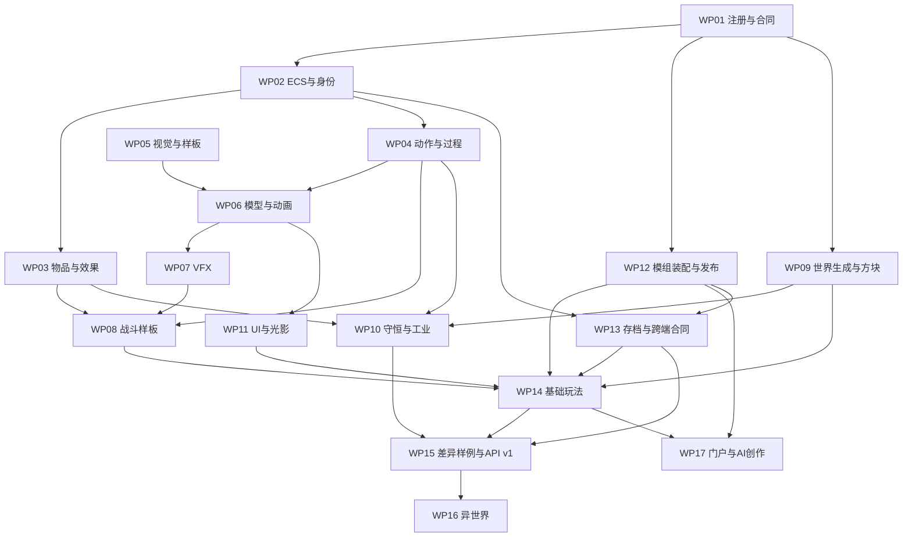

# Seedlands 玩法路线详细基线

> 版本：2026-09-07 / 详细路线基线 v1。这里的文档 v1 不代表引擎 API v1 已发布。
>
> 用途：承接本次对话已经确认的方向、具体变更、技术候选、模块责任、依赖关系与未来验收目标，供后续任务查阅和拆分。选型证据见 [ECS 研究附录](ecs-animation-research.md)。
>
> 范围：只整理规划，不启动功能实现、依赖安装、资产生产或部署。本文没有改变当前源码、存档、许可或公开 API。所有工作包均为计划，不能因本文存在而标记完成。

> 2026-09-09 架构澄清：[可组合玩法架构](composable-gameplay-architecture.md)是模块/Pack、内核/标准机制、Playbook/Ruleset、哈希完整性的较新概念基线。领域系统是可组合玩法模块，不代表全部进入不可替换内核；模块规范与业务可替换合同分开。[第一期合同](../changes/2026-09-09-composable-overworld-playbook/spec.md)将目标收敛到基础主世界循环、工具品质成长及生存/创造，以已合并 #25 独立建设，不依赖其他活动分支。现代整合包体验后置。本文原源码盘点与工作包记录保持历史口径，不能据此推断当前完成状态。

## 阅读导航

- [状态与来源口径](#status)
- [确认决策表](#decisions)
- [当前底座和并行路线](#baseline)
- [架构分层、六个模组分面和宿主](#architecture)
- [API 家族与系统合同](#api)
- [服务端 ECS：改什么、谁负责、如何迁移](#ecs)
- [物品、属性、组件、标签与附加效果](#items)
- [能力、动作轨道、战斗和反馈](#actions)
- [原质、守恒与工业过程](#conservation)
- [世界生成、方块定义与版本](#worldgen)
- [模型、骨架、动画和内容生产](#assets)
- [粒子与完整魔法表现](#vfx)
- [美术、UI 和光影包](#visual)
- [模组加载、发布 snapshot、存档和平台](#distribution)
- [基础玩法与异世界的产品范围](#demos)
- [阶段、工作包、依赖图和交付物](#roadmap)
- [选型与后置决策](#open-decisions)
- [跨系统验收目录](#acceptance)
- [讨论覆盖、证据与维护方式](#references)

## 1. 状态与来源口径

本文使用四种状态，避免把讨论建议当作已经批准的接口或已经完成的功能：

| 状态               | 含义                                                                      |
| ------------------ | ------------------------------------------------------------------------- |
| **已确认**         | 用户明确表达/确认的产品方向，或当前项目必须保留的不变量                   |
| **建议合同**       | 为实现已确认方向而提出的技术组织；后续 spec 可细化调整                    |
| **候选选型**       | 已研究，尚未通过项目内适配与验收，不应直接写入依赖或宣称准入              |
| **历史设定／待定** | 已找回的旧世界观，或尚未确定的参数、范围、格式；不能擅自扩成近期 MVP 承诺 |

本次对话的较新确认覆盖早期建议。特别是：服务端 ECS 已纳入前置路线；建模不强制 headless；首版仅 manifest 粗权限；独立 VM 和细粒度 ACL 后置；SaaS 首期使用浏览器算力，不承接通用云计算集群。

接口名、组件名、包名、目录名和阶段编号均是用于理解与拆分的草案。`builtin:sandbox`、`isekai:playbook` 等只是示例，不在本轮冻结为公共标识，也不据此预建代码目录。

## 2. 确认决策表

以下 D 编号用于后续 spec 引用，保留稳定编号。实现细节见后文，不能只照抄标题。

| ID  | 已确认方向／约束                                                 | 对后续工作的影响                                                   |
| --- | ---------------------------------------------------------------- | ------------------------------------------------------------------ |
| D01 | 本玩法线不依赖外部大模型服务                                     | 无模型时也可探索、战斗、采集、合成、生产、保存和运行基础 NPC       |
| D02 | 传统 AI 算法是必要能力                                           | 寻路、状态机、行为选择不因 AI Living World 独立而被删除            |
| D03 | 桌面浏览器、键鼠、WebGL2；衔接共享世界 Harness 与浏览器 Agent    | Godot 原生、移动端、WebGPU 不进入当前范围                          |
| D04 | 保留现有 TypeScript / PlayCanvas / Svelte 路线                   | 复用引擎能力，不因增加动画而更换客户端引擎                         |
| D05 | server 持有权威，client 为协议/预测/派生镜像，app 负责浏览器表现 | 不让插件或渲染反向取得世界可写真相                                 |
| D06 | 体素保持紧凑数值、Chunk Mesh、受控编辑                           | 普通方块不变成逐格 ECS 或 PlayCanvas Entity                        |
| D07 | 引擎暴露可组装原语，上层按自己的规则解释和组合                   | 附魔、斗气、义体改造等不成为无法替换的核心概念                     |
| D08 | 服务端 ECS 改造提上日程，置于 API v1 稳定前                      | 采用组件化方向已确定；具体库仍待有界验证                           |
| D09 | 物品需区分定义、属性、能力组件和实例运行状态                     | 外形不决定用途，定制能力不能只靠随意 metadata                      |
| D10 | 附加效果应能表达属性/能力/tag/表现变化                           | 为不同世界观映射同一种可复用机制                                   |
| D11 | 一种模组可只提供一个功能，也可提供整套玩法                       | 不要求每个 mod 都是完整游戏                                        |
| D12 | 一个可游玩世界有一个独占 playbook                                | playbook 与普通 mod 共用技术体系，承担组合根职责                   |
| D13 | playbook 定义 ruleset，基础玩法包含 survival / creative          | 可替换模式而不复制引擎；模式作用范围仍需细化                       |
| D14 | playbook 拥有玩法组合的最高裁决优先级                            | 顺序、覆盖和依赖必须明确，不等于越过核心不变量                     |
| D15 | 引擎发现冲突并暴露，组合者解决                                   | 不承诺自动解决任意代码冲突，不静默采用后加载覆盖                   |
| D16 | 模组包含代码、数据、资源、UI、光影、AI 六个可选分面              | 一个发布单位，多种职责，不是六层顺序调用                           |
| D17 | 动作轨道内独占、轨道间可并行                                     | 统一管理占用、条件、阶段、连招与取消；多轨道操作需一致裁决         |
| D18 | 动作、剑战和施法共享通用执行机制                                 | 权威事实与客户端动画播放分开；不为每种动作增添特殊计时路径         |
| D19 | 攻击冷却等操作状态需要可读 UI                                    | 不继续只依赖一行反馈文字；UI 读取权威就绪语义                      |
| D20 | 异世界原质可以表达物质、能量和其他世界现象                       | 魔法不止施法，也参与生产、提纯、流动和生态                         |
| D21 | 异世界质能总量守恒，界外律持续逆转散相化                         | 允许恢复有序状态，不凭空补发原质；熵增不是不可违反的全局约束       |
| D22 | 底层视觉必须保留 MC 类方块/像素体素语言                          | 上层可形成中土风、奇幻或其他题材风格；具体风格稿仍待批准           |
| D23 | 角色、物品、手持和掉落表现需要标准化 3D 资源与动画机制           | 内置母版可复用，资源包可扩展模型/贴图/骨架/动画                    |
| D24 | 内容生产接受 headless、有头加 CLI，必要时接受一次性 GUI          | 工具选型按质量、可编辑性和复用成本，不以无头作为准入门槛           |
| D25 | 高成本建模前先整体对齐方案和视觉稿                               | 先做游戏内 3D 样板，再扩大资产数量                                 |
| D26 | 支持核心 JS 包与玩法 JS 产物的组合交付                           | 浏览器可脚本加载，Headless 可消费纯逻辑；Node 产品兼容不在本期     |
| D27 | 首版只做 manifest 权限声明与 API 范围执行校验                    | 细粒度 ACL 留接缝，独立 VM 不进入本期                              |
| D28 | AI 创作会话开始锁引擎，发布时全锁                                | 交付不可变 snapshot，分享后不受作者后续编辑影响                    |
| D29 | 先打磨当前基础玩法，再做复杂异世界                               | 当前玩法提取为内置 playbook，不能保留一套绕过 API 的特权实现       |
| D30 | 所有底层开源，并希望扩展生态保持源码可审阅；定制服务可收费       | 用户倾向具有传播性的开源约束；具体许可证及适用边界尚未决定         |
| D31 | SaaS 首期使用浏览器算力，只托管基本模型服务及必要轻量能力        | 不建设 Agent/游戏通用计算集群，不承诺云端 Blender 和大模型 3D 计算 |
| D32 | 核心冻结指公开合同与兼容边界                                     | 不冻结内部算法，不把初版字段签名提前宣布为永久标准                 |

## 3. 当前底座和并行路线

### 3.1 源码事实与缺口

源码定位基于本次读取的 main：`91d820b59263d9ba4d8b7930637f63f5ee9af47d`。表中“现有”是静态结构证据，不代表运行时、性能或跨端验收已完成。

| 领域       | 现有实现                                                                                                                                                                                                                                                                                                                                                | 本路线的具体缺口                                            |
| ---------- | ------------------------------------------------------------------------------------------------------------------------------------------------------------------------------------------------------------------------------------------------------------------------------------------------------------------------------------------------------- | ----------------------------------------------------------- |
| 物品与配方 | [item-registry.ts](https://github.com/seedlands-game/seedlands-web-sandbox/blob/91d820b59263d9ba4d8b7930637f63f5ee9af47d/src/server/gameplay/item-registry.ts#L3)、[recipe-registry.ts](https://github.com/seedlands-game/seedlands-web-sandbox/blob/91d820b59263d9ba4d8b7930637f63f5ee9af47d/src/server/gameplay/recipe-registry.ts#L10) 固定定义与 ID | 注册式内容、typed component、实例状态、效果、tag 配方和迁移 |
| 实体       | [entity-store.ts](https://github.com/seedlands-game/seedlands-web-sandbox/blob/91d820b59263d9ba4d8b7930637f63f5ee9af47d/src/server/gameplay/entity-store.ts#L8) 为 Map 加固定类型及可选字段                                                                                                                                                             | 组件化权威存储、稳定身份与模板组合、查询和变更合同          |
| 玩家与 NPC | [player-state.ts](https://github.com/seedlands-game/seedlands-web-sandbox/blob/91d820b59263d9ba4d8b7930637f63f5ee9af47d/src/server/gameplay/player-state.ts#L29) 与 [actor-state.ts](https://github.com/seedlands-game/seedlands-web-sandbox/blob/91d820b59263d9ba4d8b7930637f63f5ee9af47d/src/server/simulation/actor-state.ts#L8) 分别持有状态        | 共享生命/需求/库存/动作能力，不同控制来源                   |
| 动作       | [action-runtime.ts](https://github.com/seedlands-game/seedlands-web-sandbox/blob/91d820b59263d9ba4d8b7930637f63f5ee9af47d/src/server/simulation/action-runtime.ts#L33) 每 actor 单动作；动作结构带导航字段                                                                                                                                              | 多活动动作、轨道占用、通用阶段与动作自有负载                |
| 攻击反馈   | [服务端攻击](https://github.com/seedlands-game/seedlands-web-sandbox/blob/91d820b59263d9ba4d8b7930637f63f5ee9af47d/src/server/gameplay/gameplay-runtime.ts#L295) 有 0.5 秒冷却，客户端有另一个尝试节流                                                                                                                                                  | 一致的就绪/阶段投影，冷却 UI、输入缓冲、组合战斗            |
| 物理       | [authority-session.ts](https://github.com/seedlands-game/seedlands-web-sandbox/blob/91d820b59263d9ba4d8b7930637f63f5ee9af47d/src/server/authority/authority-session.ts#L215) 从实体构建输入并提交结果                                                                                                                                                   | 与组件模型接入；保留唯一位置权威，按证据减少复制            |
| 模型与动画 | [实体 Presenter](https://github.com/seedlands-game/seedlands-web-sandbox/blob/91d820b59263d9ba4d8b7930637f63f5ee9af47d/src/app/gameplay/gameplay-entity-presenter.ts#L21) 使用程序化模型和姿态计算                                                                                                                                                      | 外部模型、rig、动画片段、状态图、分层、挂点与内容管线       |
| 粒子       | PlayCanvas 依赖已有相关设施，项目缺资源化 VFX 接入                                                                                                                                                                                                                                                                                                      | 事件、复合效果、预算、LOD、取消与释放                       |
| 世界生成   | [chunk-generation.ts](https://github.com/seedlands-game/seedlands-web-sandbox/blob/91d820b59263d9ba4d8b7930637f63f5ee9af47d/src/world/chunk-generation.ts#L6) 生成基线再叠加编辑                                                                                                                                                                        | 可注册生成阶段、内容数值映射、生成组合版本与原质初始存量    |
| 存档与权限 | 已有领域快照及命令授权入口                                                                                                                                                                                                                                                                                                                              | 模组清单/codec/迁移、发布版本关联与 coarse capability 适配  |

已有 demo 模型、材质和数学动作不能描述为完全没有 3D；目标是把它们升级为可维护、可扩展的生产体系。

### 3.2 与另外两条线路的关系

- **Developer Harness 线**：Headless 与 Browser 统一世界身份、命令、推进、观察、Action、trace 与 checkpoint 合同，不复制浏览器输入与渲染。Node Dedicated 已完成研究 MVP 并归档退出。
- **Agent / Living World 线**：消费同一观察、命令、动作、身份和结果接口，增强认知与自主性。本路线用传统算法即可形成可玩的闭环。
- **本路线**：组件模型、玩法 API、模组装配、表现与第一方内容。它应能在上述大模型能力尚未接入时独立交付。

Node 研究由归档 tag 与历史证据保存，后续玩法不承担 Node 专属编译、运行、协议或存档兼容义务。近期产品方向以[产品定位](product-positioning.md)为准。

共同维护的接缝：稳定身份、命令/动作信封、epoch/revision、组件编码、可见性、registry/composition 版本、检查点、逻辑时间、LOD 与唯一写 owner。Harness/Agent 线冻结相关字段时应一起审阅，不能各自定义一份。

浏览器关闭后物理模拟停止；首个 Agent MVP 恢复保存事实。离线追赶由后续 Simulation LOD change 验证；首期 SaaS 不托管游戏计算。Node 研究快照可独立恢复，但不构成当前产品承诺。

## 4. 架构分层、六个模组分面和宿主

### 4.1 所有权分层

| 层              | 持有内容                                                    | 对上层的承诺                                 |
| --------------- | ----------------------------------------------------------- | -------------------------------------------- |
| 核心运行时      | 身份、时间、权威提交、生命周期、体素、基础查询、持久化协调  | 提供受控 API，不泄漏可写真相                 |
| 可选通用机制    | 属性/效果、动作/过程、资源网络与法则校验、模型动画/VFX 适配 | 允许组合、注册扩展和选择启用                 |
| 领域系统        | 挖掘、伤害、装备、合成、需求、行为、工艺                    | 消费通用机制，声明规则与系统依赖             |
| Playbook 和内容 | 世界法则、ruleset、初始内容、世界生成组合、美术与 UI        | 形成完整玩法，也可由普通 mods 共同提供       |
| 平台            | 作品目录、版本、分享、创作会话、模型服务                    | 发布可复现玩法，不成为游戏运行必需的模型依赖 |

“通用机制”不意味着所有能力都打进不可裁剪核心。哪些物理包归属 core、哪些作为第一方库发布，等模块边界稳定后决定；本轮不预建 engine/plugins/shared 目录。

新玩法若超出已有原语表达范围，可以通过正常 API 演进引入新通用能力；“理论可定制”不等于承诺未来任何需求都无需扩展核心。

### 4.2 六个可选分面

| 分面      | 允许承载                                         | 宿主与边界                                                |
| --------- | ------------------------------------------------ | --------------------------------------------------------- |
| code      | 注册 schema、命令、系统、动作、生成逻辑和 hooks  | 区分纯逻辑、权威、客户端入口；按 manifest 获得能力接口    |
| data      | 物品、配方、tags、原型、动作参数、工艺、生成配置 | 加载时校验/编译；数据文件不因字段名而自动执行代码         |
| resources | 模型、贴图、rig、clips、VFX 资源、音频、图标     | 客户端加载；服务端只需独立的玩法描述/碰撞数据             |
| UI        | 主题 token、字体、框体、图标、布局与面板定义     | 样式与数据投影；新增交互由 client code 承接               |
| render    | 材质族、天空/雾/调色等 profile，后续特定 pass    | WebGL2 公开扩展点；不能依赖私有 renderer 后承诺长期兼容   |
| AI        | 策略配置、观察到意图的适配、认知/模拟 LOD 扩展   | 可为空；不引入第二套作弊动作 API，外部模型调用不阻塞 tick |

Playbook 可自己提供系统，也可依赖普通 mod。它的最高优先级是允许覆盖策略中的最终选择权，不等于先加载、后加载或每 tick 抢先执行。

### 4.3 启动和生命周期建议

读取发布清单 → 校验版本/依赖/权限 → 在目标宿主装载代码并收集注册 → 校验 schema/引用/冲突 → 应用显式组合决策 → 冻结本世界定义 → 创建或恢复世界 → 挂载表现 → 运行 → 停止/检查点/释放。

注册与初始化分阶段，避免模块 import 时偷偷生成实体或修改世界。依赖和 before/after 约束形成初始化 DAG；发现循环就诊断，不靠脚本偶然加载顺序修复。资源可并行读取，但规则初始化结果应一致。

浏览器建议一个世界的权威逻辑放在一个独立 Worker 中，playbook/mods 共用其权威状态；UI/渲染分面在主线程。Headless 经同一纯逻辑与开发端口验证。未来模拟岛与计算 Worker 池另有 owner/任务边界，不将“一个 mod”直接等同“一条线程”。

## 5. API 家族与系统合同

**建议合同**：先定义能力家族与责任，再定具体 TypeScript 签名。不能把 GameServer 改名后整包导出给插件。

| API 家族                  | 要支持的操作                                            | 必须一起定义                                          |
| ------------------------- | ------------------------------------------------------- | ----------------------------------------------------- |
| Registry                  | 注册/查询组件、物品、方块、原型、配方、动作、效果和资源 | namespace、版本、来源、重复注册、冻结时机             |
| Query / Observe           | 组件查询、空间查询、实体/过程状态、变更订阅             | 有界结果、读取时点、来源/主体、只读与失效语义         |
| Command / Action          | 提交意图、开始/查询/取消动作、获取回执                  | 参数 schema、调用身份、幂等、拒绝原因、阶段与结果     |
| Typed State / Transaction | 插件状态、跨库存/实体/方块/资源的操作                   | 唯一 owner、前置条件、原子性、revision 和失败无副作用 |
| Events / Hooks            | 注册校验钩子、提交后事实、表现提示                      | 可否改变候选、执行顺序、重入限制、来源链              |
| Schedule                  | 注册阶段、频率、激活条件与系统依赖                      | 使用逻辑时间、预算与可观测耗时，不自由创建权威计时器  |
| Worldgen                  | seeded RNG、阶段输入、区域生成与受限输出                | 生成版本、边界/halo、缓存、取消与确定性               |
| Save / Migrate            | 状态 codec、版本升级、检查点与恢复                      | 与所有权威状态一致保存，缺失插件与旧内容处理          |
| Presentation              | 资源/动画/VFX/音频/挂点句柄及释放                       | 事件去重、取消、资源失效、客户端只读事实              |
| UI / Render               | 主题、投影、面板槽、材质 profile、后续 pass             | 焦点/输入、作用域、渲染生命周期与能力探测             |
| AI Adapter                | 观察、意图、动作回执与策略状态                          | 与玩家/传统 NPC 共用事实，后续认知与细粒度 ACL 留接缝 |

首版权限是 API 家族级 manifest 声明与实际调用校验。宿主构造每个包的能力上下文；不能只检查 manifest 文件格式，却把完整引擎对象交给所有模组。已有玩家/主体命令校验继续保留，新增字段级 ACL 不属于本期。

运行时通用系统可采用受控的批量读写与候选缓冲，避免每个位置标量都付出对象命令往返成本；这不等于把底层可变数组公开给模组。系统的数据依赖声明用于调度和冲突解释，与安全 ACL 是不同机制。

Hooks 分清三个时机：提交前对候选进行受约束校验/规则计算；统一提交时检查不变量；提交后发布已经发生的事实。不能用“后置 hook 失败再反向撤销任意状态”充当跨域事务。

异步计算带 epoch/revision/输入指纹，结果回来后由 owner 验证再提交。库的观察回调、组件变化通知不自动等同完整变更日志。

## 6. 服务端 ECS：改什么、谁负责、如何迁移

### 6.1 采用理由与数据组织

**已确认**：服务端 ECS 纳入前置路线，目的首先是可组合能力与可维护边界。性能收益需要证据，不以更换 Map 的名称推断。

实体是稳定身份；组件是按生命周期/读写用途分组的数据；系统查询具备相关组件的实体并实施规则。人物原型是组件模板，不决定核心分支。

建议组合：

- 生存玩家：身份、位置、身体、生命、需求、库存/装备、动作控制、玩家控制。
- NPC：共享前述通用能力，使用 NPC 控制/决策状态和目标/POI 关系。
- 掉落物：身份、位置、身体、堆叠引用、拾取规则；不自动携带生命或 AI。
- 加工设备：位置或方块绑定、过程、端口、储库、输入输出库存；可没有骨骼。

普通体素、骨骼、装饰粒子与区域原质网格仍使用专业结构。同质库存按堆叠存储，不强制逐粒材料实体化。控制状态优先 AoS；已测量的批量数值数据可用 SoA/TypedArray。SoA 不等于零拷贝，禁止为了统一形式每 tick 全量往返转换。

### 6.2 具体迁移范围

| 当前对象                  | 要拆出的责任                                   | 注意事项                                                           |
| ------------------------- | ---------------------------------------------- | ------------------------------------------------------------------ |
| EntityStore               | 稳定身份、模板引用、位置、身体、生命、物品引用 | 保留生命周期/空间查询门面，去掉固定类型决定能力的约束              |
| PlayerState               | 生命、需求、库存、快捷槽、出生/复活、玩家控制  | 容量和规则不继续作为所有玩法不可替换常量                           |
| ActorState                | NPC 控制、决策状态、需求、目标与 POI 关系      | 玩家/NPC 通用冷却、生命和动作归到共享能力                          |
| ActionRuntime             | 多轨道控制引用活动动作实例                     | 阶段/历史/sequence 仍由动作 runtime 管理；导航 path 是特定动作负载 |
| GameplayRuntime           | 通用编排与可注册规则系统                       | 具体伤害、合成、生存等移入领域模块和内置玩法                       |
| AuthoritySession 物理适配 | 查询身体/位置，生成必要计算输入并提交结果      | 物理临时快照不是第二份位置真相；保留确定性顺序                     |
| GameplaySnapshot / 投影   | 版本化组件 codec 与领域快照                    | 不将内部 eid/内存布局直接变成持久协议                              |

### 6.3 ECS 库与自有实现的责任

| 事项     | 通用 ECS 库                    | Seedlands 核心/领域系统                          |
| -------- | ------------------------------ | ------------------------------------------------ |
| 实体     | 内部句柄分配、回收和有效性机制 | 持久 EntityId、世界/主体身份、引用迁移与死亡语义 |
| 组件     | 成员关系与存储/索引工具        | namespace、schema、默认值、codec、版本和合法写入 |
| 查询     | 按组件组合匹配实体             | 邻近/遮挡查询、范围限制、LOD 和主体可见性        |
| 关系     | 通用关系查询（依具体库）       | 归属、装备、目标、家庭等语义及删除后果           |
| 更新     | 数据访问、变化观察等工具       | 事务、revision、来源、回放、法则校验             |
| 系统     | bitECS 不强制系统运行器        | 逻辑时间、执行阶段、频率、预算、依赖与唯一 owner |
| 序列化   | 可复用编码/快照工具            | 长期存档、迁移、网络协议、过滤与重连             |
| 游戏规则 | 不提供剑击/挖掘/原质工业       | 通用机制加 playbook/mod 规则实现                 |

bitECS 官方允许组件存储由调用方组织，并以查询而非强制系统调度为核心；适合保留既有 scheduler。[bitECS Intro](https://github.com/NateTheGreatt/bitECS/blob/main/docs/Intro.md)

### 6.4 底座候选

| 候选     | 本轮研究基线                                             | 取舍                                            |
| -------- | -------------------------------------------------------- | ----------------------------------------------- |
| bitECS   | npm 0.4.0；灵活布局、关系与独立序列化                    | 首选验证；稳定 ID、变更提交与安全边界仍自行封装 |
| Koota    | npm 0.6.6；traits、关系、增删改追踪，React 可选          | 主要对照；嵌套对象修改需遵循追踪语义            |
| Miniplex | npm 2.0.0；普通对象与查询，无系统调度                    | 轻量备选；数值数据面和持久身份另配              |
| Becsy    | 存在 0.16.0 发布，但 latest 标签仍指旧版；较完整调度 API | 非优先；官方指南明确多线程尚未实现              |

版本只是 2026-09-07 研究快照，准入时需再次核对。不能用 GitHub main 的新能力冒充已发布包功能，也不能用 ECS 微基准代表完整游戏。详情和发布元数据见 [ECS 调研](ecs-animation-research.md)。

### 6.5 迁移策略

1. 定义组件/身份合同，封装库适配；旧 EntityStore 暂时成为 facade。
2. 先迁位置、身体、生命等共享状态；玩家和 NPC 使用同一能力读写。
3. 再迁需求、库存、控制来源、多轨道动作，逐步提取具体规则。
4. 接入调度、空间索引、变更记录、存档与客户端投影，保持 Browser/Headless 世界语义一致。

每迁入一项状态，旧入口读取或投影新 owner，不维护两份长期可写状态。组件增删和实体销毁在明确阶段提交；库的查询迭代顺序不直接决定争抢资源等玩法优先级。内部可回收句柄与稳定 ID 分离，不能把带版本位的编号直接当固定 TypedArray 的裸索引。

库准入用相同负载比较正确性、组件变更/关系、存档恢复、多世界隔离、复制量、GC 和接入成本。采用 ECS 的架构必要性已确认，测量决定实现与布局，而不是以暂无帧率瓶颈为由无限后置。

### 6.6 传统 NPC、行为与模拟 LOD

**已确认**：不用大模型也需要传统 NPC。ECS 提供状态组合和查询，不会自动获得寻路、行为树或可信的生态。

建议将链路拆为感知/观察 → 行为选择 → 意图 → 通用动作执行 → 回执。基础行为可用状态机或行为树，复杂目标是否引入效用评分/规划后续选型；不预先要求多套决策框架同时存在。玩家输入、传统 NPC 与后续 Agent 只替换意图来源，共用动作、资源和失败语义。

NPC 状态按需要包含需求、当前目标、局部已知信息、行为阶段、导航请求和关系引用。路径计算由导航模块负责，动作系统负责申请/取消及消费结果；异步路径带世界版本，不能用过期路径越过新障碍。行为状态需有 schema 和存档语义，不把框架闭包直接写进存档。

区分感知频率、决策频率、移动/战斗事实推进和表现更新。近处精细运行，远处按约定汇总需求/过程；LOD 升降级必须保留身份、资源、目标和因果，不能凭空完成一场没有规则支持的战斗。具体距离、频率和后台模拟范围由后续预算决定。

基础状态/调度/恢复接入 WP02、WP04、WP13；基础生物行为进入 WP14，异世界种群与 NPC 规则进入 WP16。AI 分面给未来认知引擎留位，不把这些传统行为推迟到 Living World 路线。

## 7. 物品、属性、组件、标签与附加效果

### 7.1 领域对象建议

| 对象                 | 内容                                         | 例子                                          |
| -------------------- | -------------------------------------------- | --------------------------------------------- |
| ItemDefinition       | 稳定内容 ID、默认组件/参数、资源绑定         | 木剑默认可装备、可近战、有耐久                |
| ItemInstance / Stack | 定义引用、数量、当前状态；必要时稳定实例身份 | 磨损、命名、改造次数、应用中的效果            |
| Component            | 有类型和 schema、被系统消费的数据            | Mining、Melee、Durable、Equippable、Reservoir |
| Attribute            | 可查询/计算的参数                            | 耐久上限、重量、挖掘速度、容量                |
| Capability / Ability | 在条件下可执行的能力与动作入口               | 挖掘、挥击、施法、输送、加工                  |
| AppliedEffect        | 有来源、条件、持续性与移除句柄的附加         | 附魔、斗气附着、义体模块                      |
| EffectiveView        | 定义、实例基础状态与有效附加的求值结果       | 当前可挖材料、有效重量、动作集、视觉提示      |

这种拆分方向已确认，具体类型名与字段属于建议合同。TS 类型不能替代包加载、网络和读档时的 runtime validator。

### 7.2 必须能表达的定制

- 给木剑添加 Mining 能力后可以挖石头，外形和名字仍是剑；挖掘系统按能力判断。
- 既可以发布“默认具有采矿能力的新剑定义”，也可以对某一把普通剑施加改造，不修改所有木剑的共享定义。
- 自定义重量等属性只有在负重/物理等系统消费时才有玩法含义；可存在纯描述字段，但不能宣称其自动生效。
- 当前磨损与最大耐久分开；临时改变最大耐久不能无规则地免费修复物品。
- 模型、贴图、光泽是表现绑定，不直接持有 PlayCanvas 对象作为服务端属性。

### 7.3 效果求值和移除

建议效果定义包含目标条件、属性修饰、能力/tag 授予和表现提示；应用实例记录来源、强度/参数、持续/周期、叠加组、独立状态、持久性与移除句柄。

属性运算阶段、同组叠加/替换/拒绝规则、优先级和平局处理必须明确。具体操作集合待定，不能默认为所有效果都任意 patch JSON。

移除效果时基于剩余来源重新求值，不能通过简单反向减值或删除组件来恢复。两种效果同时授予 Mining，移除一种后另一种仍应保留。定义、基础状态、效果与条件变化都必须使 EffectiveView 的相关缓存失效。

同一机制可映射为 MC 风附魔、异世界斗气/魔力附加和科幻改造；名字、获取方式、失败后果与平衡由 playbook 选择。魔法光泽不能成为判断真实能力的唯一依据。

### 7.4 标签、库存与配方

- 标签采用 namespace 分类，可包含静态定义标签和效果授予的有效标签；高频动作事实不一律塞进标签集合。
- 稳定内容 ID 与实例身份分离；两把 itemId 相同但耐久、效果等不同的物品不能默认合并。
- 组件定义需要堆叠等价和合并语义；普通同质材料继续紧凑堆叠。
- 配方支持定义或 tag 输入、数量、条件、实例状态消耗、成品/副产物和来源；公式与工艺算法可由 code 扩展。
- 扣料与产出一致提交；输出满、部分缺料、连续重复请求不能吞料或复制物品。
- Creative 采用内容目录与快捷引用，不用极大库存数模拟无限；是否生成真实物品、如何进入封闭法则世界由规则决定。

现代组件/codec 可参考 [Fabric Data Components](https://docs.fabricmc.net/develop/items/custom-data-components)，借鉴职责，不引入 Minecraft 依赖。

## 8. 能力、动作轨道、战斗和反馈

### 8.1 通用执行模型

能力是“允许尝试什么”；Action 是一次执行；Process 是可由角色、机器、植物或区域持有的持续过程。它们共享条件、时间、状态、回执和权威操作机制，但不强制同一运行频率或同一个万能解释器。

建议动作定义包含：参数 schema、启动条件、轨道申请、资源成本/预留、冷却组、阶段、输入缓冲、连招转移、取消/打断策略、权威检查点、可选移动曲线与表现绑定。

动作实例记录 actionId、主体/来源、定义版本、开始逻辑时间、当前阶段、已执行检查点/命中集合和终态原因。具体快照字段与格式待定。

### 8.2 多轨道规则

**已确认**：轨道内独占，轨道间可并行。下面为建议配置，而非最终固定轨道枚举：

| 动作           | 示例占用                     |
| -------------- | ---------------------------- |
| 单手横扫、突刺 | 主手；二者互斥               |
| 跳跃           | 垂直移动                     |
| 冲刺           | 水平移动                     |
| 滑铲           | 水平移动＋姿态               |
| 双手重击       | 主手＋副手＋按规则需要的姿态 |
| 全身控制动作   | 展开申请所影响的轨道集合     |

多轨道申请一次成功或一次拒绝，不能拿住一部分等待其余轨道。跨轨道并行仍检查耐力、落地等共享条件。高优先级动作只能在允许取消/打断的阶段抢占，不能只比较数字。

阶段间释放/追加占用也要有明确转换规则。角色移动通过统一物理处理移动意图，不让两个动作各自覆盖位置。逻辑轨道与骨骼 mask 不要求一一对应。

### 8.3 C/S 边界

客户端提交意图，可预测允许的表现；server 校验并建立权威动作，以逻辑时间推进事实。客户端根据动作身份、阶段与事件修正画面，处理拒绝、中断、延迟和重连。

伤害/产出不能由客户端动画回调触发。服务端使用经验证的攻击轨迹/简化碰撞数据；若数据从动画烘焙，需记录来源和版本。服务端不加载完整渲染骨架。

纯换肤保持动作时序与危险提示；若改变攻击时间、距离或轨迹，就作为权威动作变体发布。Root motion 的候选是先用原地动画配权威移动，或构建期导出一致时间曲线；最终方法待样板验证。Hit-stop 优先是局部表现，不能暂停整个常驻世界。

### 8.4 剑战样板与 UI

建议首个样板用一把剑和一种敌人，验证输入缓冲、少量连段、前摇/有效阶段/后摇、可取消窗口、防御或格挡、闪避、耐力、受击、音效/VFX和镜头反馈。连段数量、格挡/闪避细则与数值是待调参数，不写入核心常量。

Epic Fight 可作为武器风格、碰撞体、连段和命中反馈的拆分参考，不直接依赖其实现。[武器编辑文档](https://epicfight-docs.readthedocs.io/Guides/Weapons/page2/)

UI 读取统一的冷却、蓄力、阶段、输入缓冲/接招窗口和不可用原因，可由 UI 包绘制为准星刻度或图标填充。不能拿客户端攻击尝试节流作为服务端冷却。已就绪但被眩晕/缺资源也应能解释，同一状态供传统 NPC/Agent 查询。

动作按活跃集合、条件变化和到期阶段推进，不每帧解释全部动作定义。

## 9. 原质、守恒与工业过程

### 9.1 世界公理与引擎能力

**已确认的异世界公理**：原质统一表达物质、能量、生命、魔法等；总量守恒；散相化降低可用性；界外律持续恢复有序状态而不增加总量。现实熵增定律不作为不可违反的全局限制。

工程上分开总量、状态/可用性与恢复过程。可用原质不足不代表原质消失。恢复速率、相干性指标、地理差异和工艺条件后续确定；不要求首版计算微观热力学熵。

引擎允许不同 playbook 选择守恒量、边界与转换法则。基础玩法可采用较小或开放记账范围；异世界选择全范围，不强迫所有科幻/工业世界使用同一个无类型数值。

### 9.2 通用构件建议

| 构件                 | 定义责任                                   |
| -------------------- | ------------------------------------------ |
| QuantityKind         | 量的类型、单位、精度、范围                 |
| Reservoir            | 存量、容量、owner、空间归属                |
| Port / Network       | 输入输出、方向、通量、连接与拓扑           |
| Transfer             | 同类量转移，显式损耗归宿                   |
| Conversion / Process | 输入、产物、副产物、成本、速度、条件、阶段 |
| Invariant / Law      | 转换前后守恒关系、边界交换、误差与失败处理 |
| Field                | 空间分布的状态/投影，不能与储库重复记账    |

资源互通与守恒不同：统一端口 API 不意味着所有能源可任意互换，跨类型转换必须显式定义。生命回路、物品储库、地脉、植物和设备可以消费同一套机制。

### 9.3 守恒实现与边界

对一个有限区域：期末存量 = 期初存量 + 流入 − 流出；内部转移相互抵消。跨状态/类型转化按世界法则校验，不能把不同单位的数字直接相加。

- 挖矿：地形束缚态转移为物品及规则声明的剩余物。
- 发电/施法：资源转为可用态、结构、残留和散相等输出。
- 造物：从物品、环境或储库扣除原质，生成方块/实体。
- 掉落物过期、销毁、死亡：必须定义原质归宿。
- 区块卸载、LOD 降级：改变表示，不能创造、抹掉或重复计数存量。
- Creative：在开放规则中记为外部注入；封闭玩法中的编辑需有来源或独立创作规则。

以材料默认值、区域汇总和增量事务实现，不为每格方块、每单位原质建立复杂对象，也不每帧扫描全世界。量化方式和残差处理需单独决策，不能静默吞掉误差。

无限扩展世界可保证每个有限区域及边界通量的平衡；如要求一个固定有限的宇宙总量，需确定有限世界范围或有限总存量生成规则。本轮未决定。

### 9.4 原质生产与长期过程

“源质提纯阵”和“电磁精炼机”可共享输入—资源供给—加工—成品/尾料的过程框架，差异来自规则与表现。

提高矿产可以是提高回收率、富集、改变可开采性或转化其他材料；若采用回收率模型，不能突破输入可回收量。100 单位原质可从 40 可用＋60 散相改为 70＋30，但不能无来源变成 120。

总量守恒不自动保证经济平衡。结构难度、品质、转换环路、恢复速度、吞吐与控制代价仍由玩法约束。

过程需定义缺料、满输出、断线、设备拆除、中断、配方升级、保存恢复和重复请求。长过程分段提交，不锁住世界数分钟。远处可降低求解频率并汇总；是否以及怎样补算离线过程需有界、可解释，不以离线时间免费生成产物。

现有流体候选提交和分频机制可作为参考，但它们不等于已经支持库存/实体/资源的联合事务。

## 10. 世界生成、方块定义与版本

**已确认方向**：定制世界生成属于模组能力，底层继续保存紧凑数值体素。建议补充以下合同：

1. 外部使用 namespace 内容 ID，加载时编译为世界内数值映射。存档保留映射，新增模组不能重排旧编号；越界要明确拒绝或迁移。
2. 方块定义拆出碰撞/可交互属性、资源/材质引用、tags 和可选状态绑定。普通方块仍是紧凑数据，特殊设备按需要关联逻辑实体。
3. 生成接口明确区域、阶段、seeded RNG、读写范围、邻域/halo和输出。禁止以网络结果、壁钟或无种子随机数决定基础地形。
4. 生成组合、参数、内容映射与算法版本绑定为可追溯指纹；它必须纳入有效 generatorVersion 的身份，保持同 seed＋同有效版本的唯一基线，不能在版本之外偷偷改变生成。
5. 阶段可覆盖宏观地理、地形/生物群系、矿物、结构/遗迹、植被/种群、POI 与区域原质场。具体阶段划分与算法待设计，不默认允许插件任意写邻块。
6. 可并行计算不代表可随意改变顺序；跨区块接缝、不同加载顺序、取消/恢复和缓存失效需验证。

矿床可以是世界初始条件。区块首次加载只是把既定存量具体化；开采记录必须保留，重新加载不能再次发放初始资源。运行时补充矿物另属过程，需要遵守所选法则。

版本升级、删除生成插件或改变方块映射属于世界迁移，不能以资源热更新方式改变已存在世界。远处低精度数据与细化生成重建应明确覆盖关系。

## 11. 模型、骨架、动画和内容生产

### 11.1 技术方向与格式

继续复用 PlayCanvas 模型、Anim、Skin、资源和渲染能力，建设自有资源合同与动作映射。复杂骨骼动画不以 ECS 迁移为技术前提，两项工程可以沿稳定接口交汇。

**候选选型**：glTF 2.0 / GLB 作为运行时交换格式；Blockbench 适合方块角色、像素贴图与道具，Blender 适合复杂绑定/动作加工、程序化变体与批量构建。具体版本和支持子集待样板验证。

GLB 不承载完整玩法。伴随 manifest/定义需要表达挂点语义、动作映射、命中数据引用、VFX、LOD 与资源版本。Blender 任意 shader/driver 和 Blockbench 动态表达式不能默认原样进入浏览器；可烘焙动作转关键帧，运行时条件继续由游戏处理。[glTF 规范](https://github.com/KhronosGroup/glTF/blob/main/specification/2.0/Specification.adoc)、[Blockbench 表达式导出](https://blockbench.net/wiki/guides/animation-expressions/)

### 11.2 模型与骨架合同

需要确定单位、朝向、坐标系、pivot、模型 bounds、骨骼命名/层级、rig 版本、左右手/头/背/施法挂点、装备遮挡、材质族和动画命名。

建议先建立可复用人形 rig 和少量体型/皮肤，再用一个四足生物检验非人形边界。具体数量为建议样板，不是已承诺资产清单。首版不承诺任意骨架自动重定向。

保留方块轮廓，可采用刚性分段或单骨权重，肘膝等按批准风格适量变形。骨骼存在不代表动作自然；需要姿态、重心、节奏、过渡和脚步落点设计。

### 11.3 动画能力与接入

基础动作候选包含待机、走跑、起跳/落地、转身、采集、攻击、防御、受击、施法。状态图管理过渡，层与 mask 混合不同身体区域；与玩法轨道保持独立合同。[PlayCanvas 动画层](https://developer.playcanvas.com/user-manual/animation/anim-layer-masking/)

瞄准、头部跟随、脚步适配和 IK 作为后续增强，先验证片段与混合。换皮肤/同 rig 模型后动作仍成立；重新绑定后挂点、持握和 bounds 不漂移。

性能分别测姿态求值、骨骼数、层数、蒙皮、可见角色数、资源共享、draw call、CPU/GPU 和投影复制。动画 LOD 可降低远处姿态更新、附加层或模型细节，不改变权威命中和过程事实。

### 11.4 物品资源的多种展示

同一物品资源派生世界掉落、第一人称持握、第三人称持握和库存图标。显示变换显式定义，允许必要的展示模型变体，共享来源与语义。

用户要求的是像素方块实体感，不是当前粗略模型。候选做法包括像素轮廓挤出、少量 cuboid 和合并网格；不为每个像素创建实体。掉落物的物理/拾取状态与装饰 bob/旋转分开。

### 11.5 可维护的生产链

已确认：先对齐视觉，再承担高成本生产；有头、CLI、headless 和一次性 GUI 均可。

建议流程：风格要求 → 二维视觉稿 → 游戏内 3D 样板 → 固定母版/rig/导出约束 → 参数化变体或人工精修 → 校验 → 预览和游戏内验收 → 版本化资源包。

每类资产保留一个可编辑源真相：`.bbmodel` 或 `.blend`、原始贴图、palette、可编辑动作、脚本/参数。不要同时手改两份互相无法可靠同步的母版；跨工具加工采用单向且可追溯流程。

结构校验覆盖坐标、骨架/挂点、mesh/材质数、贴图/颜色空间、动画范围、资源引用、bounds、支持扩展和来源许可。发布记录源与派生内容摘要、工具/导出版本和生成参数。资源加载有取消、缓存失效、引用释放和 GPU 清理。

样板至少覆盖角色转台/动作、剑的持握/掉落/图标、一个发光道具和一个魔法效果。比较每件合格可编辑资产的总成本、返修时间与运行成本，不以模型生成价格替代。

Meshy、Tripo、TRELLIS 等仅保留离线研究候选，不作为首版运行依赖或已选供应商。第一方离线资产生产可使用开发机工具；首期 SaaS 复用资产/生成规则，不承诺托管这些重计算任务。

## 12. 粒子与完整魔法表现

粒子系统是必须补齐的表达能力，但魔法表现还包括几何、光照、材质和声音。建议建立 VFX 定义与播放合同：

| 构成                  | 要表达的场景                     |
| --------------------- | -------------------------------- |
| sprite / mesh 发射器  | 火花、烟雾、碎屑、漂浮原质       |
| beam / ribbon / trail | 束流、剑迹、连接与流动           |
| 符文/环/区域几何      | 法阵、范围、启动/加工状态        |
| 材质变化与有限动态光  | 充能、发光、腐化、元素附加       |
| 声音与镜头            | 起手、持续、命中、中断、环境反馈 |

优先封装 [PlayCanvas 粒子设施](https://developer.playcanvas.com/user-manual/graphics/particles/)，具体哪些类型复用现有组件、哪些需要自有几何实现，在样板中判断。

权威法术弹体/命中/危险区域与装饰粒子分开。表现接收带来源和事件身份的 cue，可去重、取消、更新和结束；低 LOD 或重连后可从当前过程状态重建必要持续效果，不重播全部历史。

需定义单效果和全局预算：发射数、存活数、透明 overdraw、动态灯、贴图/网格、更新频率与最长寿命。效果池化和资源释放不能导致旧引用污染新效果。

降低画质可以减少装饰，不能消除攻击前摇、危险范围和交互结果的关键提示。技能效果包不能通过修改画面扩大真实攻击范围。

## 13. 美术、UI 和光影包

### 13.1 美术语言与批准物

**已确认**：底层保留 MC 类体素/像素语言，成品要有强风格化和一致美术。Actions & Stuff 用于灵动动作与整体表现参考；中土风、古木/锻铁/石材/克制金光等仍是异世界局部视觉候选，尚无批准稿。

“8bit”落实为方块轮廓、统一像素密度、有限且协调的配色、清晰材质与明暗语言，不等于把全游戏强制为 8 位色深。

批准前需要确认：角色比例、像素密度、允许关节变形、材质表现、动作夸张程度、镜头尺度、第一/第三人称关系和目标设备预算。不能提前锁定某个 texel 数或骨骼/三角形总量。

建立昼/昏/夜基准场景，包含角色、剑、树、岩石、建筑角、掉落物、VFX 和 GUI；联合比较采样、mip、远处闪烁、色彩与视觉可读性。

### 13.2 UI 包

保留 Svelte retained UI 与按需要更新的状态投影。建议分级开放：

1. 语义 token、字体、图标、nine-slice/框体、间距和 motion。
2. HUD、快捷栏、状态提示、面板布局与扩展槽。
3. 需要交互的新面板由 client code 分面提供，通过统一输入与命令接口工作。

主题要有作用域，不任意污染其他模组。焦点、键位、Pointer Lock、暂停/菜单状态和可访问性需统一处理。改 UI 不改变权威规则；创造目录和生存库存可使用不同投影模型。

异世界发现记录/传闻界面应承接自由探索；历史设定中的“无任务书”不能被隐藏的任务清单替代，但近期是否纳入该界面需由异世界范围决定。

### 13.3 光影包

用户希望可定制渲染风格。建议分成稳定 profile 与后续 pass 两档：

- **首期候选 profile**：天空、雾、调色/LUT、曝光、bloom、阴影/反射质量、材质族及效果参数。
- **后续实验接口**：WebGL2 pass 的输入/输出 target、格式、插入点、顺序、读写与预算声明。组合冲突需明确解决。

不把 PlayCanvas 私有内部对象作为公共契约。赛博风可调霓虹、金属、反射与雾，但全场景反射、复杂体积雾等属于具体能力调研，不能因有“光影包”概念就承诺所有效果已支持。

## 14. 模组加载、发布 snapshot、存档和平台

### 14.1 包与版本

建议 manifest 表达包 ID/版本、分面入口、依赖/可选依赖、提供/需要能力、显式冲突、权限请求、schema 版本、来源许可与内容摘要。最终字段待定。

世界装配清单决定唯一 playbook、ruleset、具体 mods/配置、provider 选择与批准覆盖。依赖完整锁定，不能只锁直接依赖而放任传递依赖升级。

**已确认发布语义**：会话开始锁引擎精确版本；发布时冻结引擎、玩法、规则配置、依赖与资源，形成可分享的不可变 snapshot。编辑建立新版本；升级引擎是显式的新会话/迁移步骤，不能后台静默发生。

建议发布 snapshot 保留源码、锁清单、构建产物、资源内容摘要与构建工具信息。锁定提高复现性，不承诺跨设备逐帧像素相同。

### 14.2 一个 JS 玩法产物

核心由宿主提供；玩法可独立构建为可加载 JS 入口，支持单 JS 交付。六分面是逻辑职责，不强制六个文件。大型资源可内嵌或由锁定配套资产承载。

入口负责声明/注册适合各宿主的分面，不在 Node import 时触碰 DOM。外部依赖按发布锁解析并满足宿主能力；浏览器构建不能默认执行任意 Node/native 包。具体 ESM 打包、Worker 入口、资源 URL 与完整性加载方案列为候选决策。

### 14.3 权限、冲突和卸载

首版宿主按 manifest 授予 API 家族，调用越界要有明确错误、包来源和能力名。保留当前核心的主体、参数、版本与事务检查。细粒度认知/资源 ACL 留接口，后续与 AI 路线兼容。

Worker 不具备 DOM 访问，但仍有若干环境能力；manifest API 门禁不代表对任意恶意 JS 的 OS/网络沙箱。本期按第一方可信执行设计，不追加独立 VM 要求。[MDN Worker](https://developer.mozilla.org/en-US/docs/Web/API/Web_Workers_API/Using_web_workers)

可诊断冲突包括重名定义、版本不符、独占槽、schema 不兼容、资源/rig 不匹配、未许可覆盖、声明的系统读写/顺序冲突等。报告需要双方来源、冲突点、当前选择与组合者可修改的位置。

不能保证静态发现所有行为冲突；集成场景、运行时不变量和事件记录补充。playbook 的优先级不能替代 schema 兼容或存档迁移。

建议首版启动加载、重启切换。热更新/热卸载不是免费能力；已有世界移除必需规则或内容包需要迁移方案，不能当成取消勾选并丢弃数据。

### 14.4 存档与恢复

发布 snapshot 固定程序和内容，世界存档保存演化状态，并引用发布版本、内容数值映射、生成版本、插件状态/schema 与共同检查点。

缺必需插件或无法迁移时给出诊断，不静默将未知方块变空气或删除物品。纯外观缺失是否可替代由声明策略决定。降级无逆迁移时明确不支持；恢复完整检查点，不能仅回退一个组件造成守恒或身份失配。

浏览器本地与 Headless 的存储适配可以不同，领域快照与一致性合同共享。保留通用 checkpoint 成果，不能让各 mod 私自保存不同时间的世界；不要求兼容归档 Node 文件存储格式。

### 14.5 网页分发与首期 AI SaaS

最简门户展示玩法版本、启动要求、所需资源和开始入口。首批可只分发第一方作品；开放任意第三方内容的流程后续决定，不作为基础 demo 的前置。

创作工作流建议为：选择/锁定引擎与基底 → 浏览器内编辑和受支持构建 → 本地预览/检查 → 显示结果与变更 → 发布全锁 snapshot → 分享/派生新版本。

用户确认所有底层开源，服务针对想定制但缺开发能力的人。首期游戏运行、预览和可执行的创作工具使用浏览器算力，服务侧提供模型调用、计量及必要轻量产品能力；不自建游戏/Agent 计算集群。

用户还希望通过具有传播性的开源约束避免闭源插件妨碍 Agent 排查。该生态目标应保留；许可证如何分别覆盖引擎、扩展代码、可编辑资产和发布作品，需要独立研究。不能仅在 manifest 写一个开源字段，就宣称已经实现该目标。发布流程应保留可定位的源码、构建来源与资源来源，具体准入政策仍待确定。

模型服务凭据与计费状态不进入公开玩法 JS/snapshot。具体价格、credits 单位、源码/资源许可证和托管细则后置。第一方线下 Blender 等工具链与首期 SaaS 能力分开；后者优先组合既有母版与资源，不承诺云端原生 DCC 执行。

## 15. 基础玩法与异世界的产品范围

### 15.1 基础生存/创造 playbook

目标是把当前玩法从核心移出，补齐可玩的体验与成熟美术资产，成为公开 API 的第一个真实消费者。

| 部分     | 目标行为                                                                           |
| -------- | ---------------------------------------------------------------------------------- |
| Survival | 采集、挖掘、库存/装备、合成、基础生存、战斗、建造、保存形成闭环                    |
| Creative | 内容目录、快捷引用、飞行、即时编辑；按用户定义关闭相应生存与伤害规则               |
| 共同基础 | 同一组件与动作机制、可替换资源/UI、统一输入反馈、同一发布与存档体系                |
| 扩展证明 | 增加新物品/配方/能力不修改核心；去掉内置 playbook 后另一个满足契约的玩法可独立开局 |
| 表现质量 | 角色动作自然、手持/掉落/图标一致，反馈和材质形成统一风格                           |

这是 MC 类基础循环，不以复刻 MC 所有内容为目标。存档内 ruleset 切换、玩家各用不同模式等细节需要单独约定，不能默认热切换安全。

### 15.2 异世界：本轮确认与历史设定

本轮明确的技术目标是剑与魔法、原质同源、全范围守恒与复序、可组合规则，并可连接生产和探索。它不依赖大模型路线完成。

本次讨论补读早期世界观文件 `world-design-foundation.md`，恢复了以下世界观。这些是历史设计基线，不应被遗忘，也不全部自动排入近期切片：

| 历史方向                           | 对技术的影响                                  | 当前安排                          |
| ---------------------------------- | --------------------------------------------- | --------------------------------- |
| 六界崩坏汇入人界，旧界探索/修复    | 多区域/未来维度与生成组合                     | 长期保留；不首期开放六界          |
| 地脉、生态、文明条件受 seed 影响   | 区域场、生成与过程                            | 小区域可作为异世界验证内容        |
| 回响灵魂、成年化身、真死与有限转生 | 账号/操作者/长期身份/身体分开；生命周期可替换 | 保留身份接缝，玩法细则另拆        |
| 玩家/NPC 同规则、知识有限          | 统一能力入口，观察与记忆有范围                | 先用传统 AI，后接 Agent           |
| 世界不等玩家、下线仍有后果         | 后续 LOD/离线追赶、会话与身体策略             | 与 LOD 线衔接，本期不承诺离线进展 |
| 无固定主线、无任务书、无职业锁     | 发现记录、能力组合、开放选择                  | 内容设计约束，界面范围待拆        |
| 魔物由生态因果产生，谱系稳定       | 生成种群、生态状态与行为                      | 不把当前夜怪逻辑当完整生态        |
| 有限纵向成长、灾变和新玩家机会     | 规则上限、长期过程与历史                      | 后续玩法阶段                      |
| 种族表达身体/回路，非职业或道德锁  | 原型与能力分离                                | 首批种族与数量待确定              |

旧文件中的完整 MVP 包含地脉、生态、小聚落、两三种族、同源魔法/斗气/附魔、事件及出生/下线/真死/转生。该范围摘自历史原稿的 MVP 段落；原稿未随本 PR 整份发布。

建议先用一个区域、一组剑与魔法动作、一个原质加工过程及传统 NPC 验证规则，然后再拆完整游戏范围。这是前置切片，不能冒充旧完整 MVP 已经交付，也不能静默删除其长期目标。

### 15.3 API v1 与 v2 的关系

基础玩法产品化先形成 API v1 候选；再用少量不同题材样例验证通用性，例如采矿剑、永久/临时附加叠加、魔法提纯与机器精炼。通过后冻结真实使用的边界，再扩大异世界。

“v2 完善”表示后续能力演进，不预先决定所有扩展都需破坏 v1。能兼容增加的能力保持兼容；确需修改含义、存档或网络时另做显式版本迁移。

## 16. 阶段、工作包、依赖图和交付物

### 16.1 阶段目标

| 阶段              | 交付物                                      | 退出条件                                                                      |
| ----------------- | ------------------------------------------- | ----------------------------------------------------------------------------- |
| P0 路线基线       | 本文、决策/候选表、源证据与责任图           | 明确已确认和待定；能从工作包拆未来 spec                                       |
| P1 结构与合同候选 | 注册/身份/ECS适配、内容/动作/发布合同草案   | 主要 owner 清晰，旧 API 可有序过渡；不宣布全部能力已实现                      |
| P2 基础玩法产品化 | 生存/创造 playbook，标准资产/动作/VFX与UI   | 基础循环可玩，可替换内容，内置实现不走特权后门                                |
| P3 API v1 稳定    | 版本化公开边界、示例模组与合同验证          | 基础玩法及小差异样例通过，共享接口与 Browser/Headless Harness 及 Agent 线会合 |
| P4 异世界扩展     | 原质、剑与魔法、生产/探索与传统 NPC 闭环    | 所选切片可玩；完整历史 MVP 另有范围清单                                       |
| P5 分发与创作     | 门户、启动/分享、全锁发布、浏览器AI创作流程 | 用户可复现启动/派生作品；不依赖大模型才能玩                                   |

门户可在第一方基础玩法和发布格式可用后提前做最简版本，不必等完整异世界或 Living World。各能力按可玩纵向切片推进，不先建一个没有消费者的万能底座。

### 16.2 工作包目录

工作包整体状态：**计划／待拆 spec**。先后依赖是建议，不代表已授权执行。

2026-09-07 先行小切片：[体素工具可玩样板](../changes/2026-09-07-voxel-tool-playable-sample/spec.md)沿 WP05 打磨现有木斧/石镐的同源手持与掉落网格，以及纯表现挥动/收手；复用原有制作与权威采集。它留下内部像素资产消费者，不代表 WP05 的完整美术批准、GLB/rig 接入、动作运行时或 API v1 已完成。

| WP   | 工作包               | 主要产物                                                    | 依赖与完成信号                                           |
| ---- | -------------------- | ----------------------------------------------------------- | -------------------------------------------------------- |
| WP01 | 公开合同与注册基础   | namespace/schema/版本/来源/能力家族和注册冻结               | P0；重复/缺失引用可诊断，定义可被查询                    |
| WP02 | 稳定身份与服务端 ECS | 库适配、组件 stores、旧接口 facade、空间/物理接入           | WP01；玩家/NPC共享能力，只有一个可写 owner               |
| WP03 | 现代物品与效果       | 定义/实例/堆叠、tags、属性/效果求值、配方                   | WP01，实体接入WP02；采矿剑及效果移除例子成立             |
| WP04 | 动作/能力/过程运行时 | 多轨道、阶段、成本、冷却、取消/回执与统一UI状态             | WP01/02，装备接入WP03；互斥与并行均可解释                |
| WP05 | 美术基线与资产样板   | 批准视觉稿、角色/剑/VFX/UI基准场景                          | 可与WP01并行；通过游戏内视觉评审后扩量                   |
| WP06 | 模型资源与动画接入   | rig/挂点合同、GLB支持子集、资源生命周期、动画混合           | WP05，动作映射接WP04；换模型/皮肤仍正常                  |
| WP07 | VFX与音画反馈        | 复合效果定义、事件播放、去重/取消/LOD/预算                  | WP04/06；低画质保留关键提示，切世界无资源残留            |
| WP08 | 战斗与移动动作集     | 剑战/体术规则、输入缓冲、命中与防御/移动样板                | WP03/04/06/07；权威命中不随画质/FPS变化                  |
| WP09 | 方块/世界生成注册    | 内容数字映射、生成provider、指纹、阶段/区域合同             | WP01；加载顺序与同版本生成一致，旧编辑保留               |
| WP10 | 数量/守恒/工业过程   | 储库、端口、转换、账本、区域与LOD协调                       | WP02/03/04/09；闭合转移、恢复与跨精度不复制资源          |
| WP11 | UI与光影定制         | token/面板槽/profile，后续pass实验合同                      | WP05/06；换主题不改规则，不绑定私有renderer              |
| WP12 | 模组装配与发布       | playbook/ruleset/六分面、manifest权限、JS构建、全锁snapshot | WP01；Worker/Headless入口合法，冲突可定位                |
| WP13 | 组件存档与跨端接缝   | codec/迁移/registry映射、检查点、观察与动作版本             | 随WP02—04/09/12演进，衔接Harness/Agent线；不另建协议真相 |
| WP14 | 基础玩法剥离与打磨   | 内置生存/创造playbook、传统生物行为、成熟资产、样例mods     | 上述核心闭环；移除内置内容后替代玩法仍可启动             |
| WP15 | 差异样例与v1准入     | 小跨题材样例、错误组合、文档/兼容策略                       | WP14与WP10最小切片；不靠新增核心特例才能完成             |
| WP16 | 异世界切片与扩展     | 剑与魔法、地脉/原质加工、探索、传统NPC；后续完整范围        | WP15；用已公开接口表达并形成持续可玩体验                 |
| WP17 | 门户与AI创作SaaS     | 目录/启动/分享、引擎锁定会话、浏览器构建与模型服务          | WP12/14可先做目录；计算留浏览器，作品全锁交付            |

### 16.3 主要依赖图

箭头表示完成集成时需要使用的前置合同或产物。它不要求每项工作都等前序全部结束才开始；例如视觉样板和模型导出可先行，动作映射在相关合同稳定后接入。

WP13 是贯穿式接口工作，不应等所有实现结束后一次补接。图中 WP10 → v1 指最小闭合记账验证，不要求首版完成全部生态/工业网络。

### 16.4 后续每个 spec 至少回答

引用哪些 D 决策与 WP；修改哪个 owner；新增/改变哪些公共语义；数据/存档/资源如何版本化；怎样表达失败；如何保持旧世界；哪些确定性、浏览器、跨端和视觉证据可验收；有哪些预算仍待测。

本路线不编造工期。人数、资产规模、目标硬件、联机预算和异世界切片范围未定，无法给有根据的日历排期。先按依赖拆阶段，再由对应任务估算。

## 17. 选型与后置决策

这些不是重新讨论已确认方向，而是应在对应任务开始前作出的具体决定。

| R   | 待定事项                                                 | 当前推荐／证据                                             | 最晚决策点                           |
| --- | -------------------------------------------------------- | ---------------------------------------------------------- | ------------------------------------ |
| R01 | ECS 具体依赖、内部句柄与布局                             | bitECS 首选、Koota 对照；不直出库 API                      | WP02实施前                           |
| R02 | 组件schema/codec/属性运算和堆叠合同                      | 类型化、可迁移、来源可追踪                                 | WP03及公开合同冻结前                 |
| R03 | 轨道集合、阶段时钟、取消/连招、root motion               | 多轨道已定，具体配置与动画曲线方案待样板                   | WP04/08                              |
| R04 | 资源格式支持子集、rig/材质规范、工具版本                 | GLB＋伴随定义；Blockbench/Blender混合                      | WP06及资产扩量前                     |
| R05 | JS打包/加载、Worker入口、依赖解析与完整性                | 单玩法JS入口、全锁发布；不强制全部资源内嵌                 | WP12                                 |
| R06 | 世界规则与玩家模式作用域、切换语义                       | 区分作用域，首版不默认热切换                               | WP14                                 |
| R07 | 守恒单位/精度、残差、区域边界与复序函数                  | 局部事务＋区域汇总；有限总量宇宙范围未定                   | WP10                                 |
| R08 | 生成阶段、指纹编码、方块数值映射迁移                     | 保持有效seed/version唯一性                                 | WP09                                 |
| R09 | 设备/画面/资产数值预算                                   | 桌面WebGL2已定，目标硬件和具体上限未定                     | WP05/06/07性能验收前                 |
| R10 | 光影profile清单和custom pass能力                         | profile先，私有renderer不作API                             | WP11                                 |
| R11 | NPC行为样例、具体决策方式与完整异世界MVP范围             | 传统AI必要性已定；保留历史基线，先选可玩切片               | 基础行为在WP14前，异世界范围在WP16前 |
| R12 | 传播性开源方案、代码/资产许可、作品发布政策、credits计价 | 底层开源及扩展可审阅目标已定，适用边界、法律文本与价格未定 | 公开分发/收费前                      |

明确后置：Godot/移动端/WebGPU、强不可信代码隔离、细粒度AI ACL、任意热卸载、任意骨架自动重定向、云端DCC/通用计算集群、全六界/完整社会战争。后置不等于取消；新需求应单独评价成本和边界。

## 18. 跨系统验收目录

以下 V 编号是未来 spec 的用例种子，不是已经执行的测试。每项需要按当次范围选择确定性、真实浏览器、跨端或视觉证据。

| V   | 场景                                                   | 期望／证明范围                                                                         |
| --- | ------------------------------------------------------ | -------------------------------------------------------------------------------------- |
| V01 | 木剑定义增加Mining；再对单个实例临时赋予Mining         | 能力与外形分离，共享定义不被误改                                                       |
| V02 | 两个来源授予同一能力，移除一个                         | 另一来源仍生效；缓存与UI更新                                                           |
| V03 | 同ID但磨损/效果不同的物品尝试合并                      | 按堆叠等价规则处理，不丢实例状态                                                       |
| V04 | 合成缺料、满输出、重复请求                             | 输入/输出一致，不吞料或复制                                                            |
| V05 | 横扫同时跳跃/冲刺，再请求突刺                          | 跨轨道可并行，同轨道按规则拒绝/排队/转移                                               |
| V06 | 双手动作只剩一个空闲轨道；阶段中尝试抢占               | 原子申请，遵守取消窗口，无半持有                                                       |
| V07 | 冷却条、资源不足、被打断、输入缓冲                     | UI与动作就绪语义一致，拒绝原因可查询                                                   |
| V08 | 改帧率/动画皮肤/画质，模拟延迟和重连                   | 命中与消耗由权威决定，事件不重复执行                                                   |
| V09 | 同rig换模型/皮肤，切第一/第三人称与掉落                | 动作、挂点、物品外观与图标关系成立                                                     |
| V10 | 持续VFX取消、主体删除、切世界、低画质                  | 资源释放，无旧引用污染，关键提示保留                                                   |
| V11 | 挖矿→物品→储库→转换→副产物                             | 账本平衡，可解释每次转移                                                               |
| V12 | 区域加载/卸载、LOD切换、过程保存恢复                   | 不重复初始资源，不丢存量/进度                                                          |
| V13 | 不同区块加载顺序、同种子/版本重新生成                  | 基线与接缝一致，玩家编辑仍覆盖                                                         |
| V14 | 两个模组注册冲突、缺依赖、playbook显式选择             | 可定位诊断，执行选择，不静默后加载覆盖                                                 |
| V15 | manifest未声明能力却调用API                            | 在调用边界拒绝且无世界副作用；不冒充恶意代码沙箱验收                                   |
| V16 | 移除内置playbook，加载另一完整玩法                     | 不需要核心内置物品/生存特例才能开局                                                    |
| V17 | 作者更新作品或传递依赖后打开旧分享                     | 旧发布snapshot仍绑定旧内容；不是动态追随latest                                         |
| V18 | 缺必需插件、schema升级失败、旧存档恢复                 | 不静默丢弃内容，完整检查点一致                                                         |
| V19 | ECS句柄回收、结构增删、多世界、旧引用                  | 无串世界/陈旧引用，唯一权威保持                                                        |
| V20 | 浏览器Worker与Headless运行同一权威逻辑                 | 世界合同一致；Node网络研究归档，不构成当前验收                                         |
| V21 | 关闭所有外部模型服务，运行所选觅食/避险/战斗等行为样例 | 基础玩法和传统NPC仍可玩；行为打断、LOD和保存恢复有明确结果；创作模型服务另行反馈不可用 |
| V22 | 源质提纯阵与科幻精炼机实现同一过程接口                 | 规则/表现不同，核心无需题材分支                                                        |
| V23 | AI创作锁定引擎、浏览器预览、发布与派生                 | 发布全锁、源码可追溯，不依赖通用云计算任务                                             |
| V24 | 同负载比较存储/动画/投影路径                           | 分别报告耗时、分配/GC、内存、复制量和GPU，不以ECS名称推断收益                          |

验收按项目规则区分：静态边界与类型、纯逻辑/事务/回放、浏览器真实输入、视觉/动作质量、真实跨端网络、性能与故障恢复。构建通过不等于美术通过，导出成功不等于资产可用，本地host启动不等于远端可玩。

## 19. 讨论覆盖、证据与维护方式

### 19.1 本次对话覆盖索引

| 讨论主题                                                 | 落点                             |
| -------------------------------------------------------- | -------------------------------- |
| 引擎裸模型、第一方基础demo、异世界第二demo、网页玩法平台 | D01—07、D29—32；第3/4/15/16节    |
| 六分面、playbook独占、ruleset、组合冲突与最高优先级      | D11—16；第4/14节                 |
| 物品定义/属性/能力/实例、附魔映射、采矿剑、tag           | D09/10；第7节、V01—04            |
| 动作多轨道、互斥并行、冷却UI、战斗和施法CS关系           | D17—19；第8节、V05—08            |
| 原质同源、质能守恒、复序逆熵、工业和世界生成初始存量     | D20/21；第9/10节、V11—13/22      |
| ECS必要性、库选型、迁哪些状态、哪些自研                  | D08；第6节、WP02、V19/24         |
| 方块美术、灵动动作、模型/材质/骨架/资源包与掉落物        | D22—25；第11—13节、WP05—08       |
| Agent内容生产、headless非必要、一次性GUI和批准视觉稿     | D24/25；第11.5节                 |
| JS玩法独立交付、Worker/Headless、manifest粗权限          | D26/27；第4/5/14节、V15/20       |
| 创作锁引擎、发布全锁snapshot、分享与存档区别             | D28；第14节、V17/18/23           |
| 全部底层开源、浏览器算力、只售AI定制SaaS                 | D30/31；第14.5节、WP17           |
| 历史六界、回响灵魂、转生、无任务书与完整MVP              | 第15.2节；不擅自变成本期实现承诺 |

### 19.2 证据入口与可信边界

- 当前用户对话是本详细基线的最高需求来源；后续较新确认覆盖先前建议。
- [项目 AGENTS](../AGENTS.md)、[开发治理](development-governance.md)、[长期对齐](living-world-alignment.md) 提供现有不变量与并行路线背景。
- [ECS 研究附录](ecs-animation-research.md) 保留库版本、源码接缝和候选限制；其余机制推导已合并到本文，主要官方来源见下表。未重复迁入早期讨论稿，避免并存多份相互覆盖的路线。
- 早期世界观原稿属于历史载体阶段设计，相关目标与完整 MVP 摘要已保留在第 15.2 节；不能把其中 Minecraft 实现映射直接当成当前 Web 实现合同。
- 本文汇总了源码静态审计与官方资料研究，未新增性能数字、模型生成成功率、运行时/联网验收结论。

### 19.3 非 ECS 研究来源

以下是 2026-09-07 讨论使用的官方来源入口，记录能力依据与限制，不代表本项目完成了集成。依赖准入时应再次核对具体版本。

| 主题               | 来源                                                                                                                                                                                                                                          | 用途与边界                                                        |
| ------------------ | --------------------------------------------------------------------------------------------------------------------------------------------------------------------------------------------------------------------------------------------- | ----------------------------------------------------------------- |
| 属性、效果、能力   | [Epic Gameplay Ability System](https://dev.epicgames.com/documentation/en-us/unreal-engine/understanding-the-unreal-engine-gameplay-ability-system)、[Fabric Data Components](https://docs.fabricmc.net/develop/items/custom-data-components) | 参考概念分工，不采用其运行时或复制完整系统                        |
| Blender 自动化     | [命令行入口](https://docs.blender.org/manual/en/latest/advanced/command_line/index.html)、[Python Context](https://docs.blender.org/api/5.2/bpy.types.Context.html)                                                                           | 后台/Python 能力不消除部分 operator 的界面上下文要求              |
| Blockbench 自动化  | [插件文档](https://blockbench.net/wiki/docs/plugin/)、[CLI 转换提案](https://github.com/JannisX11/blockbench/issues/1764)                                                                                                                     | 可脚本扩展；本轮未验证通用无头编译器，有头和一次性 GUI 也符合需求 |
| 资源交换           | [glTF 2.0](https://github.com/KhronosGroup/glTF/blob/main/specification/2.0/Specification.adoc)、[Blockbench 动画表达式](https://blockbench.net/wiki/guides/animation-expressions/)                                                           | 格式及动画烘焙边界；运行时变量和玩法事件需独立合同                |
| 动画与粒子         | [PlayCanvas 动画层](https://developer.playcanvas.com/user-manual/animation/anim-layer-masking/)、[粒子](https://developer.playcanvas.com/user-manual/graphics/particles/)                                                                     | 优先复用已有引擎；未给出项目内性能或美术准出                      |
| 战斗与体素表现参考 | [Epic Fight Weapon Type Editor](https://epicfight-docs.readthedocs.io/Guides/Weapons/page2/)、[Actions & Stuff 内容指南](https://guides.orevillestudios.com/Actions-Stuff-Content-Guide-23fd70150598804aab49f4d6f3f9974a)                     | 借鉴动作、武器配置与美术表达，不复制其资产或宣称达到同等品质      |
| Worker 宿主        | [MDN Worker](https://developer.mozilla.org/en-US/docs/Web/API/Web_Workers_API/Using_web_workers)                                                                                                                                              | 与主线程的环境和消息边界，不等于任意恶意代码安全沙箱              |

### 19.4 后续维护

后续实施 spec 引用 D/WP/V 编号，并将具体候选 R 转为有证据的决策。新增决定写明来源与替代关系，避免把“方案讨论”“库支持”“项目集成”“验收通过”混为一个状态。

[长期对齐](living-world-alignment.md)作为总入口，本文作为本玩法线的详细检索基线，ECS 附录保留选型证据。源码迁移后可更新本节入口，但当前基线表应保留核查日期/版本，不让历史观察伪装成实时状态。

本文件已作为纯文档变更纳入长期 docs；这不触发任何功能代码改造、依赖准入或工作包执行。每个工作包仍需后续独立 spec 与验收。
