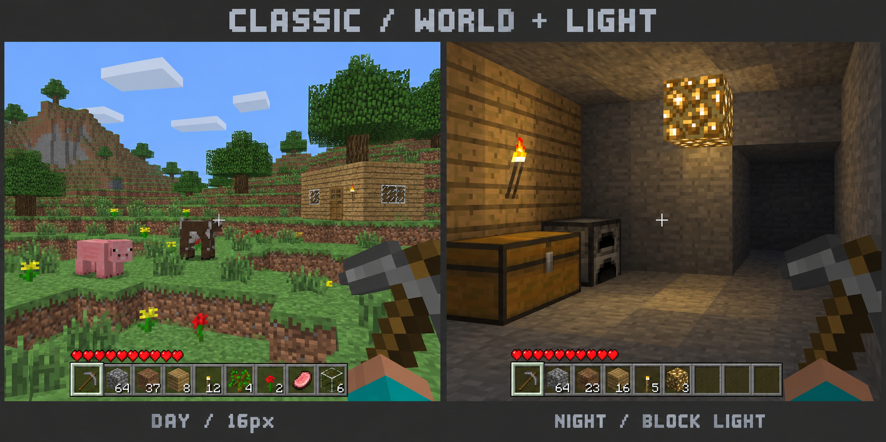
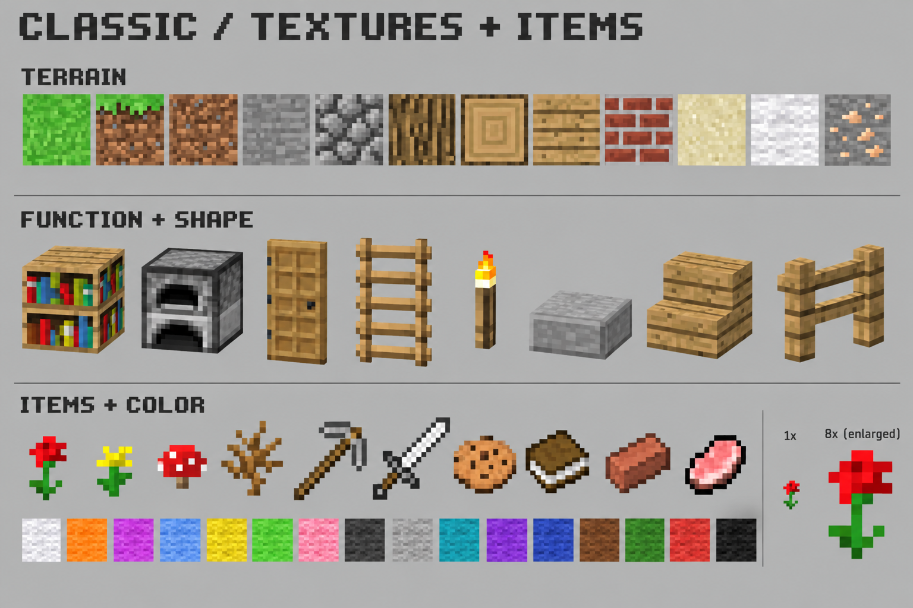
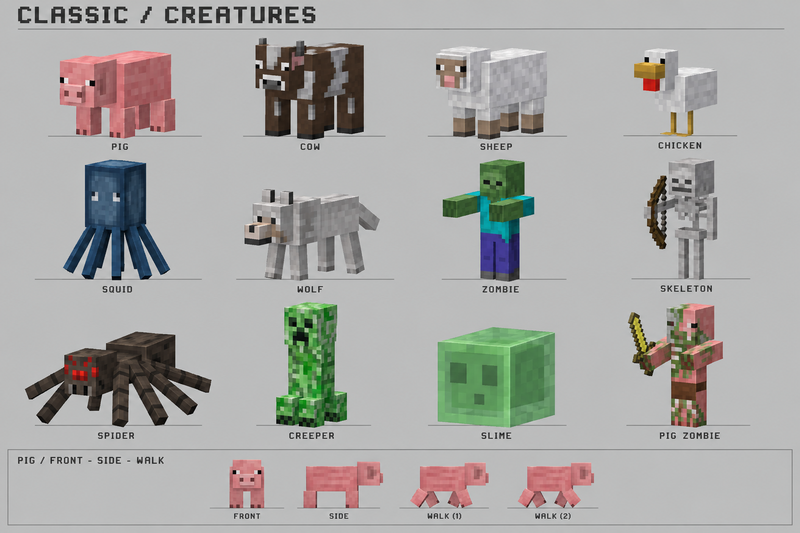

# Classic 老 Minecraft 视觉确认稿 v2

状态：方向已获用户确认；三张具体设计稿待确认。未实施美术/角色删除/光照修改。独立 worker 正在处理创造点击连穿 bug，其状态单独交付。

## 已确认决策

- Classic 尽可能还原经典老 Minecraft 体验，以当前 Beta 1.7.3 参考年代的视觉语言为基准。
- 现代、精细的视觉和玩法属于未来 Modern，本次不预建 Modern，也不把 Classic 的材质策略硬编码到 Kernel。
- 基础地形、物品与生物贴图采用16px风格及一致的像素密度。角色纹理整张 UV 图集可大于16×16，不能把16px误解为每个生物只有一张16×16图。
- 简单 cuboid 几何与经典比例，细节由像素结构表达；不沿用前稿的微缩雕塑、厚重黄铜装饰、电影光照或模糊光晕。
- 用户明确允许从本次 Classic 移除 `grazer`、`night-stalker`、`settler`，不保留默认生成、占位显示或兼容模型，不自动移入 Modern。

## 三张待确认设计稿

### 01 游玩画面与照明

确认重点：草地/树木/建筑的色彩和像素粗细，细平面花草，手持与灰色快捷栏的整体气质；夜间光源能照亮邻近表面而不靠光晕。

### 02 贴图、物品与形状

确认重点：木纹、砖缝、书脊和炉口的可识别结构，非整格物体真实形态，花/蘑菇/曲奇/猪排独立轮廓，16色羊毛可明确区分。已纠正生成版背景的彩色光晕及缺少黑色羊毛的问题。

### 03 生物

确认重点：鸡、牛、猪、羊、鱿鱼、狼、僵尸、骷髅、蜘蛛、苦力怕、史莱姆、猪僵尸共12种的轮廓、比例和色彩。不再设计三种早期自定义角色。

## 概念稿的边界与制作前必须消除的偏差

三图均由内置 image_gen 生成，提示词见本目录 `prompts.json`；不是实际游戏截图、原版截图或已经合格的贴图/动画。用户确认的是方向与形态语言，不能将整图裁成资产发布。

- 整张概念图的像素并非严格16×16原生网格；真正生产源须按明确尺寸重绘/整理并检验，图集尺寸与texel density分别记录。
- 世界图两侧 HUD 的心数、槽位细节、准星位置和手持比例存在生成误差，不作为UI几何合同。新UI草案采取Beta式生命/护甲呈现，不能为了像截图而直接更改现有生命、饥饿或氧气玩法；HUD显隐由正式spec逐项定义。
- 夜间图是光照观感目标，暖色不是承诺精确原版色温；不以图中阴影证明已实现遮挡/衰减。后续真实暗室夹具另验收。
- 生物板的猪 Walk 两帧没有充分展示对角步态差异，不能作为动画验收证据。制作时需可播放Idle/Walk/Attack/Hurt等适用片段、稳定pivot和真实速度联动；不同物种不用同一bob。
- 蛛足数量、鱿鱼触腕数量、几何尺寸、选取框和碰撞以正式物种合同校验，不由二维遮挡图直接推断。
- 材质需自行制作并留来源。以老Minecraft视觉为参照，不导入抽取的原版纹理/模型文件。
- 移除三个自定义角色不等于自动删除所有Seedlands自定义物品；灯笼等既有内容本次先纳入统一风格，是否从Classic内容清单退出另作明确决定。

## 删除早期角色的实施边界

已定位入口：`playbooks/classic/src/actors.ts` 的三类profile和旧starter ecology常量；`pack.ts:116` 的grazer专属喂食规则；`combat.ts` 的night-stalker-claw；Web Presenter 的三个专用分支；`appearance-project.ts:7` 目前只有这三类动画绑定目标。

删除清单必须同时覆盖Classic注册/内容规则、旧初始生态定义、独占近战动作/教程文案、外观目录与模型绑定、相关活跃测试。通用feeding/combat/animation和玩家共享皮肤/肢体材质不能跟随名字搜索机械删除。旧三类动画目标要被新的Classic物种绑定体系替代，不能删掉整套GLB导入/动画能力。

旧存档处理是待实施合同：识别并过滤这三类旧实体，清理指向它们的目标/行为/战斗/外观引用，保留玩家、地形、背包及其他物种；显示一次明确迁移提示。先完成迁移结果验证再保存，不因出现已移除ID直接使整个存档加载失败，也不无提示覆盖原数据。外观项目中仅绑定旧目标的记录需给出“目标已移除”状态，不能清空用户整套外观资产。具体反序列化和引用完整性仍需实施前定向核查，当前未验证迁移可执行。

## 下一道确认门

本轮仅需要用户确认三张板是否体现预期的老Minecraft视觉，可逐张指出偏差，不再重复询问已确定的年代或Modern方向。

确认后：写正式change spec与分阶段预算，制作代表切片（草/泥/石/木、红黄花/草、猪/牛、曲奇/羊毛、火把/辉光石、灰色HUD），在现有WebGL2游戏中展示，核对真实像素与模型后再批量覆盖全清单。此处的代表切片是美术落地确认，不替代最终功能、动画、光照、存档和全量资产验收。
