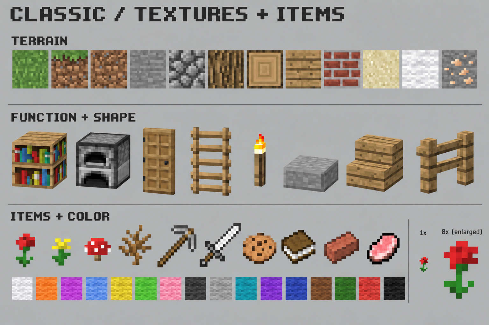
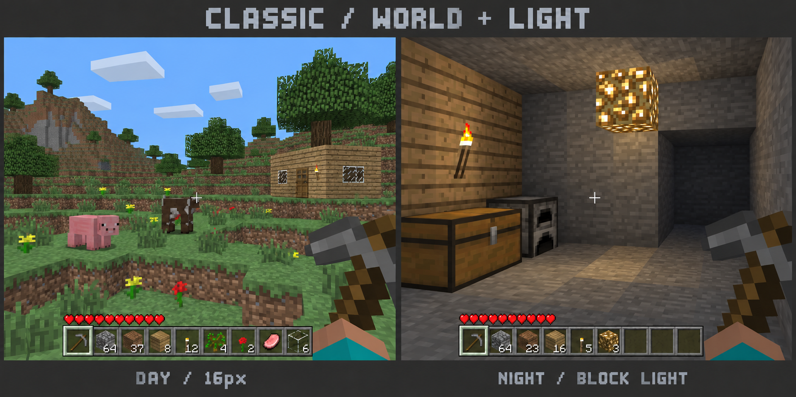

# Classic v3：仅贴图适度现代化

用户修订方向：保留老Minecraft的模型、玩法、方块形状和UI方向，仅贴图稍现代，减轻过高饱和度。

本次沿v2原图编辑，未修改游戏素材。使用内置image_gen，完整提示词见prompts.json。v2中的生物模型方向及移除三类早期角色决策继续有效。

可观察变化：草顶由亮绿改为自然草绿；木材降低黄橙倾向；石材偏中性灰；红花略柔和。16色羊毛与花/矿物等强调色仍清楚区分。没有全画面灰化或新增写实材质。此次是温和修订，部分原有像素结构有意保留；若需要进一步现代化，应具体确认纹理结构变化，而非提高分辨率。

概念图仍不等于原生16px生产纹理、精确UI、游戏实拍或光照验收；沿用v2确认说明中的生成偏差与制作门禁。生成编辑可能造成细小像素漂移，最终以可编辑源和实际游戏验证为准。

本轮待确认：这版饱和度与贴图精细感。确认后才生产代表资产，不直接切图批量替换。
