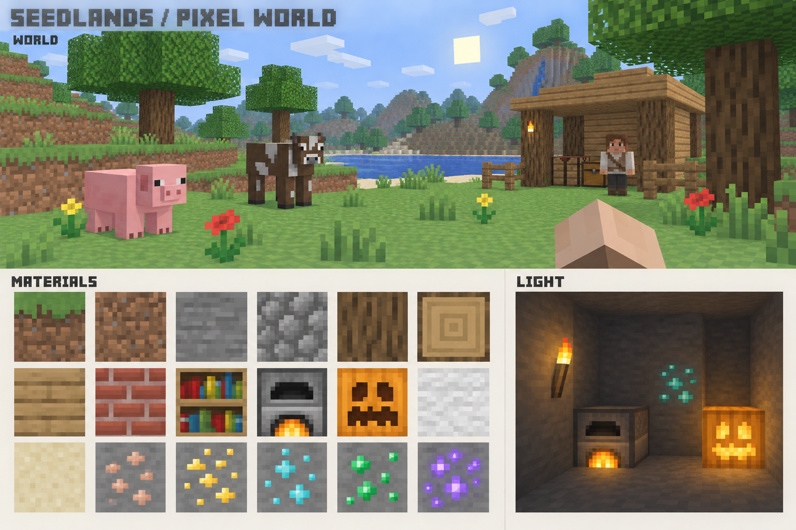
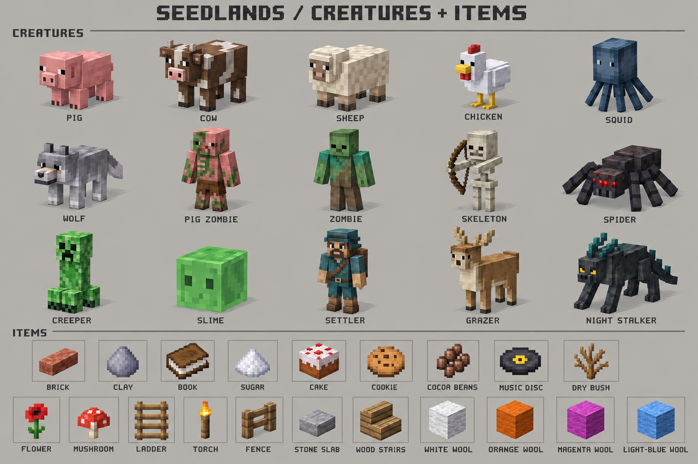

# 体验问题定位与全量像素美术方案（待用户确认）

> 后续决策更新：用户已确认Classic采用经典老Minecraft/Beta时代视觉，并允许移除grazer、night-stalker、settler。美术与旧角色兼容策略以 [Classic v2确认稿](classic-v2/confirmation.md) 为准；本文件保留当时问题定位，早期两张概念图及“保留旧三种身份”的推荐已被取代。

日期：2026-09-22。源码基线：`9115766075b8ae348397a38205fe74e24342da74`，分支 `feat/classic-beta173-playable`。

本轮只读调查并产出设计文档、概念图和注册清单，未修改生产代码、默认素材、浏览器外观项目、存档、测试或 CI，未提交/推送。结论来自当前源码、两张用户截图和只读浏览器状态；浏览器当时为暂停页，随后游戏标签关闭，因此未重现点击时序、逐物种动画和暗室照明。源码解释与运行时验收分开。

## 用户结果与设计方向

目标：创造破坏可控；生物一眼可辨；植物形态与可穿行性一致；发光方块照亮环境；全游戏达到协调、清晰、精致的 Minecraft 式像素观感。保留 Seedlands 原创资源，不以更高分辨率、随机噪点或写实后处理代替美术设计。

现有暖木/黄铜基线不再自动视为本次硬约束。推荐整体转向自然明快、简洁方块、克制材质层次；黄铜只保留于适合的器物，不让所有 UI 与生物都变成重装饰奇幻风。玩法参考版本与视觉目标分开：当前 Classic 合同沿用 Beta 1.7.3，而本次创造输入是新增体验合同，不宣称 Beta 原版创造模式等价。

### 两张待选定的概念稿

图由内置 image_gen 生成，完整提示词见 `prompts.json`。它们用于确认色彩、轮廓、材质结构和整体气质，不是游戏实拍或可直接切图上线的纹理。第一张附带绿/紫矿石、发亮蓝矿石属于生成偏差，不加入内容清单，也不意味着钻石矿应发光。第二张局部像素密度和比例仍需真实模型验证；新资源须原创细化，不能将概念图中的近似原版造型直接视为最终资产。首轮偏微缩雕塑的探索图不作为推荐基线。

## 四项定位与修复方案

### 1. 创造模式点击破坏一排

`apps/web/src/app/player/player-controller.ts:186` 左键按下开始采集，抬起才停止；`:280` 每帧继续采集，`:499` 目标变化会 cancel 再 begin。`browser-gameplay.ts:386` 发出异步 begin；`packages/stdlib/src/server/gameplay/modules/block-actions-module.ts:280` 创造分支立即编辑为空气。于是旧目标消失后，同次按压在后续帧命中后方方块并再次破坏。源码根因置信度高，具体硬件点击时序尚未录制。

推荐输入状态机：按下立即破坏一次；持续按住达到 250ms 后，每 200ms 最多再破坏一次；松开、失焦、退出 pointer lock、打开 UI 即清除状态。两项时间是本项目待确认初值，非宣称 Minecraft 精确参数。禁止同一帧补发多个破坏；以单调时间计节奏；保留 in-flight/请求序号，迟到回包不能重新启动动作。快速松开再点击可立即执行下一次。生存采集继续按硬度计时；攻击生物、击杀后方块、点空处后移入目标也要分别测试，不能只锁定旧坐标。若用户更偏好严格单击单块，可关闭长按连挖，方案默认保留长按便利。

验收：沿准星放连续五块，短按只移除第一块；长按按节奏推进；30/60/144Hz、低帧率、worker 延迟均无连穿；模式切换、失败权限、暂停恢复、生存采集和生物攻击不回归。

### 2. 生物与全量美术

逻辑有 15 个 actor archetype，客户端专用生物/NPC 模型只有 grazer、stalker、settler。`apps/web/src/app/gameplay/gameplay-entity-presenter.ts:167` 对其余 12 个物种统一走 `fallback-body` 炭黑盒子；通用位移 bob 使无肢体盒子上下移动。猪的症状有直接源码解释，不应先归咎显卡或贴图加载失败。

全体身份：鸡、牛、猪、羊、鱿鱼、狼、猪僵尸、僵尸、骷髅、蜘蛛、苦力怕、史莱姆，加旧 grazer、night-stalker、settler；另审玩家全身与第一人称手臂。旧身份保留恢复兼容，不恢复成默认刷怪候选。

纹理问题也存在于数据绑定：`terrain-assets.ts:103` 为大批地形源提供同一噪声底图，仅部分物品有结构特例；`asset-progression-sources.ts:72` 的 16 色羊毛未传颜色，`asset-catalog.ts:282` 又指向共同 wool 纹理；`utility-sprite.ts:424` 的曲奇/蘑菇煲等共享矩形；`asset-catalog.ts:286` 将花、蘑菇、梯子等图标直接指向地形贴图。结构覆盖测试只证明绑定可解析，不证明物品可辨。

机器提取清单 `inventory.json`：73 个非空气体素、76 个面材质、194 个视觉物品绑定、15 个独立 actor、5 张 UI 主图片。数字来自当前视觉目录，不冒称权威物品运行时闭包已验收；同源的方块/物品/材质不是三份独立制作量。补充检查范围还有作物成长、载具、投射物、装备、画、天气/流体/火焰/粒子、选择框/破坏反馈和全部菜单。

| 资产族                 | 制作准则与覆盖要求                                                                                                   |
| ---------------------- | -------------------------------------------------------------------------------------------------------------------- |
| 地形、矿物、树木       | 地形优先原生 16×16；有意组织色块、纹理方向和大中小层次；树皮纵纹、端面年轮、矿脉成簇，检查相邻平铺                   |
| 建筑与功能块           | 木板缝、砖缝、书脊、炉口、门窗、活板门、音符盒/唱片机各有结构；区分顶/侧/正面和状态，不能仅改颜色                    |
| 非整格方块             | 台阶、楼梯、栅栏、梯子、床、门、铁轨、火把的世界/手持/掉落/图标表现对应实际形状                                      |
| 植物与农业             | 茎、叶、花瓣、伞盖有透明轮廓；覆盖树苗、草、双色花、双色蘑菇、枯灌木、甘蔗和作物成长阶段；仙人掌仍保持体积与碰撞     |
| 生物与人物             | 每种独立比例、轮廓、材质分区和动画 rig；四足步态、双足、八足、游泳和史莱姆伸缩不能共用全身 bob；深色生物仍可读       |
| 工具、资源、食物、装备 | 优先复用现有 32px 资产入口与像素密度；每个物品有真实轮廓；五阶工具材质区分；空/水/奶/熔岩桶、皮革/猪排不能靠名称辨别 |
| 颜色与状态变体         | 16 色羊毛在图标、手持、掉落、放置状态都一致；若世界状态尚不能表达颜色，标为实现缺口，不能用图标修复掩盖              |
| UI 与反馈              | 简化黑曜石黄铜重边框；统一像素边框、选中态与图标尺度；生命/护甲/氧气分别表达；破坏、受击、火焰粒子匹配材质           |

生产要求：地形材质 3–5 个主要明度层级，按具体画面允许少量强调色；最近邻保持源像素。模型使用简单 cuboid 和清晰 pivot，细节主要由纹理承担。身体根平稳，腿以关节摆动，移动速度驱动步频；片段不提交玩法伤害。不得靠增加密集小方块模拟每个像素。全部资产对照同一白天、阴影、夜间标尺，先确认猪/草花/木石/曲奇/火把这一小套实际落地效果，再按族批量生产。

### 3. 花草是可穿过的立方体

`packages/stdlib/src/world/voxel-model.ts:18` 没有植物专用几何；`mesh.ts:175` 的无专用模型分支进入完整方块 greedy mesh。`voxel.ts:302` 将花草定义为 nonSolid，因此出现视觉实体立方体与无碰撞的冲突。`terrain-assets.ts:130` 的植物纹理只是随机透明孔洞；红花、红蘑菇、枯灌木还未被旧 cutout 清单完整覆盖。

修复：在现有 Chunk Mesh 中加入交叉双面 alpha-test 植物几何；花草/树苗/蘑菇/枯灌木按类型有真实轮廓与高度，甘蔗采用独立细茎/交叉片配置。保持无实体碰撞，保留合理选取范围与采集反馈；不创建每株一个 Entity。统一材质分类，核对正反面、阴影 alpha、AO、相邻面剔除和物品形态。TS/Rust/Wasm 活跃 mesher 必须同合同，不能只修某个预览入口。此次不更改 seed/generatorVersion 或植物生成密度，以免把视觉修复扩大为世界生成迁移。

验收：正面、侧面、斜视和远处均有茎叶轮廓，无完整立方体壳；可穿行、可选取、可采集；不因透明像素挡住后方完整方块的视野；新旧存档和区块重载一致。

### 4. 发光方块没有照亮环境

`apps/web/src/app/scene/advanced-visual-effects.ts:263` 只收集灯笼进入局部点光源。`packages/stdlib/src/server/gameplay/light-sampler.ts:3` 玩法采样只定义辉光石15、灯笼14、火焰15、熔岩15，未传入 terrain shader。其 Manhattan 距离扫描未处理光路遮挡。`advanced-lighting-budget.ts` 的档位只允许 2/4/6 个局部光源，投影数为 0/1/2。

纠正一个容易误判的点：辉光石归 opaque 不等于完全不自发光。`voxel-materials.ts:163` 给所有非透明类别接入 `voxelAppearanceEmissionGlsl` 与每层 emission 参数，因此辉光石有表面自发光路径；它仍没有环境光源。熔岩/火焰虽归 emissive，但 `terrain-assets.ts:225` 默认 emission 为0。火把、南瓜灯、燃烧熔炉、发光红石矿也未完整接入。

推荐分层实现：

1. 单一发光/遮光定义供玩法与呈现消费；玩法强度位于纯内容/模块侧，颜色与材质参数归外观。补齐各发光状态及熄灭转换，区分炉口、火把火头和实体外壳的 emissive mask。
2. 基础方块光用有界增量体素传播，处理阻挡、衰减、移除后重算、跨 chunk 邻接和未知区块。权威消费者使用同一规则；客户端接收/派生带 world revision 的光数据进入 Chunk Mesh/材质，实体在其位置采样。普通实体块挡直射路径，开放路径可绕射传播；未知不假定亮或暗。缓存为派生数据，不改变世界编辑 owner。
3. 现有局部点光源仅增强少量近处细节；基础照明不依赖前几个槽位，因此低画质和光源密集场景仍有正确方块光。继续 WebGL2，不引入 WebGPU/GI。

仅扩大灯笼扫描表可作为中间调试步骤，不能作为最终 Minecraft 式照明交付：仍会有槽位上限、无阴影漏光以及玩法/视觉不一致。改变现有 S3f 距离采样合同会影响刷怪与农业判断，须在新 spec 明确这项变化并做回归。

拟定强度初值：火把14，辉光石/熔岩/火焰/南瓜灯15，燃烧炉13，亮红石矿9，灯笼保持14；这些是待验证的本项目合同值。亮矿只在 active 状态发光；炉火熄灭应恢复普通材质与光照。手持动态光不在本轮默认要求，避免把放置照明扩张为新的玩法。

验收：固定暗室中每种单光源分别拍帧并检查周边光值；遮墙/开洞/移除/熄灭/爆炸/跨区块/保存重载；密集光源超过6个仍不因槽位失去基础亮度；生物也受光；白天不泛白，夜间不靠 bloom 假装照亮。

## 工具与生产流水线

推荐复用现有 PixelTexture、模型加载、资产工坊、快照/恢复和 PlayCanvas 缩略图链路。已探测宿主机 Blender 5.2.1 LTS 可执行；仓库有 `scripts/assets/generate-brass-trail-lantern.py` 静态配方。不能宣称该配方已能批量生产动画生物：需要独立模板、UV/rig/片段和绑定扩展；当前 GLB 绑定只开放旧三种身份。

| 路线                            | 本次选择                                                                                                  |
| ------------------------------- | --------------------------------------------------------------------------------------------------------- |
| 现有管线 + 像素源 + Blender CLI | 推荐。沿既有导入/验证/预览链扩展，保留可编辑源、明确 UV 与动画                                            |
| Blockbench                      | 官方支持低模、像素与动画及 glTF 导出，适合人工精修；本机安装/批量导出未验证，不作为自动化已经可用的前提   |
| 外部成品资源包/采购             | 当前没有已验证且完整覆盖所有 ID、动画及授权的候选，不先引入采购；若后续选包，应按相同代表切片比较接入成本 |
| 任意图生3D或重建资产编辑器      | 不作为默认。缺少当前项目骨架、低模、UV与绑定证据；现有工坊已足够承载生产结果                              |

工序：确认概念稿 → 冻结 spec 和资产族清单 → 代表资产真实像素源/模型 → 工坊与实际游戏对照 → 用户确认代表切片 → 有界批次生产 → 确定性检查 → 全量联系表与游戏验收。概念图由 image_gen；需要绘制的贴图可用 image_gen 产生候选，再按目标网格/调色板整理并人工审图；不能直接缩小整张设计稿当作像素资产。几何/UV/rig/动画用 Blender 配方生产；已有 declarative geometry 保留可复用部分。所有图标通过现有实际模型/精灵源生成，不能另画一套不相符的图标。

每项记录稳定 ID、尺寸/像素密度、palette、alpha、几何预算、UV、碰撞/选择形态、动画片段、各显示场景、来源、版本和 hash。保留用户外观覆盖优先级及上一版恢复能力；先核对覆盖引起的旧外观，不清空 IndexedDB 或用户存档。批处理负责编译/导出/验证；语义审图按资产族审，不以“已导出”代替质量通过。

## 分阶段实施与验收门

本轮状态：源码定位和概念稿完成；实现、RED、运行时复现、产品验收均未执行。长期 docs baseline 尚未修改，因为风格尚待确认。

确认后建议分成独立可验收阶段，每段控制在6小时活跃执行内：输入修复；风格与代表切片；植物网格和形态；物品/地形分批；生物分批；体素照明分层；整合验收。大范围总体估算需按 `docs/change-estimation.md` 在正式 spec 冻结时登记，含返工与20%预算缓冲；credits、费率、额度占比当前未知，不虚构费用或一次性完成时长。不自动创建 Goal。

正式交付需要：

- 所有注册 ID 与状态逐项闭包；12 个新物种不走通用盒子，旧三种身份可恢复；没有遗漏项被默认 fallback 遮住。
- 确定性像素/几何/光传播/输入状态机检查；彩色羊毛纹理内容区分、物品同源绑定和导入导出兼容。
- Browser 中输入与权威编辑次数、场景白天/夜间、正侧背面生物与完整动作、植物选取、暗室照明、库存/手持/掉落/放置全链路。
- 视觉盲辨与联系表审阅：隐藏名称仍能辨认猪/牛/羊、食物/资源及非整格方块；不能靠 bounding box/alpha 自动检查推断“好看”。
- 固定场景复查新增模型、植物与光照的资源开销；不宣称未做工程对照的性能收益。性能采样遵循独占执行窗口。
- 现行架构冻结与后续 Classic spec 存在阶段性差异；新 spec 明确本 change 的 Browser/跨层验收入口，不能把暂缓项写通过或默默扩大 CI。

## 本次需用户确认的内容

1. 采用两张推荐稿所表达的简洁、精致、自然的 Minecraft 式像素方向，调整现有重黄铜 UI 基线。
2. 创造输入采用“短按一块、长按有节奏连挖”，或选择严格一次按压只破坏一块。
3. 同意四项分阶段修复及全量素材整治范围；代表资产在真实游戏呈现确认后再批量替换，不一口气重画全部再看效果。

## 外部一手参考

- [Minecraft 官方操作说明](https://www.minecraft.net/en-us/article/minecraft-controls)：创造模式立即破坏；该页不提供本方案的250/200ms参数。
- [Blockbench 官方](https://blockbench.net/)与[glTF导出说明](https://blockbench.net/wiki/guides/model-rendering/)：工具能力参考，不是本机已安装或生产链已跑通的证据。
